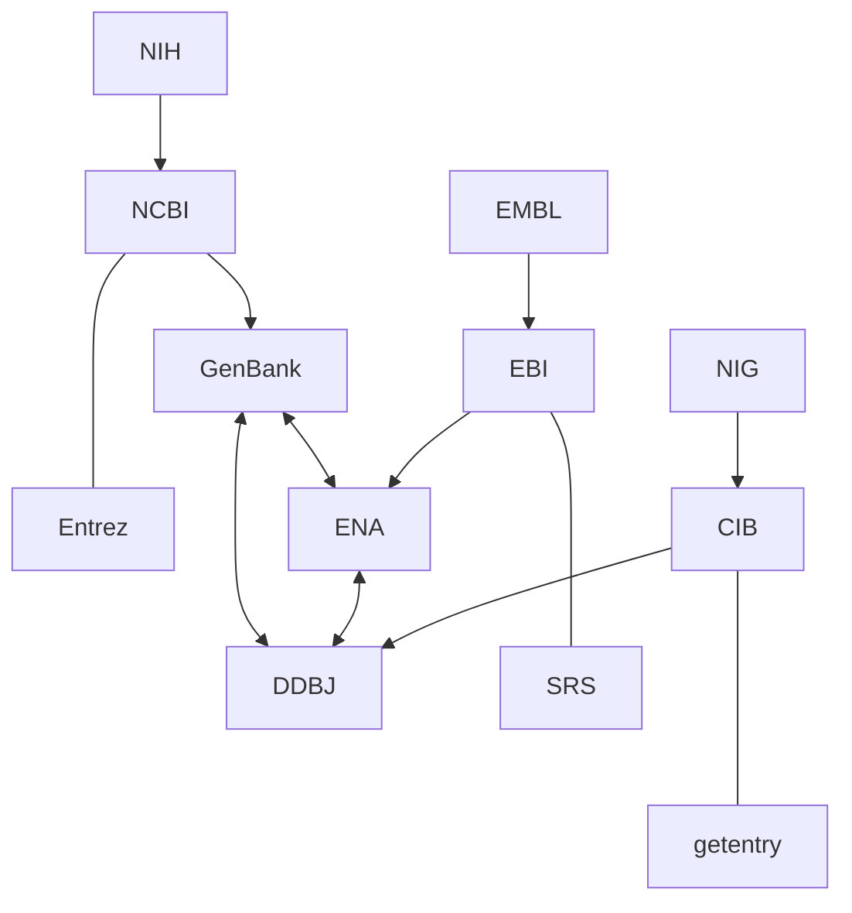

# 绪论
## 产生&发展
1936 图灵机
1946 the first computer
1951 氨基酸测序
1953 Watson-Crick 螺旋
1958 蛋白质晶体结构、中心法则
1962 Dayhoff--> comprotein
1966 遗传密码子
1967 Dayhoff-->蛋白质序列图集-->PIR
==1975 DNA测序、巨硬和苹果==
==1979 GenBank（US）==
==1982 ENA（EU）==
==1984 DDBJ（JP）==
（三大核酸数据库）
1987 ==bioinformatics==一词出现
==1990.10 **人类基因组计划（the Human Genome Project）**==
## 定义
用计算机解决生物问题
# 数据库
## Why？
人基因组：3Gbp-->600,000页-->30米厚
in database：1块HDD（甚至还有多的）
## 分类
按内容分
- 核酸数据库
- 蛋白质数据库
- 专用数据库
按级别分
-  一级数据库：最直接基础数据
- 二级数据库：经过整理，分析，归纳，注释而得到的
## Examples
### 专用数据库
#### PubMed
NIH下属论文搜索引擎
```pubmed
PMID- 30641049
OWN - NLM
STAT- MEDLINE
DCOM- 20191213
LR  - 20200315
IS  - 1096-0384 (Electronic)
IS  - 0003-9861 (Print)
IS  - 0003-9861 (Linking)
VI  - 663
DP  - 2019 Mar 15
TI  - Molecular and cellular regulation of human glucokinase.[标题]
PG  - 199-213
LID - S0003-9861(18)31016-6 [pii]
LID - 10.1016/j.abb.2019.01.011 [doi]
AB  - Glucose metabolism in humans is tightly controlled by the activity of glucokinase ...
CI  - Copyright © 2019 Elsevier Inc. All rights reserved.
FAU - Sternisha, Shawn M
AU  - Sternisha SM[作者]
AD  - Department of Chemistry and Biochemistry, Florida State University, Tallahassee, 
      FL, 32306, USA.[作者地址]
FAU - Miller, Brian G
AU  - Miller BG
AD  - Department of Chemistry and Biochemistry, Florida State University, Tallahassee, 
      FL, 32306, USA. Electronic address: miller@chem.fsu.edu.
LA  - eng
GR  - R01 GM115388/GM/NIGMS NIH HHS/United States
PT  - Journal Article
PT  - Research Support, N.I.H., Extramural
PT  - Review[类型]
DEP - 20190111
PL  - United States
TA  - Arch Biochem Biophys
JT  - Archives of biochemistry and biophysics
JID - 0372430
RN  - 0 (Carrier Proteins)
RN  - 0 (SUMO-1 Protein)
RN  - 0 (glucokinase regulatory protein)
RN  - EC 2.7.1.105 (Phosphofructokinase-2)
RN  - EC 2.7.1.2 (Glucokinase)
RN  - IY9XDZ35W2 (Glucose)
SB  - IM
MH  - Animals
MH  - Carrier Proteins/physiology
MH  - Enzyme Activation
MH  - Glucokinase/antagonists & inhibitors/chemistry/*metabolism
MH  - Glucose/analysis
MH  - Humans
MH  - Phosphofructokinase-2/metabolism
MH  - Protein Binding
MH  - Protein Conformation
MH  - Protein Processing, Post-Translational
MH  - SUMO-1 Protein/metabolism
PMC - PMC6377845
MID - NIHMS1519350
OTO - NOTNLM
OT  - Conformational dynamics
OT  - Diabetes
OT  - Glucokinase
OT  - Protein-protein interaction
OT  - Regulation
EDAT- 2019/01/15 06:00
MHDA- 2019/12/18 06:00
CRDT- 2019/01/15 06:00
PHST- 2018/12/12 00:00 [received]
PHST- 2019/01/09 00:00 [revised]
PHST- 2019/01/10 00:00 [accepted]
PHST- 2019/01/15 06:00 [pubmed]
PHST- 2019/12/18 06:00 [medline]
PHST- 2019/01/15 06:00 [entrez]
AID - S0003-9861(18)31016-6 [pii]
AID - 10.1016/j.abb.2019.01.011 [doi]
PST - ppublish
SO  - Arch Biochem Biophys. 2019 Mar 15;663:199-213. doi: 10.1016/j.abb.2019.01.011. 
      Epub 2019 Jan 11.
```
#### KEGG
京都基因与基因组百科全书
**有代谢通路图欸！**
#### OMIM
人类孟德尔遗传Online
遗传病分类
#### ZINC
化合物商业数据库
### 一级核酸数据库
#### GenBank
NCBI负责，属US
数据来源：
1. 测序工作者提交
	- BankIt
	- Sequin
2. 交换
3. 专利数据
#### ENA
欧洲分子生物学研究室EMBL负责，属EU
#### DDBJ
日本国立遗传学研究所NIG负责，属JP
#### INSDC
==国际核酸数据库合作联盟==，将三大数据库数据每日更新汇总，进行同步

!notice
物种做key words搜索时用拉丁名，不能用缩写
```markdown
LOCUS       X01714[基因座名]                  1609 bp[长度]    DNA[类别]     linear[拓扑类型]   BCT[物种类型：Bacteria] 23-OCT-2008[更新日期]
DEFINITION  E. coli dut gene for dUTPase (EC 3.6.1.23) (deoxyuridine
            5'-triphosphate nucleotidohydrolase).
ACCESSION   X01714[检索号，同一数据库唯一不变，不一定与LOCUS相同]
VERSION     X01714.1[版本号] [可能有GI：纯版本号，与VERSION平行]
KEYWORDS    dUTPase; unidentified reading frame.
SOURCE      Escherichia colip[所属物种俗名]
  ORGANISM  [Escherichia coli](https://www.ncbi.nlm.nih.gov/Taxonomy/Browser/wwwtax.cgi?id=562)
            Bacteria; Pseudomonadota; Gammaproteobacteria; Enterobacterales;[更详细的定义]
            Enterobacteriaceae; Escherichia.
REFERENCE   1  (bases 1 to 1609)[参考文献]
  AUTHORS   Lundberg,L.G., Thoresson,H.O., Karlstrom,O.H. and Nyman,P.O.
  TITLE     Nucleotide sequence of the structural gene for dUTPase of
            Escherichia coli K-12
  JOURNAL   EMBO J. 2 (6), 967-971 (1983)
   PUBMED   [6139280](https://www.ncbi.nlm.nih.gov/pubmed/6139280)
COMMENT     Data kindly reviewed (25-NOV-1985) by L. Lundberg.
FEATURES             Location/Qualifiers[描述已确定的片段]
     source          1..1609
                     /organism="Escherichia coli"
                     /mol_type="genomic DNA"
                     /db_xref="taxon:[562](https://www.ncbi.nlm.nih.gov/Taxonomy/Browser/wwwtax.cgi?id=562)"     [regulatory](https://www.ncbi.nlm.nih.gov/nuccore/X01714.1?from=286&to=291)      286..291
                     /regulatory_class="promoter"
                     /note="-35 region"     [regulatory](https://www.ncbi.nlm.nih.gov/nuccore/X01714.1?from=310&to=316)      310..316
                     /regulatory_class="promoter"[启动子]
                     /note="-10 region"     [misc_feature](https://www.ncbi.nlm.nih.gov/nuccore/X01714.1?from=322&to=324)    322..324
                     /note="put. transcription start region"     [regulatory](https://www.ncbi.nlm.nih.gov/nuccore/X01714.1?from=330&to=333)      330..333
                     /regulatory_class="ribosome_binding_site"
                     /note="put. rRNA binding site"     [CDS](https://www.ncbi.nlm.nih.gov/nuccore/X01714.1?from=343&to=798) [一个开放阅读框]            343..798
                     /note="unnamed protein product; dUTP-ase (aa 1-151)"
                     /codon_start=1
                     /transl_table=[11](https://www.ncbi.nlm.nih.gov/Taxonomy/Utils/wprintgc.cgi?mode=c#SG11)
                     /protein_id="[CAA25859.1](https://www.ncbi.nlm.nih.gov/protein/41297)"
                     /db_xref="GOA:[P06968](https://www.ebi.ac.uk/ego/GProtein?ac=P06968)"
                     /db_xref="InterPro:[IPR008180](https://www.ebi.ac.uk/interpro/entry/InterPro/IPR008180)"
                     /db_xref="InterPro:[IPR008181](https://www.ebi.ac.uk/interpro/entry/InterPro/IPR008181)"
                     /db_xref="PDB:[1DUD](http://www.rcsb.org/pdb/cgi/explore.cgi?pdbId=1DUD)"
                     /db_xref="PDB:[1DUP](http://www.rcsb.org/pdb/cgi/explore.cgi?pdbId=1DUP)"
                     /db_xref="PDB:[1EU5](http://www.rcsb.org/pdb/cgi/explore.cgi?pdbId=1EU5)"
                     /db_xref="PDB:[1EUW](http://www.rcsb.org/pdb/cgi/explore.cgi?pdbId=1EUW)"
                     /db_xref="PDB:[1RN8](http://www.rcsb.org/pdb/cgi/explore.cgi?pdbId=1RN8)"
                     /db_xref="PDB:[1RNJ](http://www.rcsb.org/pdb/cgi/explore.cgi?pdbId=1RNJ)"
                     /db_xref="PDB:[1SEH](http://www.rcsb.org/pdb/cgi/explore.cgi?pdbId=1SEH)"
                     /db_xref="PDB:[1SYL](http://www.rcsb.org/pdb/cgi/explore.cgi?pdbId=1SYL)"
                     /db_xref="PDB:[2HR6](http://www.rcsb.org/pdb/cgi/explore.cgi?pdbId=2HR6)"
                     /db_xref="PDB:[2HRM](http://www.rcsb.org/pdb/cgi/explore.cgi?pdbId=2HRM)"
                     /db_xref="UniProtKB/Swiss-Prot:[P06968](https://www.uniprot.org/uniprot/P06968)"
                     /translation="MKKIDVKILDPRVGKEFPLPTYATSGSAGLDLRACLNDAVELAP
                     GDTTLVPTGLAIHIADPSLAAMMLPRSGLGHKHGIVLGNLVGLIDSDYQGQLMISVWN
                     RGQDSFTIQPGERIAQMIFVPVVQAEFNLVEDFDATDRGEGGFGHSGRQ"[翻译产物，机翻]     [misc_feature](https://www.ncbi.nlm.nih.gov/nuccore/X01714.1?from=831&to=851)    831..851
                     /note="put.stem-loop structure"     [repeat_region](https://www.ncbi.nlm.nih.gov/nuccore/X01714.1?from=831&to=838)   831..838
                     /note="inverted repeat A"     [repeat_region](https://www.ncbi.nlm.nih.gov/nuccore/X01714.1?from=844&to=851)   844..851
                     /note="inverted repeat A'"     [misc_feature](https://www.ncbi.nlm.nih.gov/nuccore/X01714.1?from=866&to=893)    866..893
                     /note="put. stem-loop structure"     [repeat_region](https://www.ncbi.nlm.nih.gov/nuccore/X01714.1?from=866&to=872)   866..872
                     /note="imp. inverted repeat B"     [repeat_region](https://www.ncbi.nlm.nih.gov/nuccore/X01714.1?from=888&to=893)   888..893
                     /note="imp. inverted repeat B'"     [regulatory](https://www.ncbi.nlm.nih.gov/nuccore/X01714.1?from=889&to=895)      889..895
                     /regulatory_class="ribosome_binding_site"
                     /note="pot. rRNA binding site"     [CDS](https://www.ncbi.nlm.nih.gov/nuccore/X01714.1?from=905&to=1540)             905..1540
                     /note="unnamed protein product; unidentified reading
                     frame"
                     /codon_start=1
                     /transl_table=[11](https://www.ncbi.nlm.nih.gov/Taxonomy/Utils/wprintgc.cgi?mode=c#SG11)
                     /protein_id="[CAA25860.1](https://www.ncbi.nlm.nih.gov/protein/41298)"
                     /db_xref="GOA:[P0C093](https://www.ebi.ac.uk/ego/GProtein?ac=P0C093)"
                     /db_xref="InterPro:[IPR001647](https://www.ebi.ac.uk/interpro/entry/InterPro/IPR001647)"
                     /db_xref="InterPro:[IPR009057](https://www.ebi.ac.uk/interpro/entry/InterPro/IPR009057)"
                     /db_xref="InterPro:[IPR011075](https://www.ebi.ac.uk/interpro/entry/InterPro/IPR011075)"
                     /db_xref="InterPro:[IPR015893](https://www.ebi.ac.uk/interpro/entry/InterPro/IPR015893)"
                     /db_xref="UniProtKB/Swiss-Prot:[P0C093](https://www.uniprot.org/uniprot/P0C093)"
                     /translation="MAEKQTAKRNRREEILQSLALMLESSDGSQRITTAKLAASVGVS
                     EAALYRHFPSKTRMFDSLIEFIEDSLITRINLILKDEKDTTARLRLIVLLLLGFGERN
                     PGLTRILTGHALMFEQDRLQGRINQLFERIEAQLRQVLREKRMREGEGYTTDETLLAS
                     QILAFCEGMLSRFVRSEFKYRPTDDFDARWPLIAASCSNMTPDDFSSGEFL"
ORIGIN[序列]      
        1 cagagaaaat caaaaagcag gccacgcagg gtgatgaatt aacaataaaa atggttaaaa...
//[The End]
```
只要序列？下载FASTA文件
#### 中国国家基因库CNGB
### 二级核酸数据库
#### RefSeq
GenBank中存在重复，冗余序列
RefSeq对其进行了筛选
> Ref- 参考
> non-redundant 无冗余
##### 序列号
\*\*\_0123456
X：推测
N：真实测定
C：完整序列
M：转录mRNA序列
N：非编码序列
P：蛋白质序列
> 运行架构

#### WormBase
蠕虫数据库
#### FlyBase
果蝇数据库
#### UniGene（已下架）
转录图谱数据库
> EST序列：表达序列标签，cDNA的一个片段，有时可代表特定的cDNA分子

#### Gene
以物种为记录对象，收录基因记录
属NCBI
#### miRBase
储存miRNA
### 基因组数据库
#### Ensembl
欧洲生物信息学研究所和英国桑格研究所维护
#### TIGR/JCVI
微生物宏基因组数据库
==HMP：人类微生物组计划==
### 一级蛋白质数据库
#### swissprot
人工注释的蛋白质序列数据库，注释可信度高，冗余度小，相关信息丰富
由EMBL与瑞士生物信息学研究所共同管理
#### TrEMBL
由计算机注释，包含EMBL中所有核酸序列的翻译产物
#### PIR
现在算是综合数据库
#### UniProt
swissprot+TrEMBL+PIR
##### UniProtKB
数据存取中心
##### UniRef
将密切相关的序列整合在一起，提高搜索速度
##### UniParc
历史档案
#### PDB
蛋白质结构数据库，实际上存的是==生物大分子==3D结构
>实测结果：非蛋白质结构放在子库里的

只有通过==实验方法测得的==才会被存入
### 二级蛋白质数据库
#### Pfam
蛋白质结构家族集合
通过匹配结构域来推测其分类家族和功能
#### Prosite
蛋白质模体数据库
#### CATH
对结构域分类
#### SCOP
也是蛋白质结构域数据库，但更侧重进化和起源
# 序列对比
## 序列
$S_i$：序列$S$第$i$项
$S'$：子序列
相似的一级结构-->相似的高级结构
## 一致度&相似度
一致度：对应位置上残基==相同数目==占总长百分比
相似度：对应位置上残基==相同或相似数目==占总长百分比
### 碱基替换记分矩阵

#### 转换颠换矩阵
相同-->$+1$
转换-->$-1$
颠换-->$-5$
#### 等价矩阵
相同-->$+1$
不相同-->$+0$
#### BLAST矩阵
相同-->$+5$
不相同-->$-4$
### 氨基酸替换矩阵
#### 等价矩阵
相同-->$+1$
不相同-->
#### PAM-n矩阵
两氨基酸替换越频繁-->得分越高
PAM-1：真实数据统计得到（适用于几乎一致的序列）
PAM-n：PAM-1自乘$n$次得到
最常见：PAM-250矩阵（适用于亲缘关系远的序列）
#### BLOSUM-n矩阵
由一致度大于等于n的序列直接计算得来，而非自乘
#### PAM-n or BLOSUM-n？
PAM-1<-->BLOSUM-80
PAM-120<-->BLOSUM-62
PAM-250<-->BLOSUM-250
序列关系较远：PAM-n准确度受限，选BLOSUM-45更精确
序列关系较近：差别不大
最常用：BLOSUM-62
#### 遗传密码矩阵
由密码子相互转换所需的碱基改变得到
#### 疏水矩阵
由疏水性改变得到，变化越小，得分越高，反之亦然
偏重蛋白质功能方面
## 双序列比对
### 打点矩阵
连续的对角线（或其平行线）表示相同的区域
自己与自己打点-->可测重复片段与出现次数（与主对角线平行的短平行线）
作用：寻找短串联重复序列STR
### 序列比对（Alignment）算法
通过插入空位，使相似度最大化
分类：
- 多序列比对
- 双序列比对
	- 全局比对
	- 局部比对
#### Needleman-Wunsch算法
==DP==！！！
$W_(i,j)$：$i$ 与 $j$ 的替换记分
$S_(i,j)$：按照替换记分矩阵得到的前缀和
状态转移方程
$$
S_{i,j}=\max\{S_{i-1,j-1}+W_{i,j},S_{i-1,j}+gap,S_{i,j-1}+gap\}
$$
临界值
$$\displaylines{
S_{0,j}=gap*j,0\leq in\\
S_{i,0}=gap*i,0\leq im
}
$$
需要记录转移路径-->最终匹配结果
#### Smith-Waterman算法
在Needleman-Wunsch的基础上加了一点
状态转移方程
$$
S_{i,j}=\max\{0,S_{i-1,j-1}+W_{i,j},S_{i-1,j}+gap,S_{i,j-1}+gap\}
$$
临界值
$$\displaylines{
S_{0,j}=0,0\leq in\\
S_{i,0}=0,0\leq im
}
$$
Gap的生物学意义：indel（insert，delete）
## 数据库检索
### BLAST：Basic Local Alignment Search Tool
基本原理：寻找片段对-->延伸-->高分值片段对
aka Word (k-tuple) method
分类
- BLASTx：用一条核酸序列翻译成六条蛋白质序列（互补，不同起点 $2\times 3$）搜索
- tBLASTn：用一条蛋白质序列搜索被翻译的核酸序列库
- tBLASTx：用一条翻译后的核酸序列搜索被翻译的核酸序列库
- 无tBLASTp
#### PSI-BLAST：位点特异性迭代BLAST
根据上一次BLAST的搜索结果创建一个位置权重矩阵，扩大下一次搜索范围
#### PHI-BLAST
## 多序列比对
