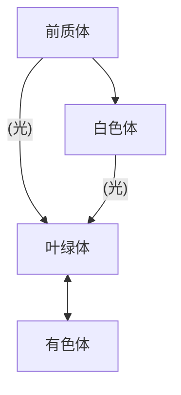

# 细胞基本结构

>[!warning] 注意
>此处指记录植物中较特殊的部分，其他部分为节省时间略过

## 质体

分类

- 叶绿体
- 有色体
- 白色体
发育

## 高尔基体

在植物细胞中与根冠黏液和树脂的分泌有关，也参与了半纤维素的合成和细胞板的形成

## 圆球体

前期具有溶酶体的部分性质，只有单层磷酯，后期逐渐发育为油滴

## 微体

含有氧化酶、过氧化氢酶，分为过氧化物酶体和乙醛酸循环体

>[!info] 关于溶酶体
>有观点认为在植物中应以广义上的溶酶体来分类，以此看，微体、圆球体和液泡都算溶酶体

## 细胞壁

植物特有结构，分为胞间层、初生壁和次生壁，次生壁又分为外中内三层

胞间层 -->果胶

初生壁 -->半纤维素，纤维素，果胶，并含有一些蛋白，有延展性

次生壁 -->纤维素为主，常木质化

# 组织
## 分生组织

分类

- 顶端分生组织 -->初生分生组织或原分生组织
- 侧生分生组织 -->包括形成层和木栓形成层等，次生分生组织
- 居间分生组织 -->原分生组织的残留，初生分生组织或原分生组织
## 保护组织

早期为表皮，由角质层（角质 + 蜡）和角化层（角质 + 纤维素）组成，有气孔，次生生长后为周皮，由木栓层，木栓形成层和栓内层组成，气孔演变为皮孔

## 薄壁组织

植物的基本组织

### 特化
- 传递细胞：初生壁向内突出，协助物质传输，分布在物质交流密集的区域
- 厚角组织：角隅处初生加厚，不在根中分布，初生性质的加厚使其具备生长的能力，多在早期出现
- 厚壁组织：次生性质加厚，木质化，是死细胞
	- 石细胞：均匀加厚的单个细胞，有管状纹孔道，常因汇合形成分支纹孔道
	- 纤维：不均匀木质化的梭状细胞
## 输导组织
### 木质部

由管胞和薄壁组织形成，高等植物中管胞发育成导管（两端穿孔）和木纤维。在后期发育时薄壁细胞常木质化，行储藏功能。有木纤维

### 韧皮部

筛管和伴胞组成。筛管具筛孔、筛板和筛域（特化的初生纹孔场），细胞质部分降解，仍保留线粒体，质体，P- 蛋白体（形成黏液塞）和一部分内质网，相邻筛管间形成原生质联络索，并包裹胼胝体鞘

低等植物中无筛管，而只有筛胞，且只有筛域，无 P- 蛋白体，==但是有原生质联络索==

韧皮纤维叫木纤维木质化程度低

## 分泌组织

外分泌

- 腺表皮/毛
- 蜜腺
- 排水器
内分泌
- 油细胞
- 黏液细胞
- 含晶细胞
- 鞣质细胞
- 芥子酶细胞

分泌腔、道分为裂生型、溶生型、裂溶生型

乳汁道分为无节和有节，无节的仅有一个细胞，存续时间短，有节的有多个细胞打通形成。仅具初生壁，常为多核细胞