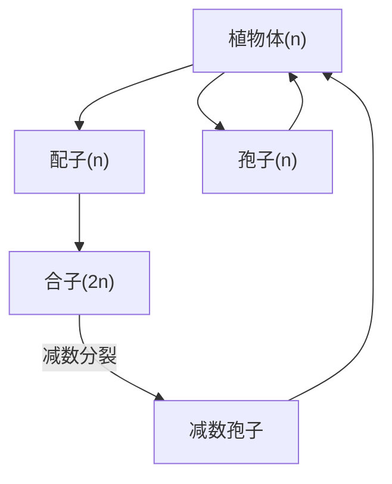
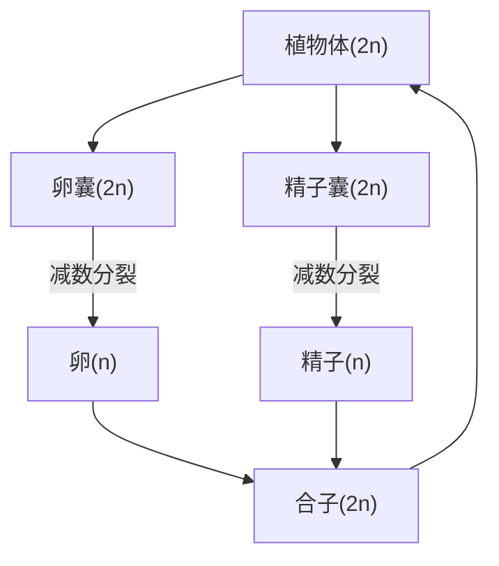
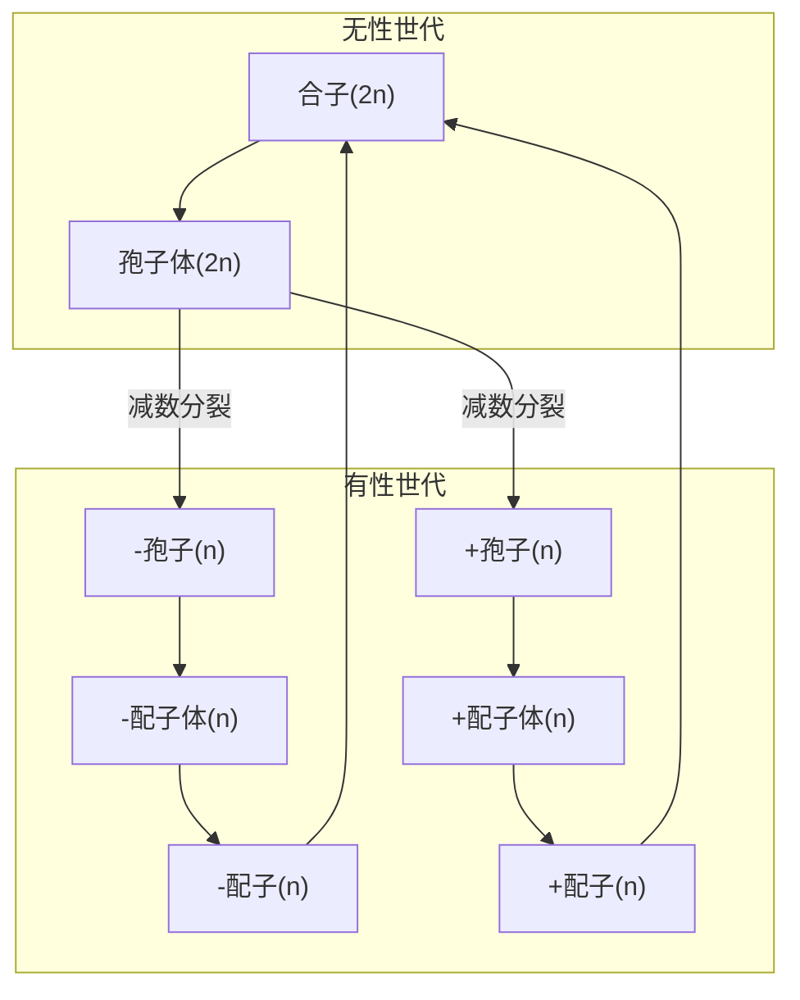

## 合子减数分裂

```mermaid
graph 
a["植物体(n)"]-->b["配子(n)"]-->c["合子(2n)"]--减数分裂-->d["减数孢子"]-->a-->e["孢子(n)"]-->a
```

## 配子减数分裂

```mermaid
graph
a["植物体(2n)"]-->b["卵囊(2n)"]--减数分裂-->c["卵(n)"]-->d["合子(2n)"]-->a
a-->e["精子囊(2n)"]--减数分裂-->f["精子(n)"]-->d
```

## 居间减数分裂

```mermaid
graph
subgraph 无性世代
a["合子(2n)"]
b["孢子体(2n)"]
end
subgraph 有性世代
c["-孢子(n)"]
d["+孢子(n)"]
e["-配子体(n)"]
f["+配子体(n)"]
g["-配子(n)"]
h["+配子(n)"]
end
a-->b--减数分裂-->c-->e-->g-->a
b--减数分裂-->d-->f-->h-->a
```

- 同形世代交替：石莼
- 异形世代交替
	- 孢子体优势：海带，蕨类植物，裸子植物，被子植物
	- 配子体优势：礁膜，萱藻