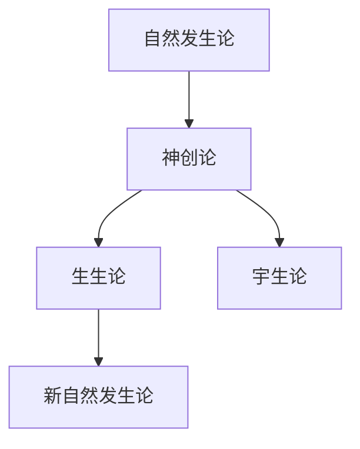
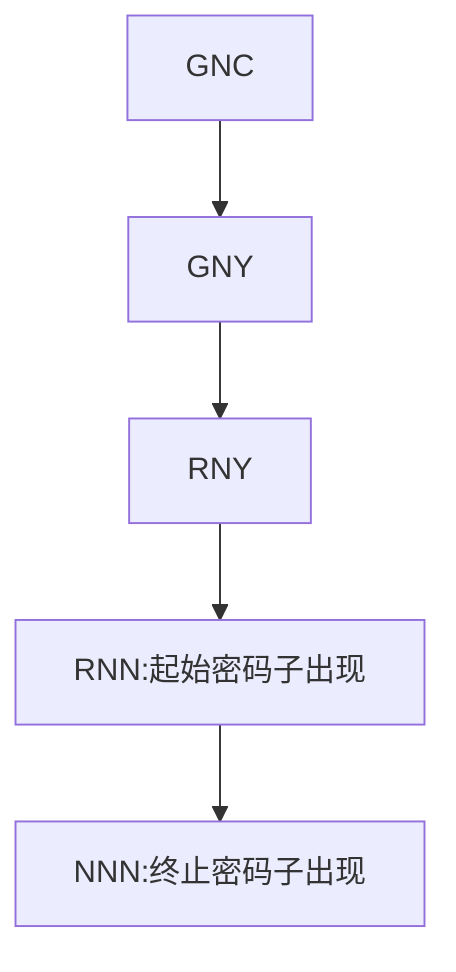

# 生命的特点
1. 自我更新：同化、异化
2. 自我复制
3. 自我调控
4. 自我突变：多方向性、重演性、可逆性
5. 节律性
# 对生命起源的认识

巴斯德鹅颈瓶实验：支持了生生论

新自然发生论：认为最早的生命是有一种原始粘液演化而来

## 早期地球

初生大气消失后，形成 `CO2`，`CH4`，`N2`，`H2O`，`H2S`，`NH3` 等为主的次生大气（==没有游离氧==）

可用能源：热能、太阳能（紫外线可被 `CH4` 等吸收）、放电 (导致==`HCN`==合成）

## 化学演化学说

由无机小分子到有机小分子再到生物大分子

### 米勒的放电实验

在实验室条件下通过火花放电合成了 11 种氨基酸

### 有机小分子到生物大分子
1. 实质为蛋白质形成与演化（功能上先有代谢再有复制）
2. 实质为核酸形成与演化 -->`RNA` 世界假说
3. 核苷酸与蛋白质共同起源（==赵玉芬 - 曹培生理论==）
### 起源
1. 陆相起源说
2. 海相起源说
3. 深海烟囱起源说
### 密码子起源

