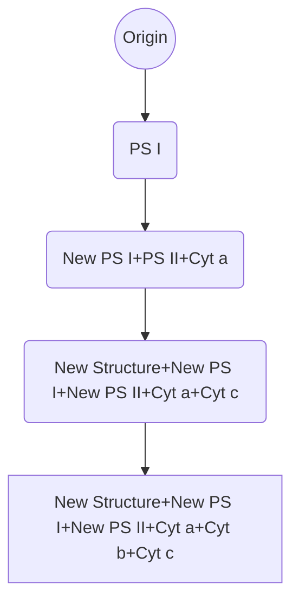
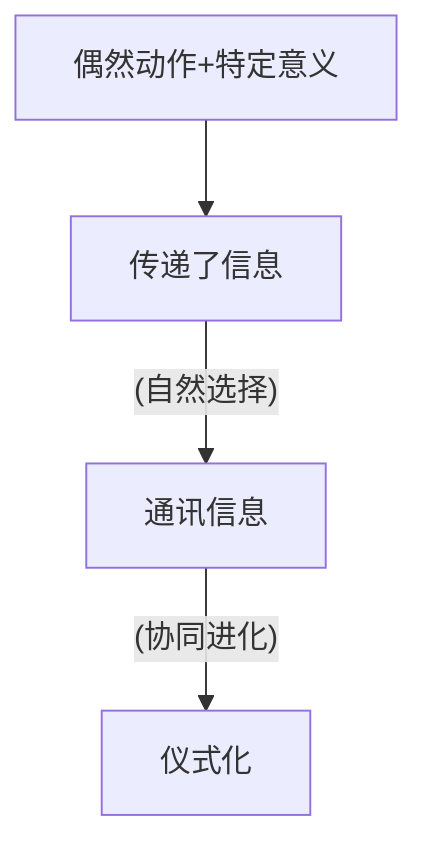

## 形态结构
方向：复杂化、简化
总趋势：复杂性提高，多样性增长
实现途径：
1. 叠加组合（ $\varnothing\rightarrow1$）
2. 渐进式适应进化（$1\rightarrow2$）
3. 旧器官改造（$2\rightarrow a$）
## 功能进化
方式：
1. 功能强化：细胞与组织功能强化、器官功能强化
2. 功能扩大
3. 功能更替
实例
1. 代谢途径进化
2. 营养方式进化

3. 免疫功能进化
## 行为进化
### 分类
- 先天性行为
- 后天习得行为
### 基本环节
学习
由简单到复杂依次为
1. 习惯化
2. 经典条件反射
3. 操作式条件反射
4. 印记（鸟类）
5. 游戏（哺乳类&鸦科动物）
6. 模仿（鸟类&哺乳类）
7. 情绪感应（鸟类&哺乳类）
8. 悟性学习&判断&推理
	1. 绕道问题
	2. 原则学习
	3. 符号化过程
### 行为准则
1. 公正感
2. 平等感
3. 领域感
4. 奖励与惩罚
### 通讯行为
分类
1. 化学通讯：信息素
>异种信息素：针对其他物种
>超动信息素&引物信息素：行为变化很久以后才开始 
2. 机械通讯（触觉、听觉）
3. 辐射通讯（视觉）
	1. 蜜蜂的八字舞![[生物表型进化 2024-04-12 18.58.22.excalidraw]]
	2. 萤火虫发光
起源：

