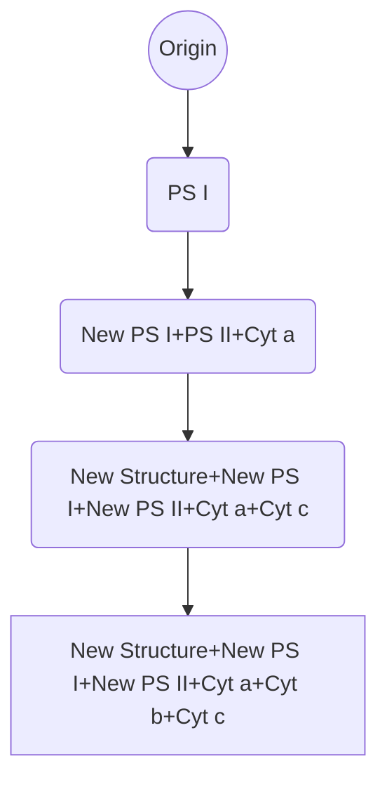

## 形态结构
方向：复杂化、简化
总趋势：复杂性提高，多样性增长
实现途径：
1. 叠加组合（ $\varnothing\rightarrow1$）
2. 渐进式适应进化（$1\rightarrow2$）
3. 旧器官改造（$2\rightarrow a$）
## 功能进化

```mermaid
graph
a((Origin))-->b(PS I)-->c(New PS I+PS II+Cyt a)-->d(New Structure+New PS I+New PS II+Cyt a+Cyt c)-->e[New Structure+New PS I+New PS II+Cyt a+Cyt b+Cyt c]
```
