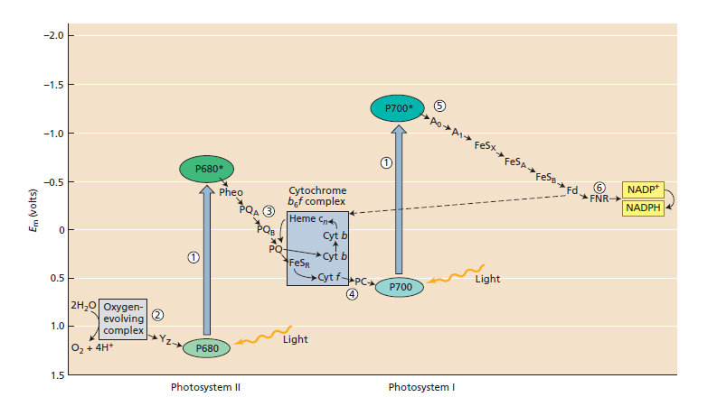

# 大联考2考后知识点总结

## 一、微观部分

- 与整联蛋白相互作用的主要包括黏附分子、层粘连蛋白、纤连蛋白、胶原蛋白等，==但不包括微丝、微管、中间丝==

- 线粒体上存在[**线粒体钙单向转运蛋白**](https://zhuanlan.zhihu.com/p/142679507)，可调节$[Ca^{2+}]$

- CAR-T??

- 温和噬菌体：

  ```mermaid
  graph LR
  侵入-->整合
  整合-->特定条件下使宿主裂解
  ```

- 抗毒素：中和外毒素作用

  类毒素：外毒素经变性处理后==脱去毒性==、==保留免疫原性==的物质

  被动免疫：机体==被动接受==外来抗体

##   二、动植物、动植物生理

- 
- 山楂刺为**茎刺**
- 蚜虫为**半翅目**（半翅目蚜总科）
- 水螅==无水母型==，相应的，以海月水母为代表的钵水母==水母型、水螅型==均有（**即世代交替**）
- to be continue

## 三、动物行为学、生态学

- to be continue

## 四、遗传、进化、生物系统

- | 附加体         | 胞质体         |
  | -------------- | -------------- |
  | 常与染色体结合 | 不与染色体结合 |

- A-20-B-30-C   a++/+bc

- 20%干涉 abc/abc杂交 abc/+bc

- 1-20%\*(1-30%)-30%\*(1-20%)-20%\*30%\*(1-20%)