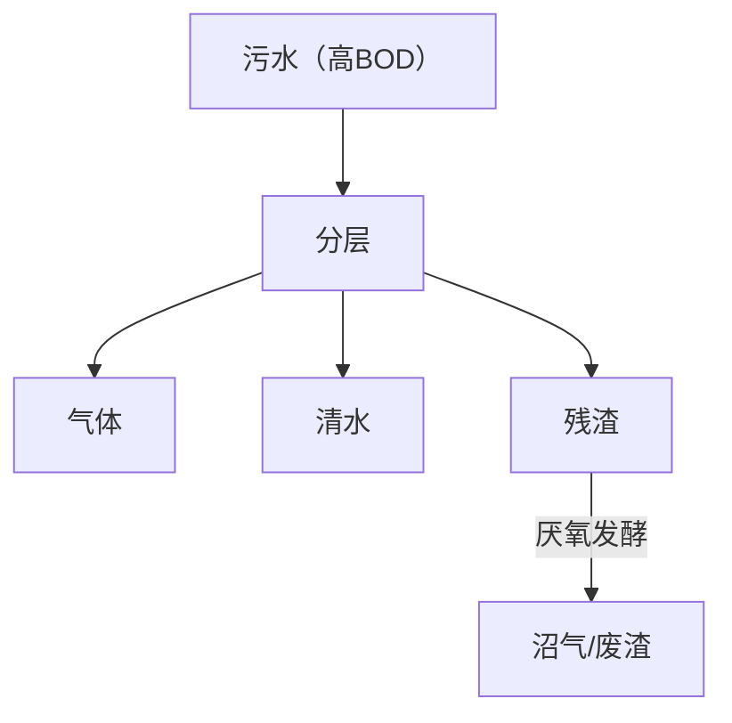

# 微观
## 生物发光
$$
\ce{FMNH2 + O2 +RCHO->[荧光素酶]FMN +RCOOH +H2O +光}
$$

可用于检测环境质量，在有毒有害物质存在时，细胞活性下降，发光强度下降

## 污水处理

- BOD：生物需氧量，微生物氧化分解 1 升水中一部分易氧化有机物时所消耗的溶氧量，常用 BOD5，即 5 日需氧量
- COD~~（使命召唤）~~：化学需氧量，强氧化剂氧化耗氧量，只能处理 80%~100%
- TOD：总需氧量，高温下燃烧需氧量
- DO：溶解氧量，天然水一般 $\pu{5\sim10mg/L}$ 
- **完全混合曝气法**：aka 表面加速曝气法，使用活性污泥处理，在曝气池内不断搅拌，行有氧发酵，另有沉淀池收集污泥团，再行厌氧消化
- **厌氧污泥消化器**：无氧条件下处理高浓度（BOD5>2000）污水，aka**沼气发酵罐**，从上至下分层为浮渣层、清液层、活性污泥层、稳定态污泥层