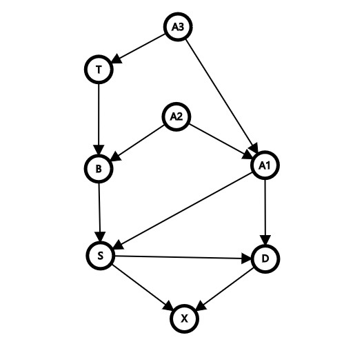
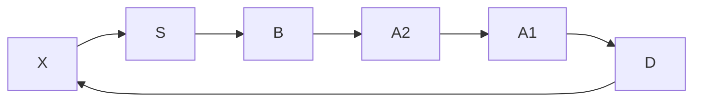
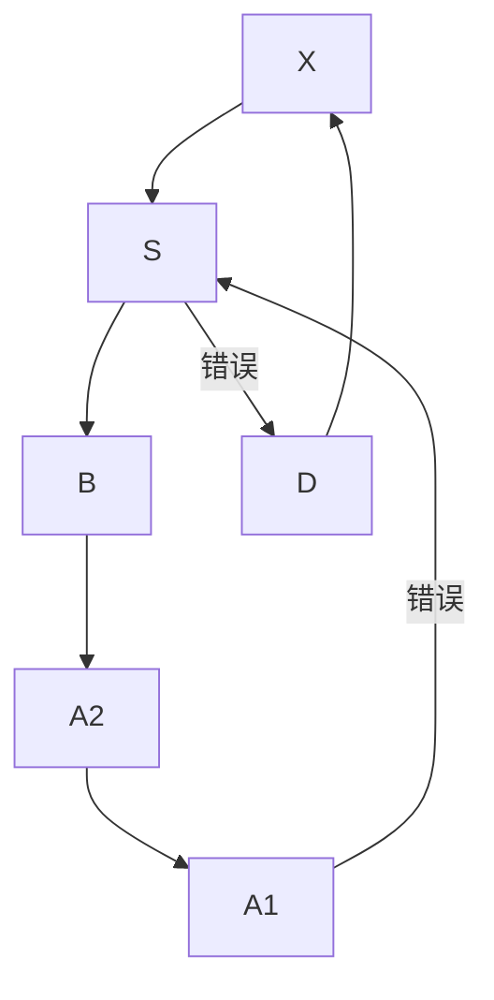

# 遗传笔记

## 计数原理

分类加法$P(A+B)=P(A)+P(B)\\A、B互斥$ 如红花和白花、分步乘法$P(A\times B)=P(A)\times P(B) \\A、B独立$如白花、圆粒
$$
如果存在n对互补基因，则隐形纯和的概率为\\
\lim_{n\rightarrow\infin}[1-(\frac{3}4{})^n]=1
$$


## 组合数

$$
从n个元素里取m个\\
C_n^m=\dfrac{n!}{m!\times(n!-m!)}\\
易知\\
C_n^m=C_n^{n-m}\\
C_n^0=C_n^n=1\ \ C_n^1=n
$$

在配子计算中的运用（以$AAaa$为例）
$$
Aa:选一个A、再选一个a，即C_2^1\times C_2^1=4\\
以此类推\\
aa:C_2^2=1\\
AA:C_2^2=1
$$
对于染色体易位，一般只对妇女考虑，因为精子不易传递染色体易位

## 二项式定理

$$
F_1代分离比:\\
3:1\\
\downarrow\\
(1:2):1\\
\downarrow\\
符合二项式分布
$$

在遗传学中常用二项式定理来计算，因为常出现一对相对性状，刚好满足二项式应用条件
$$
(a+b)^n=\sum_{m=0}^{n}C_n^m\times a^{n-m}\times b^m\\
a^{n-m}\times b^m:抽中该组合的概率\\
C_n^m:该组合可能的排列数
$$
二项式存在对称性、符合二项式定理的分布称作二项式分布

当$n\rightarrow\infin$时，二项式分布趋近于正态分布

在遗传中，可以用类似方式将其推广到三项或更多项

## 积事件

$$
P(A*B)=P(a)\times P(B)\\
$$
## 条件概率

$$
如果A、B存在交集、则\\
P(A*B)=P(A)\times P(B/A)=P(B)\times P(A/B) B/A:A条件下B的概率\\
变形可得\\
P(B/A)=\dfrac{P(B)\times P(A/B)}{P(A)}\\
由Venn图(自己画吧)可得\\
P(A)=P(B)\times P(A/B)+P(\overline B)\times P(A/\overline B) \overline B:非B事件的概率\\
代入可得\\
P(B/A)=\dfrac{P(B)\times P(A/B)}{P(B)\times P(A/B)+P(\overline B)\times P(A/\overline B)}\\
$$

对于近交计算，可以从隐性基因的流动来考虑（梦回图论）

## 种群进化与遗传平衡

- AD:常染色体显性
- AR:常染色体隐性
- XD:性染色体显性
- XR:性染色体隐性
- 对于一种群随机交配

$$
P:pP1+qP2\\
\downarrow\\
F1:p^2P1\times P1:2pqP1\times P2:q^2P2\times P2
$$
- 狭义遗传平衡:基因频率不变,基因型频率不变

### 验证是否为平衡群体

$$
\begin{split}H^2&=(2pq)^2=4p^2q^2\\
&=4DR\\
\therefore&验证该式即可
\end{split}
$$
### 求杂合子最大比例

$$
H=2pq=2\times(1-q)q=2q-2q^2\\
求导(y=x^a \rightarrow y'=ax^{a-1})\\
H'=2-4q\\
令H'=0,则q=\dfrac{1}{2}\\\\
H\times H=2pq\times2pq=4p^2q^2\\
D\times R=p^2\times q^2\times2=2p^2q^2=\dfrac{H\times H}{2}
$$
### 与性别相关的基因频率

$$
设一隐性基因X^-在男性群体中频率为p,女性中为q\\
P表型:男\ p(X^-Y)\ 女\ q^2(X^-X^-)\\
F_1基因型:男\ q\ 女\ \dfrac{p+q}{2}\\(来自男方的配子有p为X^-,来自女方的配子有q为X^-)
$$
### 选择平衡

条件:

- 随机交配
- 无选择
- 无突变
- 大种群
- 无迁入迁出

相对存活率$w=\dfrac{绝对存活率}{绝对存活率最大值}$

死去的即为被选择掉的,所以定义选择系数$s=1-w$

#### $S_{aa}=0$

|       | AA      | Aa        | aa      | sum       |
| ----- | ------- | --------- | ------- | --------- |
| 初始  | $p_0^2$ | $2p_0q_0$ | $q_0^2$ | 1         |
| 1代后 | $p_0^2$ | $2p_0q_0$ | 0       | $1-q_0^2$ |

$$
\therefore q_1=\dfrac{p_0q_0}{1-q_0^2}=\dfrac{p_0q_0}{(1-q_0)(1+q_0)}=\dfrac{q_0}{1+q_0}\\

q_2=\dfrac{q_1}{1+q_1}=\dfrac{\dfrac{q_0}{1+q_0}}{1+\dfrac{q_0}{1+q_0}}=\dfrac{q_0}{1+2q_0}\\
\vdots\\
q_n=\dfrac{q_0}{1+nq_0}
$$

#### $S_{aa}=t,S_{Aa}=s$

|       | AA           | Aa        | aa           | sum               |
| ----- | ------------ | --------- | ------------ | ----------------- |
| 初始  | $p_0^2$      | $2p_0q_0$ | $q_0^2$      | 1                 |
| 1代后 | $(1-s)p_0^2$ | $2p_0q_0$ | $(1-t)q_0^2$ | $1-sp_0^2-tq_0^2$ |

$$
若为平衡遗传\\
\therefore q_1=\dfrac{(1-t)q_o^2+p_0q_0}{1-sp_0^2-tq_0^2}=q_0
\\
易得\begin{cases}
q_0=\dfrac{s}{s+t}\\p_0=\dfrac{t}{s+t}\end{cases}
$$

### 突变

$$
A\xrightarrow u a\\
a\xrightarrow v A\\
p_1=p+vq-up\\
平衡时:q=up=u(1-q)\\
易得\begin{cases}{q=\dfrac{u}{u+v}\\
p=\dfrac{v}{u+v}}\end{cases}
$$

#### 选择-突变平衡

$$
A(群体中频率为p)\xrightarrow{突变u}a(群体中频率为q)\xrightarrow{选择系数s}淘汰\\
平衡状态下:\\
up=sq^2\\
当p\rightarrow 1时,u=sq^2
$$

#####  存在从性现象

以男性为例
$$
3X^+(群体中频率为p)\xrightarrow{突变u}X^-(群体中频率为q)\xrightarrow{选择系数s}淘汰
\\只考虑男性,所以每三个突变(XX+XY)中只有一个有意义\\
平衡状态下:\\
3up=sq\\
当p\rightarrow 1时,3u=sq
$$

##### 存在非随机交配

$$
固定指数:F=\dfrac{H_e-H_o}{H_e}\rightarrow近交系数\\
H_e:期望值,即2pq\\
H_o:实际上的H\\
变形,得H_o=(1-F)H_e\\
对于自交,F=\dfrac{1}{2},H_{o_n}={\dfrac{1}{2^n}}\\
F>0,杂合性下降; 连续自交时\\
$$
### 迁入迁出

$$
设种群1\set{A:p_1,a:q_1},种群2\set{A:p_2,a:q_2}\\
混合后的种群3\set{A:p_1+p_2,a:q_1+q_2}\\
假如种群1,种群2均为平衡种群,则\\
种群1=\set{AA:p_1^2,Aa:2p_1q_1,aa:q_1^2}\\
种群2=\set{AA:p_2^2,Aa:2p_2q_2,aa:q_2^2}\\
种群3=\set{AA:\dfrac{p_1^2+p_2^2}{2},Aa:p_1q_1+p_2q_2,aa:\dfrac{q_1^2+q_2^2}2}\\
种群3中Aa期望值为(p_1+p_2)\times(q_1+q_2)=p_1q_1+p_2q_2+p_1q_2+p_2q_1\\
显然,期望值大于实际值
$$


### 小种群中遗传漂变

(搞不懂公式怎么来的)

易见,群体越小,遗传漂变越严重

当$N$保持不变时,类比逻辑斯谛方程,令$F=(1-\dfrac{1}{kN})$

$F$同时反映了近交系数,所以有最大值$\dfrac12$

显然,此时$N=1$,所以解得$k=2$

再设$t$为世代数,易得公式$H_t=(1-\dfrac{1}{2N})^tH$

## 近交系数



近交环：由当前代从父方回溯到共同祖先再从母方递推回来的环，==每个节点只可出现一次==

这是一个正确的近交环



这是一个错误的近交环(其中S出现了两次)



假设节点`X`的所有近交环的集合为$L$,则
$$
F_X=(1+F_S)\sum_i^N{{(\dfrac12)}^{node(L_i)-1}}\\
次数即为环上除X外节点的数\\
F_S为该环上公共祖先的近交系数,若不是近交后代,则为0
$$

## 数量遗传

$$
\sigma^2=\dfrac{(X_i-\mu)^2}n\\
\mu:期望平均值\\
\sigma^2:标准差\\
S^2=\dfrac{(X_i-\overline X)^2}{df}\\
S^2:方差\\
此时df=n-1(自由度)\\
\overline X:实际平均值
$$

$V_E$:环境方差

$V_G$:遗传方差

$H^2$:广义遗传力
$$
H^2=\dfrac{V_G}{V_G+V_E}\times100\%
$$
均值回归理论:数量性状在偏离平均值时会逐代逐渐回归平均值
$$
\mu=100\\
M\ F\\
110\ 120\\
\downarrow\\
F1:106\\
\vdots\\
Fn\rightarrow100
$$
$V_A$加性方差

$V_D$:显性方差

$V_I$:互作方差

$V_G=V_A+V_D+V_I$
$$
理论上Aa的数量性状\\
O=Aa=\dfrac{AA+aa}{2}\\
实际上会出现偏差\\
d=Aa'-O\\\
d>0,显性方差\\
d<0,隐形方差\\
同时,可计算出一个显性基因的作用效果\\
a=\dfrac{AA-aa}2
$$

$$
对S^2化简\\
S^2=\dfrac{(X_i-\overline X)^2}{df}\\
\because
样本够大\\
\therefore df\rightarrow n\\
\begin{split}
S^2&=\dfrac{\sum_{i=1}^n(X_i^2-2\overline XX_i+\overline X^2)}{n}\\
&=\dfrac{\sum_{i=1}^nX_i^2-2\overline X\sum_{i=1}^nX_i+n\overline X^2}{n}\\
&=\dfrac{\sum_{i=1}^nX_i^2-2n\overline X^2+n\overline X^2}{n}\\
&=\dfrac{\sum_{i=1}^nX_i^2-n\overline X^2}{n}\\
&=\dfrac{\sum_{i=1}^nX_i^2-n\overline X^2}{n}\\
&=\dfrac{\sum_{i=1}^nX_i^2-\dfrac{(\sum_{i=1}^nX_i)^2}{n}}{n}\\
当n=1时\\
S^2&=\sum_{i=1}^nX_i^2-(\sum_{i=1}^nX_i)^2\\
\end{split}
$$

| $F_2$ | $f$        | $X_i$ | $fX_i$      | $fX_i^2$      |
| ----- | ---------- | ----- | ----------- | ------------- |
| AA    | $\dfrac14$ | $a$   | $\dfrac14a$ | $\dfrac14a^2$ |


## 基因连锁与交换

重组率:
$$
R_f=\dfrac{重组配子}{总配子}\\
R_f反映了两个连锁基因在染色体上的距离,距离越大,重组值越大\\
\therefore将1\%的R_f设作一遗传距离,单位为厘摩尔根(cM)
$$
通常情况下两个位点之间只会交换一次,但有的时候会出现双交换,需要通过四分子分析来校正                                                                                                      

## 遗传技术

- DNA内切酶

  - 在DNA内部切割

  - 识别回文序列(既互补又相同)

  - 可切出粘性末端

    

  - 不同内切酶识别的DNA序列不同,但可能切出相同的粘性末端

- 电泳

  - DNA带电因而在电场中可泳动
  - 泳动速率由荷质比决定
  - SDS凝胶可消除DNA电荷差异,使泳动速率只与质量有关

- DNA文库

  - 使用EcoR1酶将

- Sanger测序

  - 又称第一代测序
  - 使用双脱氧核苷酸测序
  - 加入后因3'-OH缺失无法延长
  - 随后电泳
  - 速率很慢,只能测几kb

- 高通量测序

  - 第二代测序
  - 基于PCR,合成大量长度只差1bp的序列
  - 仍使用双脱氧核苷酸,但带上了染料
  - 使用毛细管电泳进行分离并识别

- 第三代测序

  - 序列长度更长,速度更快,可多序列同时进行
  - 最后由机器识别并输出
  - 输出结果为光吸收图
  - 主峰为识别到的核苷酸,杂波为机器自身的干扰,可忽略

- WGS:全基因组测序

  - 鸟枪法:用不同的内切酶随机切割,分别测序,按照重叠的序列进行拼接

- WES:外显子测序

- RNA-seq:转录组测序

- *de novo*:从头测序

- PCR

  - 体外扩增

- 基因打靶

  - 基因敲除(KO)

    - 只需破坏关键外显子(一般为第二个,第三个)

  - 基因进入/敲入

  - 基因替代

  - 原理:

    1. 基于同源重组/位点特异性重组
       - 位点特异性重组不需要同源
    2. 基因转座
    3. RNA干扰(RNAi)

  - 分类:

    - 完全KO:==一般不活==

    - 条件性敲除:==特定时空条件==

      - Cre/Loxp系统

        - Cre重组酶
          - 单体酶
          - 效率高达$70\%$
          - 可通过任意启动子转录
          - ==位点特异性==:识别Loxp序列切割
        - Loxp序列
          - 反向重复序列+$8bp$特定序列==定方向==(作图带上箭头)
        - 实现条件性:特定启动子+Loxp序列插入特定位点

      - Flp/FRT系统

        - 来自原核生物,进化上与Cre/Loxp系统同源

        - Flp酶+FRT序列

        - FRT序列构成:
          $$
          \xRightarrow{c}\xRightarrow{b}\cdots\xLeftarrow{a}\\
          方向由中间序列确定,实际使用中可删除c序列
          $$

    - 诱导性敲除:==完全可控== (未完成)

      - 不再直接失活基因,而是关闭基因产物激活,相关基因
      - Cre/Loxp系统+诱导系统:四环素,他莫昔芬(雌激素类似物)\

    - 转录前水平基因沉默

      - ==CRISPR/Cas9系统==:依靠DNA甲基/乙酰化实现
        - 合成crDNA:引物+重复序列(Cas9识别)
        - dCas9:失去切割能力
        - 表观遗传编辑器==相比直接切割更可靠==
          - dCas9+p300(乙酰化酶)
          - dCas9+KRAB(甲基化酶)
      - AntiRNA:反义RNA
        - 形成双链阻碍转录
      - RNAi
        - siRNA(小干扰RNA)以双链形式进入
        - 被切割成小片段
        - 可形成沉默复合体切割底物,还可==扩增==(效应放大)
        - miRNA也形成沉默复合体,但不与底物完全互补,也不切割底物
        - circRNA:RNA海绵
          - 吸附miRNA,解除其抑制作用
          - 可用于抑癌
            - 癌症研究相关技术
              - 划痕实验:癌组织上划痕,通过观察其恢复速度反映其增殖能力
              - 迁移小室:多孔膜上放置癌细胞,测量其迁移到膜下空间的数量反映迁移能力,增加一层蛋白膜还可反映其侵袭能力

  - 载体

    - T-DNA

    - 转座子(如Ac-Ds转座子)

      - 转座酶切割反向重复序列
      - Ac为自主性转座子
      - Ds为非自主性转座子,其转座酶失活
      - 常用失去反向重复序列的Ac+Ds随机插入
      - 筛选有Ds无Ac的突变体(稳定)

    - HIV-1(慢病毒/逆转录病毒)

    - 噬菌体(温和)==将基因插入宿主拟核==

      - 根瘤农杆菌*vir*基因表达转座酶

      - 具趋化性:乙酰丁香酮阿拉伯糖

      - **VIR**蛋白识别反向重复序列LB,RB并切割

      - 将片段随机导入植物细胞

      - 随后筛选

        - PCR

          - 使用BP+RP做引物,检验是否转录成功

          - | 引物  |  AA  |  Aa  |  aa  |
            | :---: | :--: | :--: | :--: |
            | BP+RP |  -   |  +   |  +   |
            | LP+RP |  +   |  +   |  -   |

            ==插入成功后LP,RP之间距离太长,无法成功合成==

- 基因组编辑

  - 基本原理:找到核酸酶,特异性切割
  - 第一代:ZFN
    - 锌指蛋白(ZFN):识别三个连续碱基对
    - Fok I:仅二聚体有活性
    - 给Fok I接上ZFN
  - 第二代:TALENs
    - TALEN识别一个碱基对
    - 依然给Fok I接上TALEN
  - 第三代:CRISPR/Cas9
  - 切割后修复
    - 同源修复
    - 非同源修复
  - 效率很高,多倍体也可使用
  - 单碱基编辑技术(BE)
    - dCas9+胞嘧啶脱氨酶(C变U,复制/修复后由G-C对变A-T对)\
  - 先导编辑器(PE)
    - dCas9+

- 遗传标记

  - 必备特征:稳定,遗传

  - 酶切探针

    - RFCP:限制酶切片段长度多态性

    - AFLP:在RFCP基础上利用了PCR技术,不再使用探针Southern杂交

    - RAPD:随机引物扩增长度多态性

    - ==SSR(STR)==:简单重复序列

      $固定端-SSR-SSR-SSR-\cdots-SSR-固定端$

      具遗传性

      - 应用:DNA指纹,亲子鉴定
        - 找十几组较稳定的STR基因座,看亲子间是否存在遗传性
      - 相关疾病
        - 亨廷顿舞蹈症:STR重复过多引起

    - SNP:单核苷酸多态性

      - 转换,颠换,插入,缺失
      - 一般插入,缺失很少,且一个点位一般只有一种突变,存在==二态性==
      - 应用:构建进化树
        - 突变速率通常为常值

  - PCR

  - 芯片测序

## 分子遗传

- 结构

- 复制

  - DNA聚合酶

    - 催化特点:只能从5'到3'延长,所以合成时从模板链的3'到5'
    - 具3'-5'水解酶活性,切除引物

  - 转录

    - 需要启动子

    - 内含子剪切

      - 剪切供体+分支位点+剪切受体

      - ```mermaid
        graph LR
        识别剪切供体-->剪断-->与分支位点形成套索结构-->切除剪切受体
        ```
    
    - 突变和损伤修复
    
      - DNA聚合酶存在自我矫正
      - 嘧啶二聚体
        - 原核生物中可拆开
        - 也可直接切除,重新合成

