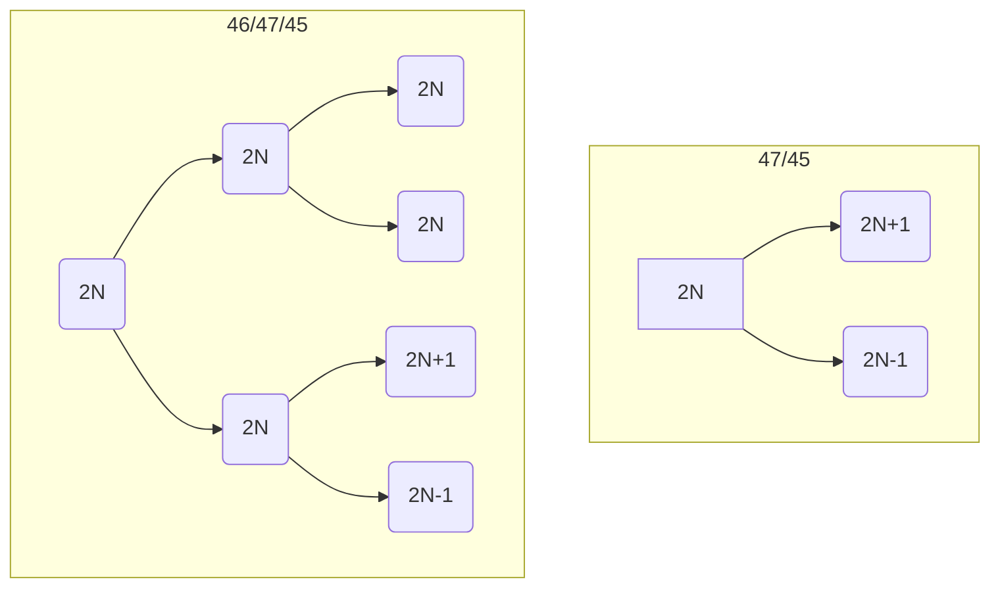

- 基因流：来自不同种群的群体混合
- 胚胎嵌合体：卵裂时出现错误导致同时存在两种或多种核型的细胞系
	- 检验：至少取 50 个分裂相，取出观察或者 `FISH`

- 多线染色体：核内有丝分裂，着丝点不分裂
	- 条带：认为与转录活性有关
	- Y 染色体：固缩在着丝点
	- puff 结构：泡状结构，局部解螺旋
- 双色法染色：`Annexin-V` 染细胞表面 `PS`，`PI` 染核（不能穿膜）
- 染料：
	- 苏木精：染核
- 交叉端化：染色体交叉向端处移行
- 植物受精
	- 精核 (n)+ 卵细胞 (n)-->胚 (2 n)
	- 精核 (n)+2 极核 (n)-->胚乳 (3 n)
	- 染色体计数最佳时间：终变期，后期Ɪ
- 交叉&交换&重组
	- 交叉：细胞学上，形态特征
	- 交换：行为上
		- 如果有丝分裂中出现大量交换，意味着有大问题
	- 重组：遗传学上，是结果
	- 重组率<交换率
- 四倍体 AAaa 减数分裂：AA:Aa:aa=1:4:1
- 甲基化：可降低转录效率（招募不同蛋白，动态改变染色质结构）
	- 甲基化遗传：植物种可将甲基化信息传递给子代，哺乳动物中在受精后会全基因组去甲基化（除了印迹基因）
	- 亲本冲突：父源印迹基因促胚胎生长，母源相反
- 组蛋白修饰：
	- 稳定性：甲基化>乙酰化>磷酸化
	- 乙酰化：多与活化相关
	- 甲基化：与位置有关，可激活可抑制
	- 磷酸化：多基因活化有关
- 印迹中心：
	- 由一个印迹控制元件调控
	- 绝大多数有 `CpG` 岛，能发生 DNA 甲基化
	- `CpG` 岛内或附近有成簇，有向的重复片段
- 表型模拟&表观遗传
	- 表型模拟是通过改变酶的活性来模拟表型，不可遗传
	- 表观遗传是影响基因的表达，可遗传
- 染色体结构变异
	- 重复：扰乱基因的固有平衡体系（eg. 果蝇棒眼），存在位置、剂量效应
		- 缺失：导致拟显性
	- 易位：改变基因连锁关系
		- 易位杂合子：形成十字交叉 -->八字环 -->交替式分离（可育）/相邻式分离（不可育）-->总体来说半不育
		- 费城染色体：9q 和 22q 发生易位，产生新基因（BCR+AML-->BCR-AML，对细胞周期调控有影响） -->慢性粒细胞性白血病（CML）
			- 治疗：格列卫 -->结合 BCR-AML 酪氨酸激酶的 ATP 结合位点，抑制其活性
		- 花斑型位置效应：1 号染色体的红眼基因从常染色质区易位到异染色质区
	- 倒位：
		- 倒位环：在片段长度适中时出现 -->染色体桥
			- 交换抑制：
	- 并联 X 染色体：果蝇中 X 染色体并联在一起，形成一条双臂染色体