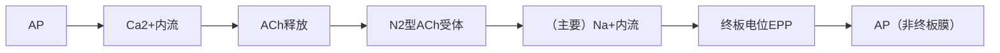
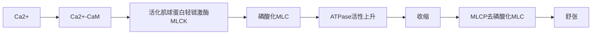

## 电活动
### 静息电位

以细胞外液为零电势点，内部电位约为 $-70\mathrm{mV}$

#### 形成

|     | inside | outside | $[X]_{o}/[X]_{i}$ | 平衡电位 |
| --- | ------ | ------- | ----------------- | ---- |
| 钠   | 145    | 12      | 12                | +67  |
| 钾   | 4      | 155     | 0.026             | -98  |
| 氯   | 120    | 4       | 30                | -90  |

Nernst 公式

$$
E_{X}=\frac{RT}{ZF}\ln \frac{[X]_{o}}{[X]_{i}}
$$

近似 ($29.2\degree C$ ，正 1 价，$37\degree C$ 时系数为 $61.5$)

$$
E_{X}=60\lg \frac{[X]_{o}}{[X]_{i}}
$$

通常情况下，细胞对钾和钠的通透性最大，因此

$$
E_m=\frac{G_{K}}{G_{K}+G_{Na}}E_{K} + \frac{G_{Na}}{G_{K}+G_{Na}}E_{Na}
$$
#### 生电作用

$\mathrm{Na^+}$ - $\mathrm{K^+}$ 泵 -->净移入一个负电荷 -->电位负值增大

### 动作电位
#### 特点
1. 全或无
2. 不衰减
3. 脉冲式发放
#### 产生机制

（整个过程中浓度几乎不变，但由于离子会形成电偶层，因此膜电位会大幅改变）

- `TTX`（河豚毒素）阻断钠通道 -->内向消失
- `TEA`（四乙铵）阻断钾通道 -->外向消失
1. 升支：去极化到一定程度后，$\mathrm{Na^+}$ 通道激活 --> $\mathrm{Na^+}$ 内流 -->正反馈
2. 降支：**$\mathrm{Na^+}$ 通道失活**（失活门关，激活门开）$\mathrm{K^+}$ 通道激活 --> $\mathrm{K^+}$ 内流
3. 复极化 --> $\mathrm{Na^+}$ 通道复活（失活门开，激活门关），钠钾泵工作 -->电位恢复
#### 引发

阈强度：引发 `AP` 最小刺激强度

阈刺激：**相当于**阈强度的刺激

阈电位：使 $\mathrm{Na^+}$ 内流进入正反馈的最小电位（影响因素：钠通道分布，活性，$\mathrm{Ca^{2+}}$ 浓度=>低钙惊厥）

#### 传播

局部电流学说（有髓神经纤维 -->跳跃式传导）

细胞间：连接蛋白（connexin）六聚体；高 $\mathrm{Ca^{2+}}$ ，低 $\mathrm{pH}$ 时可关闭 -->防扩散

### 兴奋性

细胞接受刺激后产生动作电位的能力

#### 变化
- 绝对不应期：对应锋电位，多数钠钙通道已激活，随后失活
- 相对不应期：兴奋性逐渐恢复，但复活的通道数量较少，阈值高
- 超常期：基本复活，膜电位离阈电位较低
- 低常期：完全复活，轻度超极化
### 电紧张电位&局部电位
#### 被动电学特性

作为**静态的**电学元件时的表现

##### 膜电容

约 $1\mathrm{\mu F/cm^{2}}$ -->由计算可知，形成膜电位所需离子移动量不足万分之一

##### 膜电阻

纯脂质双层：$10^6\sim10^9\Omega$

生物膜：$10^3\Omega$

##### 轴向电阻

沿细胞长轴存在的电阻

### 电紧张电位

仅有被动电学特性决定，注入矩形波脉冲电流形成

#### 空间常数

衰减至最大值 $1/e$ 时的空间距离=> $\lambda$ ，通常介于 $0.1\mathrm{mm}$ 至 $1\mathrm{mm}$ 之间

#### 时间常数

![[时间常数.excalidraw]]

充电至最大值 $1- 1/e$ 时的时间或放电至最大值 $1/e$ ==> $\tau$

#### 极性

膜内注射负电荷 -->吸引正电荷 -->去极化

膜内注射正电荷 -->吸引负电荷 -->超极化

#### 特征
1. 等级性电位
2. 衰减性传导
3. 电位可融合
### 局部电位

部分离子通道参与的，不能远距离传播的电位 ->aka. 局部兴奋；可由去极化电紧张电位诱导

#### 特征
1. 等级性电位
2. 衰减性传导
3. 没有不应期，可通过空间总和/时间总和叠加达到阈值 -->AP

## 肌肉收缩
### 骨骼肌神经 - 肌接头

接头前膜：`ACh` 释放具有 $\mathrm{Ca^{2+}}$ 依赖性；量子释放

微终板电位 `MEPP`：随机运动导致单个囊泡自发释放引起，约每秒一次，平均幅度 $0.4\mathrm{mV}$

强直后增强：强直刺激后 `EPP` 持续增大数分钟

#### 影响
- 筒箭毒碱/α- 银环蛇毒：阻断 N2 型 `ACh` 受体 -->松弛
- 自身抗体破坏 -->重症肌无力
- 新斯的明：抑制乙酰胆碱酯酶 -->改善肌无力
- 有机磷：使胆碱酯酶被磷酸化 -->中毒
### 横纹肌细胞
#### 肌节

![[肌节.png]]

#### 肌管系统

横管：aka. T 管 -->由横纹肌细胞膜内陷形成 -->与肌原纤维垂直（钙通道：二氢吡啶受体）

纵管：aka. L 管=肌质网 `SR` =纵行肌质网 `LSR`（大量钙泵） + 终池/连接肌质网 `JSR`（心肌：二联管；骨骼肌：三联管；大量 `RYR`）

#### 收缩：肌丝滑行理论

![[肌丝滑行理论]]

tropomyosin：原肌球蛋白

Troponin：肌钙蛋白= `TnT`（结合 `tropomyosin`） + `TnI`（结合 `actin`） + `TnC`（结合 4 个 $\mathrm{Ca^{2+}}$）

#### 兴奋收缩耦联
1. 动作电位沿 T 管传导
2. `JSR` 释放 $\mathrm{Ca^{2+}}$（骨骼肌：构象变化诱导触发钙释放；心肌：钙诱导钙释放 `CICR`）
3. 肌丝滑行
4. `LSR` 回收 $\mathrm{Ca^{2+}}$ --> `JSR`
#### 收缩
1. 等长收缩：张力变化，长度不变
2. 等张收缩：张力不变，长度变化
3. 伸长收缩：拉肌肉的力超过了张力，肌肉被拉长

#### 负荷

前负荷：收缩前遇到的阻力 -->决定初长度 -->粗肌丝与细肌丝完全重合时张力最大 ^2c4a50

后负荷：收缩时遇到的阻力 -->反映张力大小

#### 张力 - 速度曲线

![[Pasted image 20241128162559.png]]

`Vmax` -->等张收缩

`Fmax` -->等长收缩

#### 收缩能力

内在特性，与负荷无关

#### 收缩总和

非全或无式，可以叠加

1. 多纤维总和：aka. 多运动单位总和（大小原则：收缩时先小后大，舒张时先大后小）
2. 单收缩：潜伏期 $10 \mathrm{ms}$ + 收缩期 $50\mathrm{ms}$ + 舒张期 $60\mathrm{ms}$
3. 强直收缩：单收缩叠加
	1. 不完全：叠加在上一次收缩舒张期（少，e.g.肌紧张）
	2. 完全：叠加在上一次收缩收缩期（**主要**）
### 平滑肌
#### 分类
- 内脏平滑肌：有类似心肌的闰盘 -->功能合胞体样活动，有少数**起搏细胞**-->自律性（自主神经调节兴奋性、收缩强度/频率）
- 多单位平滑肌：睫状肌，虹膜肌，竖毛肌，气管和大血管的平滑肌 -->没有自律性 -->受自主神经控制（收缩）
#### 结构
- 无 Z 盘 -->致密体/斑替代 -->中间丝相互连接
- 细胞间连接：致密带 -->机械连接；缝隙连接 -->电耦联
- 无 T 管 -->纵向走行带状凹入 -->收缩缓慢（也因为 $\mathrm{Ca^{2+}}$ 回收慢）
- `SR` 不发达，除 `RYR` 还有 ` IP3R `
#### 活动
- `RP` 低于横纹肌 --> $\mathrm{Na^+}$ 通透性较高
- `RP` 不稳定 -->形成慢波
- 动作电位诱发：肠道/输精管 --> $\mathrm{Ca^{2+}}$ 内流；膀胱/输尿管 --> $\mathrm{Na^+}$ 内流
#### 收缩
##### 触发
- 电 - 机械耦联：`AP` -->兴奋 - 收缩耦联（多数 $\mathrm{Ca^{2+}}$ 来自胞外）
- 药物 - 机械耦联：药物/信号分子 -->GPCR-PLC-IP3 通路 --> `IP3R` --> $\mathrm{Ca^{2+}}$ 释放
##### 滑行

