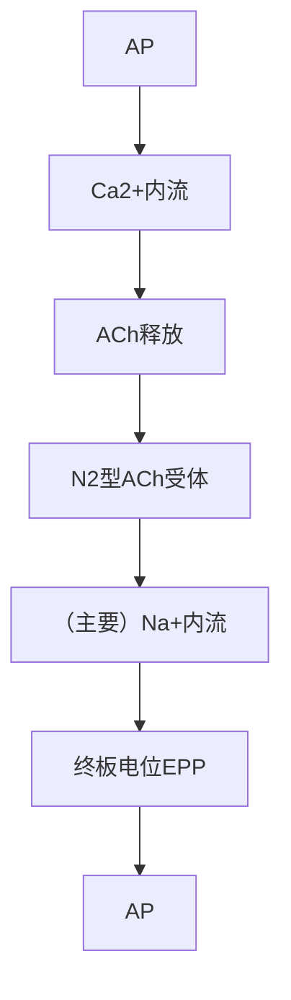
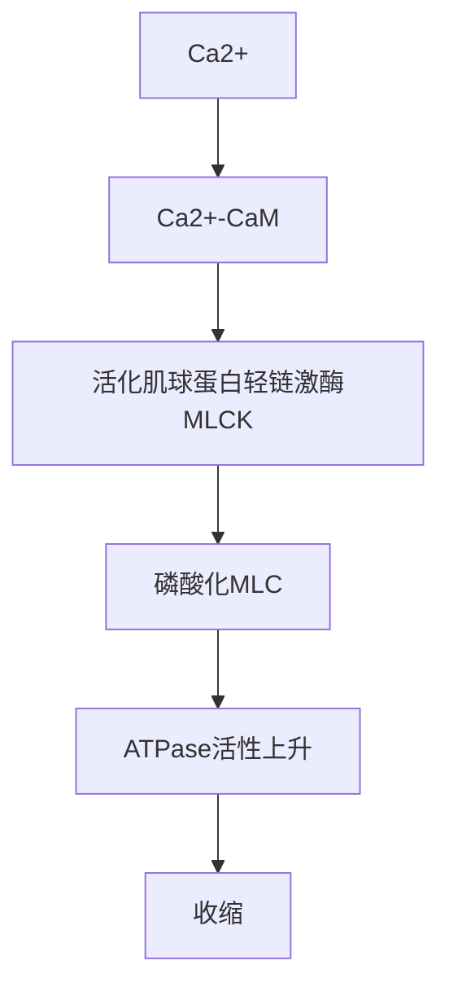

## 肌肉收缩
### 终板膜

```mermaid
flowchart
A[AP]-->G["Ca2+内流"]-->B["ACh释放"]-->C["N2型ACh受体"]-->D["（主要）Na+内流"]-->E["终板电位EPP"]-->F[AP]
```

### 平滑肌

```mermaid
graph
Ca2+-->Ca2+-CaM-->活化肌球蛋白轻链激酶MLCK-->磷酸化MLC-->ATPase活性上升-->收缩
```
