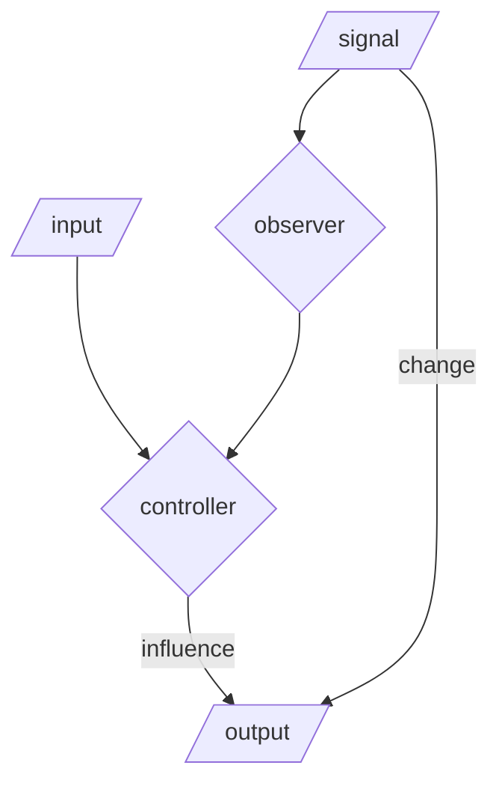
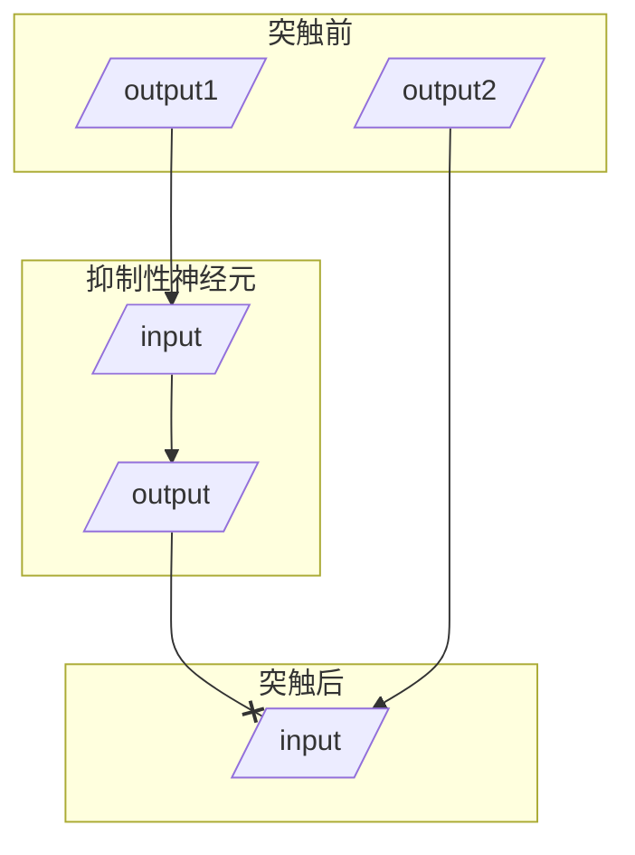
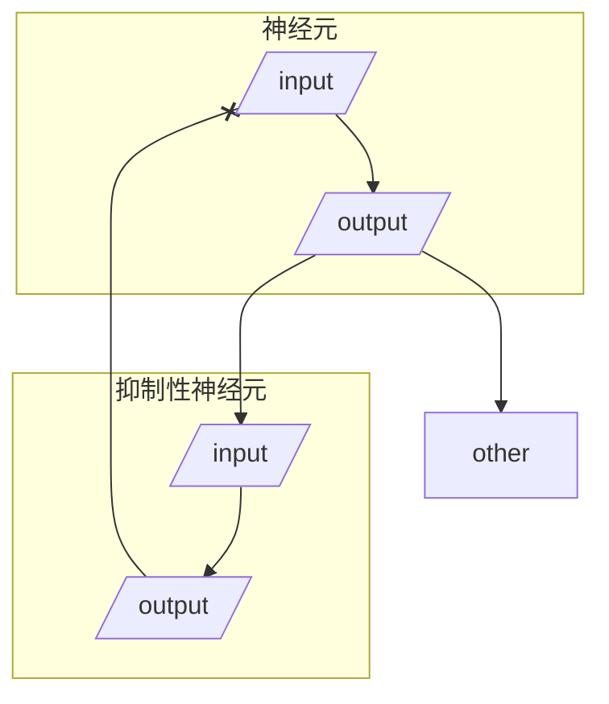

调节 -->保证细胞内液的稳定

前馈



>[!faq] 生物节律
>分类：
>- 低频
>- 中频
>- 高频
>
>主要中枢：下丘脑视交叉上核
>意义：使生物对环境==变化==做更好的前瞻性适应

多糖是携带信息最多的物质<-- 可变性最高

>[!faq] Na+/K+-ATPase
> 2 K+ in, 3 Na+ out （==你怎么还没记住==）
> 磷酸化（E1 态）：结合 Na+
> 去磷酸化（E2 态）：结合 K+

>[!faq] 离子水平
>胞质中 Ca2+ 非常低，约为胞外的万分之一
>胞质中 K+ 浓度高
>
>>[!example]- 一个小小的补充
>>在地震时如果腿被长时间压住，一定不要直接挪开障碍物，要先绑上
>>细胞破裂 -->K+ 释放 -->高血钾 -->心脏骤停

甲状腺滤泡细胞聚碘是继发性主动运输

遗传信息横向传递：通过病毒

促代谢性受体多为 GPCR

细胞外基质存在凝胶态和熔胶态两种形式，熔胶态流动性更强，更有助于代谢

>[!faq] 树突？轴突？
>树突短且分枝多，轴突长且分枝少
>轴突只负责传出
>髓鞘不止在轴突上有，==某些树突上也有==

>[!info] 损伤电位
>![[玛卡巴卡 2024-08-03 10.44.35.excalidraw]]

>[!faq] 静息电位
>原因：细胞内外钠钾分布不均
>大小：约等于 K 的平衡电位，RBC $-10 \mathrm{mV}$，平滑肌 $-55 \mathrm{mV}$，神经 $-70\mathrm{mV}$，骨骼肌&心肌 $-90\mathrm{mV}$

>[!info] 坐骨神经腓肠肌标本
>![[玛卡巴卡 2024-08-03 11.04.02.excalidraw]]

电刺激使用方波最有效

>[!info] 概念辨析
>刺激：能引起机体细胞、组织、器官或整体的活动状态发生变化的任何环境==变化==因子
>反应：由 刺激引起的改变
>兴奋：接受刺激产生动作电位的过程
>刺激参数，强度，持续时间，强度随时间的变化
>阈强度：==时间和强度不变时==，引起组织兴奋的最小刺激强度
>阈刺激：刚好引起组织兴奋的有效刺激

>[!faq] 强度 - 时间曲线
>基强度（图中的 R）：在时间无限长 ($30\mathrm{ms}$) 的情况下，使组织兴奋的最小刺激强度
>时值（图中的 C）：在两倍基强度的情况下刚能引起组织兴奋的最短时间


阈刺激和阈上刺激==一定==能够产生 AP

>[!info] 刺激的极性法则
>通电时，阴极兴奋，断电时阳极兴奋

绝对不应期：锋电位

相对不应期：负后电位前半程

超长期：负后电位后半程

阈下总和：分为时间总和和空间总和

电紧张：通电时或断电后组织兴奋性发生改变

>[!faq] 神经干的复合动作电位
>阈值：兴奋性最高的神经纤维的阈值（一根兴奋，全部兴奋）
>最大刺激：使所有纤维都兴奋的刺激入场
>最大锋电位：所有纤维都兴奋的最大综合电位

>[!info] 神经肌肉接头
>特征：单向传递；突触延搁；高度敏感（易受药物，理化因素影响）；易疲劳（递质有限）
>终板膜：N2 型受体
>抑制：
>- 受体抑制剂：箭毒
>- 胆碱酯酶抑制剂：新斯的明，毒扁豆碱，有机磷农药
>- 其他 ：α- 银环蛇毒阻断 ACh 门控通道；河豚毒素阻断 Na 通道

>[!info] IPSP&EPSP
>EPSP：递质提高了后膜上受体对 Na，K，Cl 的通透性（==尤其是 Na==），产生局部去极化电位
>IPSP：递质提高了后膜上受体对 K，Cl 的通透性（==尤其是 Cl==），产生局部超极化电位

突触前抑制：一个兴奋性突触对另一个突触的抑制，轴 - 轴突触

突触前易化：在一个突触中发生的，突触前对突触后的兴奋加强作用

突触后抑制

1. 传入侧枝性抑制



2. 回返型抑制



神经调质：

1. 分子量大，含量低
2. 释放后不能重吸收
3. 需要通过第二信使发挥作用
4. 作用缓慢持久
5. 只调节递质的释放量或受体对递质的敏感度，不直接参与信息传递
主要递质类型
1. ACh：有 N 型（烟碱型）和 M 型（毒蕈碱型）受体

| 表格  |     |
| --- | --- |
|     |     |

2. 儿茶酚胺类：多巴胺，肾上腺素，去甲肾上腺素

```smiles
C1(O)C(O)CCC(C(O)C)C1
C1(O)C(O)CCC(C(O)CN)C1
C1(O)C(O)CCC(C(O)CNC)C1
```

>[!todo] 待办
>这里有些东西要整理！

3. 氨基酸类递质
	1. 兴奋性：`Glu`，`Asp`
	2. 抑制性：`GABA`，`Gly`
4. 5- 羟色胺（`5-HT`）

```smiles
C1=CC2=C(C=C1O)C(=CN2)CCN
```

2. 一氧化氮

>[!info] 骨骼肌
> ### 超微结构
> to be continue
> ### 功能解剖
> ### 肌膜系统
> - 横小管
> - 纵小管
> - 终池
> - 钙通道
> 	- 横管膜：DHPR （二氢吡啶受体）
> 	- 终池：非电压门控 Ca 通道（雷诺丁受体）
> - 钙泵
> ### 收缩机制
> Ca2+ 进入 -->结合肌钙蛋白 -->结合位点暴露 -->myosin 结合细肌丝 -->ADP 脱离，位移 -->myosin 结合 ATP，脱离细肌丝 -->ATP 水解
> #### 钙离子
> 从终池中释放，结合肌钙蛋白 TnC 亚基，调节细肌丝（在平滑肌中调节粗肌丝）
> ### 机械特性
> 1. 等长收缩：张力变化，长度不变
> 2. 等张收缩：张力不变，长度变化
> 3. 伸长收缩：拉肌肉的力超过了张力，肌肉被拉长
>
> 单收缩：潜伏期 $10 \mathrm{ms}$ + 收缩期 $50\mathrm{ms}$ + 舒张期 $60\mathrm{ms}$
> 强直收缩：单收缩叠加
> 前负荷：收缩前遇到的阻力 -->决定初长度
> 后负荷：收缩时遇到的阻力

>[!info] 平滑肌
>### 与骨骼肌的不同
>- 粗肌丝浓度仅为骨骼肌的 $\frac{1}{3}$
>- 细肌丝没有肌钙蛋白，但 actin 是骨骼肌 2 倍
>- 肌质网不发达
>### 电活动
>- AP 由 Ca 内流，K 外流引起
>- 单位平滑肌：自发产生 AP
>	- 起搏点电位：自动去极化达到阈电位（Na 进入）
>	- 慢波电位（==Cajal 细胞==）：自动周期性交替去极化和复极化，与 Na 有关
>		- AP 会在慢波电位顶端产生
>### 收缩
>唯一条件：myosin 的磷酸化
>Ca 进入 -->激活肌球蛋白轻链激酶（MLCK）-->磷酸化 myosin
>Ca 调节
>- 肌质网：IP3 通路，作用不大
>- 胞外：门控 Ca 通道
>- 泵出：钙泵，==速度慢==

>[!info] 心肌
> $\text I_f$ 通道 -->节律细胞
>快反应 AP
>
>0. Na 通道开
>1. Na 通道关，K 瞬时外流
>2. K 外流，Ca 内流 -->平台期
>3. K 外流，Ca 关
>4. Na-K 交换，Na-Ca 交换，复位
>Ca 移动
>AP/神经递质 -->L 型通道 -->激活肌质网膜的 Ca 通道（钙诱导钙释放）

>[!info] 神经
>基本模式：整合 -->反射

>[!info] 运动控制
>### 种类
>1. 反射性运动
>2. 随意性运动
>3. 节律性运动
>### 调控模式
> ```mermaid
>graph 
>subgraph 锥体系
>a[基底核] 
>b[脑干]
>end
>subgraph 锥体外系
>c[丘脑]
>d[小脑]
>end
>S[大脑皮层运动区]
>E1[脊髓]-->E2[/骨骼肌/]
>S-->a-->b-->E1
>d-->c-->S
>S-->d
>a<-->c
>b<-->d  
>```
>ɣ运动神经元控制梭内肌 -->收缩能力不强 -->张力变化 -->传入冲动
>核袋纤维：动态ɣ
>核链纤维：静态ɣ
>肌腱：与梭外肌纤维串联，感受张力变化，抑制同一肌肉的α神经元
>单突触反射：
>- 相位牵张反射：快速牵拉形成 eg.膝跳反射
>- 紧张性牵张反射：多由重力引起
>反牵张反射：抑制被牵拉肌肉，激活拮抗肌
>屈肌反射: 多种感受器，引起关节屈肌收缩
>伸肌反射：交互抑制，对侧伸肌反射
>脑干：上下传递，网状结构中存在易化区和抑制区（依赖高级中枢的作用而兴奋）
>去大脑僵直\

---

>[!faq] 感觉器官
>分类
>- 按部位
>	- 表面感受器
>	- 深感受器
>	- 内感受器
>- 按刺激性质
>	- 化学感受器
>	- 痛觉感受器
>	- 温度感受器
>	- 机械感受器
>	- 光感受器
>换能：感受器电位变化 -->感受器电位（一种分级电位）-->转换为神经细胞 AP 频率
>适应：刺激的持续会导致 AP 频率的下降
>精度：由感受器密度和感受野大小决定
>视觉
>眼
>结构
>- 眼球壁
>	- 巩膜
>	- 脉络膜（有孔 -->瞳孔 -->虹膜 + 睫状肌）
>	- 视网膜（没有血管）
>- 折光体
>	- 角膜
>	- 房水
>	- 晶状体
>	- 玻璃体
>瞳孔
>- 瞳孔括约肌（动眼神经，副交感）
>- 瞳孔开大肌（交感）
>晶状体调节
>模糊 -->视神经 -->中脑顶盖前区 -->动眼神经，副交感 -->睫状神经节换元 -->效应器
>（假性）近视：睫状肌持续紧张 -->痉挛
>（真性）近视：持续假性近视 -->眼轴增长
>老花眼：晶状体弹性下降
>三重反应
>1. 瞳孔缩小
>2. 晶状体变凸
>3. 视轴会合
>青光眼：房水循环受阻/房水生成过多 -->压迫神经 -->逐渐死亡
>治疗： $0.004\%$ 前列腺素
>病理性飞蚊症：主要由高度近视，眼部炎症，视网膜出血导致
>视网膜信息处理

>[!faq] 听觉
>听阈：1000 赫兹时，0 分贝 --> $10\mathrm{W/cm^2}$，取 $\log$ 即为分贝
>人耳在 $1000\mathrm{Hz}-300\mathrm{Hz}$ 时听阈最小
>微音器电位
>耳蜗：低频 -->蜗底，高频 -->蜗顶
>锁相反应：总的神经冲动与声波相位一直
>听神经动作电位
>投射：双侧投射，对侧优势

>[!todo] 特异性免疫
>T 细胞的发育
>在胸腺表达各种膜蛋白
>1. 三阴性期：CD 4 无，CD 8 无，TCR 无
>2. 双阴性期：表达 TCR