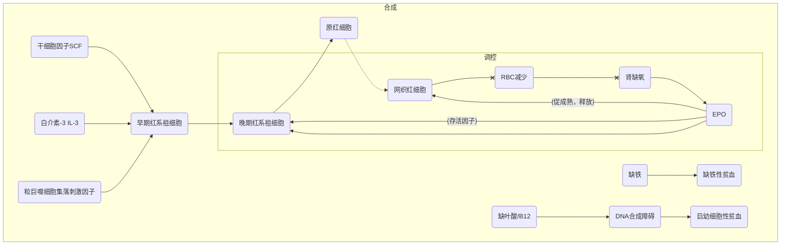
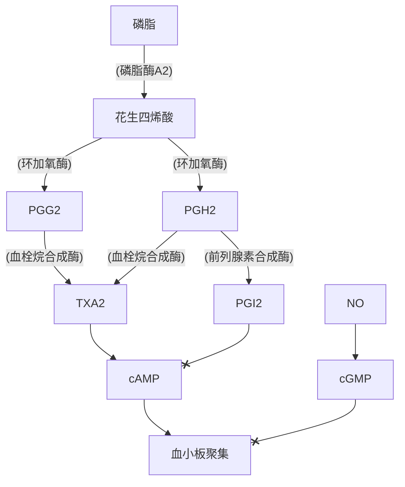
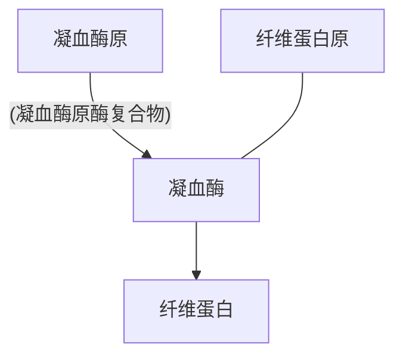

## RBC

## WBC
### 中性粒细胞
血液中主要吞噬细胞
循环池+边缘池
杀菌方式：非氧杀菌、依氧杀菌（==主==）
### 单核细胞
尚未成熟，成熟后为巨噬细胞-->单核吞噬细胞系统
巨噬细胞：更强吞噬能力、呈递抗原
对某些细胞内细菌、真菌、原虫杀伤极为关键
释放各类细胞因子：集落刺激因子、白介素、肿瘤坏死因子、干扰素
组织中可发育为树突状细胞-->抗原呈递
### 嗜酸性粒细胞
数量昼夜波动<--糖皮质激素导致
基本无杀菌作用
拮抗一型超敏反应
参与对蠕虫幼虫的免疫（==成虫无效==）
哮喘中最主要效应细胞
### 嗜碱性粒细胞
释放肝素-->抗凝血
参与变态反应-->一型超敏反应
释放嗜酸性粒细胞趋化因子A-->限制超敏反应
### 淋巴细胞
T细胞：细胞免疫
B细胞：体液免疫
NK细胞：机体固有免疫，直接杀伤目的细胞
### 调节
各类集落刺激因子-->促生成
乳铁蛋白、转化生长因子$\beta$-->直接抑制生成，限制集落刺激因子释放、作用
## 血小板

### 合成
巨核细胞（==多倍体细胞==）脱落的小块细胞质
肝（恒定速率）-->TPO-->巨核系祖细胞存活、增殖
## 凝血
#### 基本途径


```

```