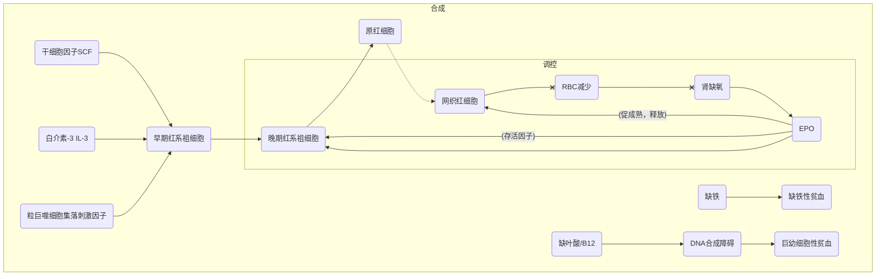
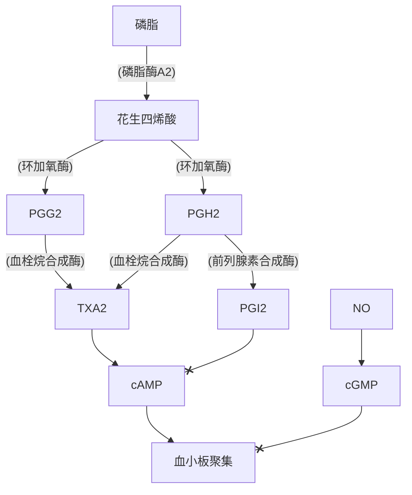
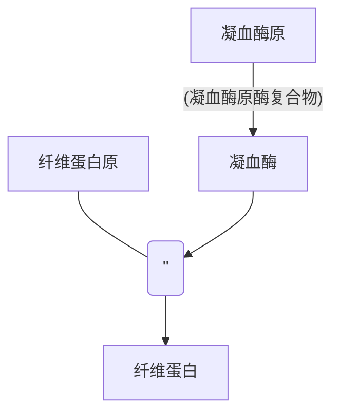
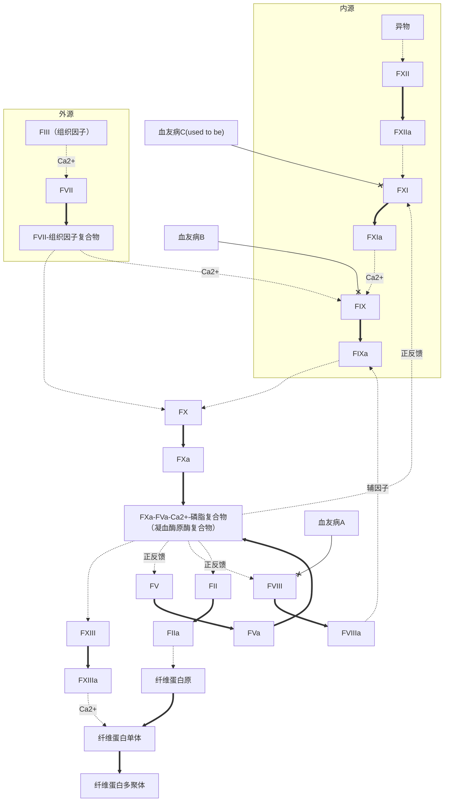
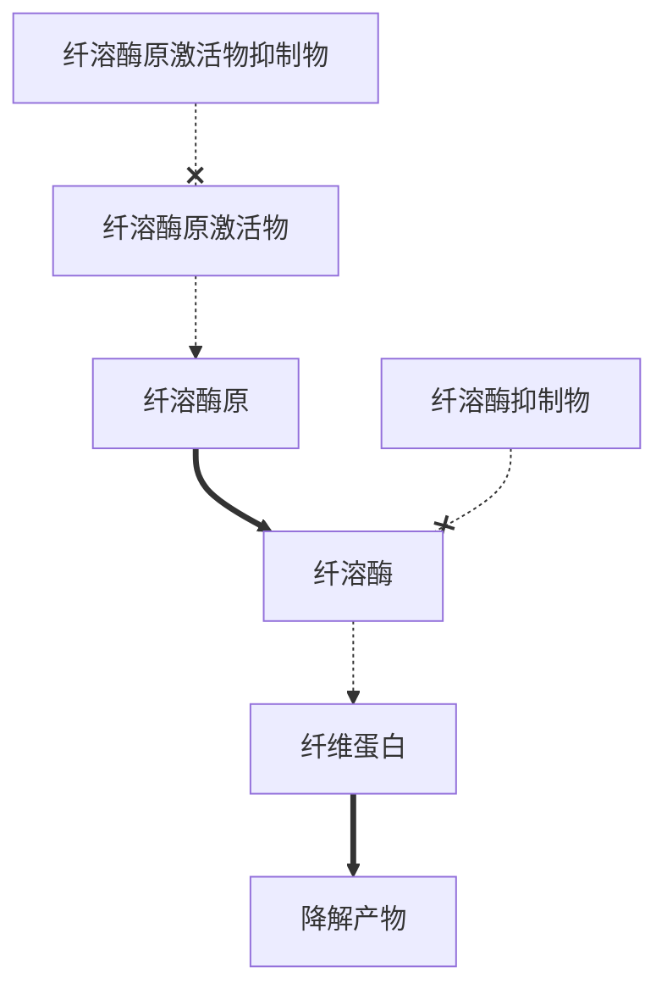
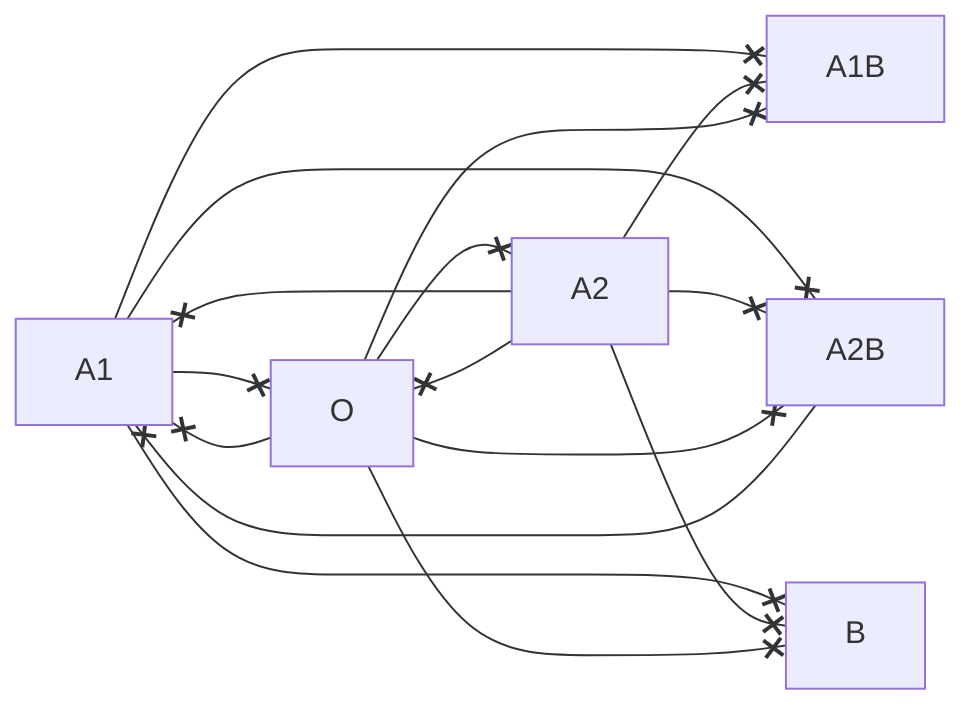

## RBC

## WBC
### 中性粒细胞
血液中主要吞噬细胞
循环池+边缘池
杀菌方式：非氧杀菌、依氧杀菌（==主==）
### 单核细胞
尚未成熟，成熟后为巨噬细胞-->单核吞噬细胞系统
巨噬细胞：更强吞噬能力、呈递抗原
对某些细胞内细菌、真菌、原虫杀伤极为关键
释放各类细胞因子：集落刺激因子、白介素、肿瘤坏死因子、干扰素
组织中可发育为树突状细胞-->抗原呈递
### 嗜酸性粒细胞
数量昼夜波动<--糖皮质激素导致
基本无杀菌作用
拮抗一型超敏反应
参与对蠕虫幼虫的免疫（==成虫无效==）
哮喘中最主要效应细胞
### 嗜碱性粒细胞
释放肝素-->抗凝血
参与变态反应-->一型超敏反应
释放嗜酸性粒细胞趋化因子A-->限制超敏反应
### 淋巴细胞
T细胞：细胞免疫
B细胞：体液免疫
NK细胞：机体固有免疫，直接杀伤目的细胞
### 调节
各类集落刺激因子-->促生成
乳铁蛋白、转化生长因子$\beta$-->直接抑制生成，限制集落刺激因子释放、作用
## 血小板
### 激活

^e202b0

^bf9423

### 合成
巨核细胞（==多倍体细胞==）脱落的小块细胞质
肝（恒定速率）-->TPO-->巨核系祖细胞存活、增殖
### 凝血
#### 基本途径

丝氨酸蛋白酶：2，7，9，10，11，12
依赖维生素K：2，7，9，10
1：纤维蛋白原
2：凝血酶原
3：组织因子
没有 6：FVa
#### 负调节
##### 血管内皮
屏蔽凝血因子、[[#^e202b0| 释放 PGI2，NO 、ADP酶]]、分泌组织型纤溶酶原激活物
##### 纤维蛋白
吸附凝血酶防扩散
##### 单核吞噬细胞
吞噬活化凝血因子
##### 抗凝物质
丝氨酸蛋白酶抑制物（抗凝血酶+肝素、肝素辅因子 II）、蛋白质 C 系统（灭活 `FVIIIa`、`FVa`，促进纤维蛋白溶解）
##### 组织因子途径抑制物 TFPI
结合 `FXa` 后负反馈抑制外源性凝血途径
##### 肝素
具抗凝作用，也可增强抗凝血酶作用发挥间接作用
##### 抗凝剂
去除 `Ca2+` ：枸橼酸钠、草酸铵、草酸钾
维生素 K 拮抗剂：华法林
### 溶解

纤溶酶原激活物：`t-PA` (组织型) , `u-PA`（尿激酶型）
纤溶抑制物：纤溶酶原激活物抑制物-1 `PAI-1`，$\alpha_2$ 抗纤溶酶 $\alpha_2AP$  
## 血型
凝集素（$\gamma$ -球蛋白）和凝集原导致-->红细胞凝集，破裂溶血
前体物质-->H 抗原-->A/B 抗原
### ABO

### Rh
常见抗原：`RhD`（主），`RhC/cE/e `
抗体为体液性免疫的 `IgG`，仅接触后产生