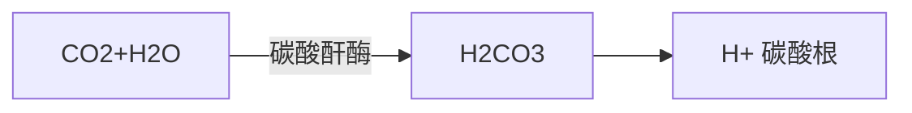
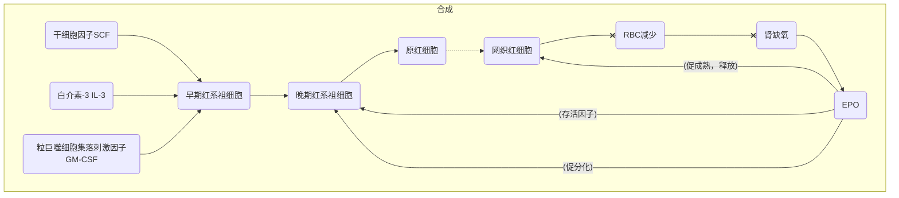
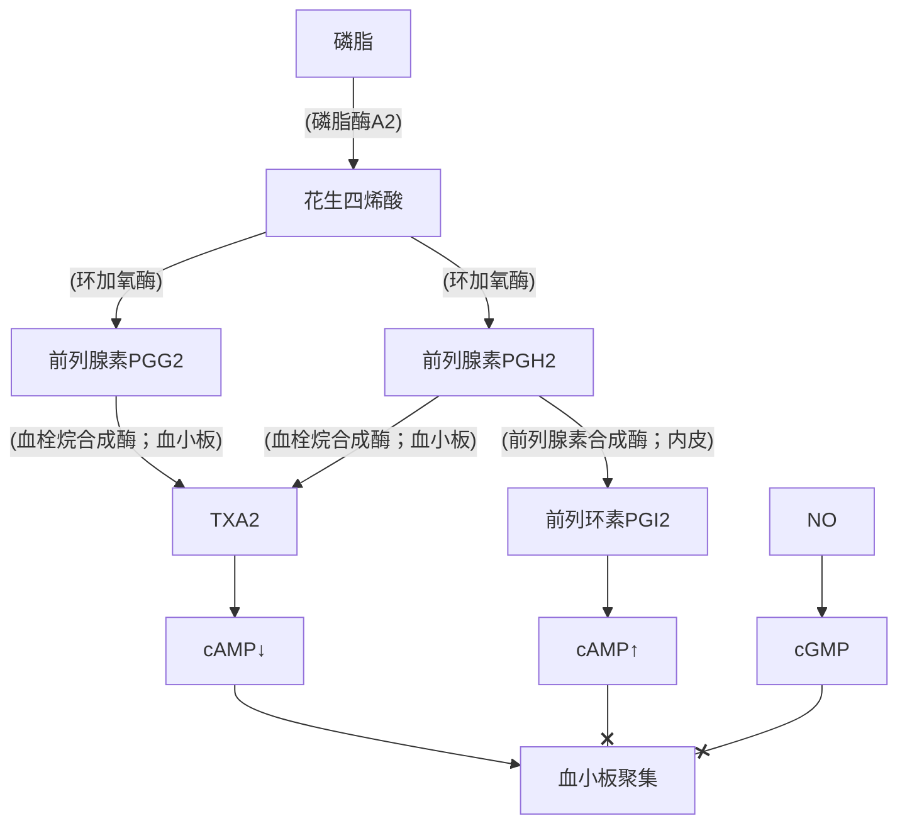
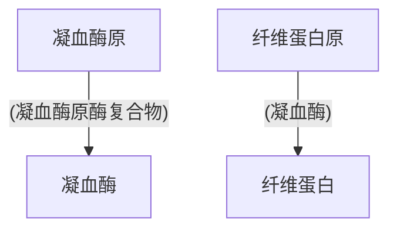
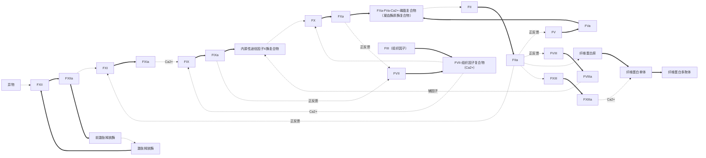
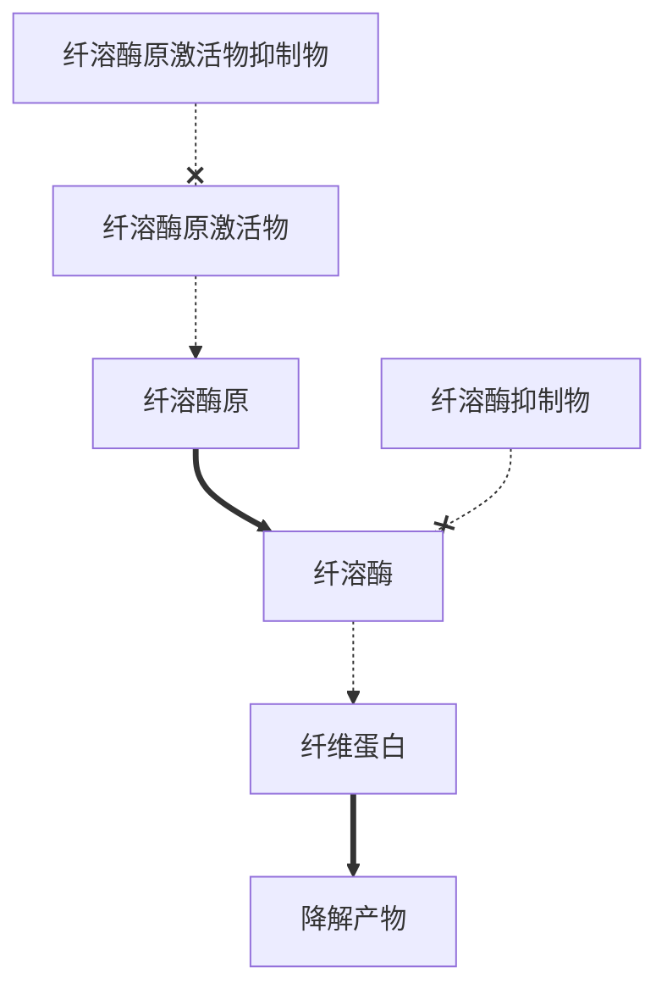

## 理化特性
### 比重
- 全血：1.05~1.06
- 血浆：1.025~1.03
- `RBC`：1.09~1.092
### 黏度

（相对于水）

- 全血：4 ~5--> 血细胞比容
- 血浆：1.6~2.4--> 血浆蛋白含量
### 渗透压

血浆：$300\mathrm{mmol/L}\Leftrightarrow770\mathrm{kPa}\Leftrightarrow5790\mathrm{mmHg}$

主要来源：晶体 --> $\mathrm{Na^+}$，$\mathrm{Cl^-}$（80%）；胶体 --> 白蛋白（75%~80%）

晶体渗透压保持相对稳定，胶体渗透压起重要调节作用

#### 等渗&等张

渗透压相等 --> 等渗 e.g. 1.9% 尿素

渗透压相等且**溶质不能自由跨膜**--> 等张 e.g.0.9%NaCl

### pH
7.35~7.45
缓冲对：$\mathrm{NaHCO_3/H_2CO_3},\mathrm{Na_2HPO_4/Nah_2PO_4}$，蛋白质钠盐/蛋白质，KHb/Hb（`RBC` 内）

## 免疫学特性
### 固有免疫

遗传获得，包括固有免疫分子（补体），固有免疫细胞

### 获得性免疫

T 淋巴细胞 --> 细胞免疫

B 淋巴细胞 --> 抗体 --> 中和毒性/阻止进入细胞/增强杀伤作用（抗体依赖细胞介导的细胞性作用）/结合抗原后激活补体

RBC--> 表面有补体受体 --> 黏附抗原
>[!important] 补体
>老古董，最早出现在后口无脊椎动物中
>高等哺乳动物有三条途径：经典、替代、凝集素；由血清中一组不耐热、酶活性蛋白组成
>Cn→Cna + Cnb
>a 即away，小片段，游离片段  
> b 即big、bind，大片段，非游离片段， 一般是功能片段
>**活化**形式：在补体序数正上方加小横线
>补体**灭活**形式：在补体前加“i”表示（inactivated），如 iC3b、iC4b。
>![[补体.png]]
>>[!note] 经典
>>1. `IgG` /  `IgM` 结合抗原 `Ag`，暴露补体结合位点 `CH2`
>>2. `C1q` 结合，`C1r`、`C1s`构象变化
>>3. 活化形成 $C\overline{1}$
>>4. $C4\xRightarrow{C \overline1}C4a+C4b$ $C2\xRightarrow{C\overline1}C2a+C2b$ $C4b+C2a\Rightarrow C\overline{4b2a}$，形成 `C3` 转化酶
>>5. $C3\xRightarrow{C \overline {4b2a}}C3a+C3b$ $C \overline{4b2a}+C3b \Rightarrow C \overline{4b2a3b}$，形成 `C5`转化酶
>>6. $C5 \xRightarrow{C \overline{4b2a3b}}C5b+C6+C7\Rightarrow C \overline{5b67}$，结合在膜上
>>7. $C \overline{5b67}+C8+nC9\Rightarrow C \overline{5b6789n}$，即攻膜复合体 `MAC`，破坏细胞膜
>
>>[!note] 替代
>>1. `C3`在非感染状态会自发的在硫酯键处水解，形成`C3(H2O)`，与 `B`，`D`因子（使B因子分解为`Ba`和`Bb`作用形成C3(H2O)Bb液态`C3`转化酶 $C3(\mathrm{H_2O})\xRightarrow{B}C3(\mathrm{H_{2O}B}\xRightarrow{D}C3(\mathrm{H_2O}Bb))$
>>2. $C3\xRightarrow{C3(\mathrm{H_2O})Bb}C3a+C3b$
>>3. 感染状态下 `C3b`结合在附近感染物表面，以类似方式形成`C3bBb`
>>4. `P` 因子使 `C3` 裂解、形成 $C \overline{3bBbC3b}$，即 `C5` 转化酶-->进入 C5 途径
>>5. 也可形成 $C\overline{3bPBb}$，即 C3 转化酶
>
>>[!note] 甘露糖
>>甘露糖结合甘露糖结合凝集素 `MBl` 激活 `MBL` 相关丝氨酸蛋白酶 `MASP`，进入 `C4`、`C2` 活化
>
>抑制因子
>- `C1` 抑制因子 `C1NH`：灭活 `C1`、`MASP`
>- `H`、`I` 因子：灭活 `C3b` 、`C4b`
>- `C4` 结合蛋白：抑制 `C4b` 与 `C2` 结合
>- `CD59`：结合 `C5b678`，抑制 `C9` 再结合，抑制 `MAC` 形成

## 血浆

| 离子                   | 浓度                          |
| -------------------- | --------------------------- |
| $\mathrm{Na^+}$      | 136-146 mmol/l              |
| $\mathrm{K^+}$       | 3.8-5.2 mmol/l              |
| $\mathrm{Ca^{2+}}$   | ==2.3-2.7 mmol/l==（远高于细胞内液） |
| $\mathrm{Mg^{2+}}$   | 0.8-1.2 mmol/l              |
| $\mathrm{Cl^-}$      | ==96-106 mmol/l==（高于细胞内液）   |
| $\mathrm{HCO_3^-}$   | ==24-28 mmol/l==（高于细胞内液）    |
| $\mathrm{PO_4^{3-}}$ | ==1.0-1.4 mmol/l==（低于细胞内液）  |

### 血浆蛋白
- 白蛋白 $40\sim48\mathrm{g/L}$（肝脏产生）
- 球蛋白 $15\sim30\mathrm{g/L}$（除γ- 球蛋白来自浆细胞，其余均由肝脏产生）
- 纤维蛋白原
肝病 --> 白蛋白↓，γ- 球蛋白↑
#### 作用
1. 胶体渗透压
2. 维持激素较长半衰期
3. 运输载体
4. 凝血生理过程/抵御病原微生物/营养
## 血细胞生成

![[血细胞生成.png]]

`CFU`：定向祖细胞在体外培养时会形成相应血细胞的集落，即**集落形成单位**`CFU`

`BFU`：某些早期祖细胞形成的很大的群落，即**爆式集落形成单位**

定向祖细胞的增殖和分化同步进行，==因此并不是单一群体==

造血微环境：造血干细胞定居、存活、分化、成熟的场所（T 淋巴细胞 --> 胸腺中成熟）

归巢 --> 造血干细胞表达相应黏附蛋白

再生障碍性贫血 --> 造血微环境缺陷/造血干细胞缺乏

## RBC
### 数量&形态

♂：$(4.0\sim5.5)\times10^{12}\mathrm{/L}$；♀：$(3.5\sim5.0)\times \mathrm{/L}$

`Hb`：♂--> $120\sim160\mathrm{g/L}$，♀--> $110\sim150\mathrm{g/L}$

双凹圆蝶形，无核，无线粒体，能量 --> `EMP` --> 维持钠泵工作 --> 维持正常离子浓度、细胞形态

### 生理特性
- 可塑变形性
- 悬浮稳定性 --> 红细胞沉降率 `ESR`：第一小时末 `RBC` 沉降速度（♂：$0\sim15\mathrm{mm/h}$，♀：$0\sim20\mathrm{mm/h}$
	- 血浆成分改变（`RBC` 表面 N- 乙酰神经氨酸带负电 --> 带负电卵磷脂、白蛋白抑制叠连；带正电纤维蛋白原、球蛋白促进叠连）--> 红细胞叠连↑-->ESR↑↑
	- 活动性肺结核/风湿热 --> 炎症因子 --> 纤维蛋白原↑-->ESR↑
- 渗透脆性（开始溶血：0.42% ~0.46%NaCl；全部溶血：0.28%~0.32%NaCl；衰老细胞抵抗性弱）
### 功能

运输 $\mathrm{O_2}$ 、$\mathrm{CO_2}$ （碳酸氢盐 88%、氨基甲酰血红蛋白 7%，直接溶解）

### 调节

网织红细胞：刚脱去细胞核，细胞器未完全清除 --> 外周网织红细胞反映造血功能

#### 贫血

缺叶酸/B12-->DNA 合成障碍 --> 巨幼细胞性贫血（叶酸：3~5 年后；B12：3~4 个月后）

缺铁 --> 缺铁性贫血

双肾破坏 --> `EPO` ↓--> 肾性贫血

红细胞破坏过多 --> 溶血性贫血

慢性炎症 --> 转化生长因子β/干扰素γ/肿瘤坏死因子 --> 抑制早期红系祖细胞增殖 --> 贫血

#### 调节

`EPO`：与 `Hb` 水平负相关；大剂量 EPO--> 对神经、心脏、肾脏起抗凋亡效应

肾小管间质细胞分泌 `EPO` ==（没有库存，现用现造）==<-- 低氧诱导因子 `HIF-1` 结合 3' 端增强子

5% ~10% `EPO` 来自肾外器官（e.g.肝）

雄激素 --> `EPO` ↑--> 男性 `RBC` & `Hb` 高于女性

雌激素 --> 降低红系祖细胞对 `EPO` 反应

#### 破坏

平均寿命 120 天 --> 滞留脾/骨髓中被巨噬细胞吞噬（**血管外破坏**）--> 重新利用铁、氨基酸；胆红素注入胆汁排除

血管内受冲击破坏（**血管内破坏**）--> `Hb` 与触珠蛋白结合 --> 被肝摄取

超过触珠蛋白结合能力 --> 随肾排除 --> 血红蛋白尿

## WBC
### 分类&数量

总数：$(4\sim10)\times10^{9}\mathrm{/L}$

- 中性粒细胞 50%~70%
- 嗜酸性粒细胞 0.5%~5%
- 嗜碱性粒细胞 0%~1%
- 单核细胞 3%~8%
- 淋巴细胞 20%~40%
新生儿 `WBC` 较高，主要为中性粒细胞，之后淋巴细胞增多至 70%，后减少，青春期与成人近
受时间（下午多）、进食、疼痛、情绪激动、剧烈运动等影响
女性妊娠波动于 $(12\sim17)\times10^{9}\mathrm{/L}$，分娩末高达 $34\times10^{9}\mathrm{/L}$
### 生理特性&功能
- 吞噬
- 形成抗体/致敏淋巴细胞
- 白细胞渗出：伸出伪足做变形运动 --> 穿过毛细血管壁
- 趋化性 --> 趋化因子：细胞降解产物、抗原 - 抗体复合物、补体活化产物、细菌毒素、细菌
	- 炎症区域常易于吸引白细胞
- 选择性吞噬
### 中性粒细胞

核：分叶状 --> 多形核白细胞

血液中主要吞噬细胞

循环池 + 边缘池（肾上腺素 --> 促进进入循环池）；骨髓中有大量储备（外周 15~20 倍）

进入组织液后不再返回血管

吞噬后杀菌方式：非氧杀菌（水解酶、乳铁蛋白、杀菌性通透性增加蛋白）、依氧杀菌（活性氧基团、==主==）

分解细菌 --> 溶酶体 --> 一定量后自身解体 --> 溶酶体酶释放 --> 脓液

还可吞噬、清除衰老 `RBC`、抗原抗体复合体

### 单核细胞

尚未成熟，成熟在组织中发育为巨噬细胞 --> 单核吞噬细胞系统

巨噬细胞：更强吞噬能力（体积↑，溶酶体（大量酯酶 --> 消化某些细菌脂膜）↑、线粒体↑）、呈递抗原

新生儿发育不完全 --> 病毒、细胞内致病菌敏感

移动速度慢、预备量较少、发育需要时间 --> 数天、数周后才能成为主要吞噬细胞

对某些细胞内细菌、真菌、原虫杀伤极为关键

释放各类细胞因子：集落刺激因子 `CSF`、白介素（`IL-1`、`IL-3`、`IL-6` ）、肿瘤坏死因子（`TNF-α`）、干扰素（`IFN-α`、`IFN-β`）

对肿瘤、病毒感染细胞有强大杀伤能力

组织中可发育为**树突状细胞** --> 抗原呈递

### 嗜酸性粒细胞

含较大的椭圆形嗜酸性颗粒 --> 过氧化物酶、主要碱性蛋白 `MBP`、嗜酸性粒细胞阳离子蛋白 --> 带正电 --> 嗜酸

数量昼夜波动 <-- 肾上腺皮质激素（≠糖皮质激素）导致

主要在组织中，无杀菌作用

拮抗一型超敏反应 --> 产生前列腺素 E 抑制嗜碱性粒细胞；吞噬嗜碱性粒细胞、肥大细胞释放的颗粒；释放组胺酶、芳香硫酸酶灭活组胺、白三烯

参与对蠕虫幼虫的免疫（`IgG`，`IgE`，补体 `C3` 的调理作用下， ==成虫无效==）

某些情况下释放多种促炎介质及 `MBP` --> 支气管上皮毒性 --> 支气管痉挛 --> 哮喘中最主要效应细胞

### 嗜碱性粒细胞

存在于血液中，发生炎症时受趋化因子影响迁移至组织中

胞质较大碱性染色颗粒 --> 肝素、组胺、嗜酸性粒细胞趋化因子 A

活化 --> 可释放白三烯、`IL-4`

释放肝素 --> 抗凝血 --> 保持血管通畅

组胺、过敏性慢反应物质 --> 毛细血管壁通透性增加，局部充血水肿；支气管平滑肌收缩 -->Ⅰ型超敏反应（荨麻疹；哮喘）

释放嗜酸性粒细胞趋化因子 A --> 聚集嗜酸性粒细胞 --> 限制超敏反应

参与固有免疫调节 --> 机体抗寄生虫免疫应答？

### 淋巴细胞

T 细胞：细胞免疫

B 细胞：体液免疫

NK 细胞：机体固有免疫，直接杀伤目的细胞

### 调节

各类集落刺激因子

- 粒巨噬细胞集落刺激因子 `GM-CSF` --> 中性粒细胞、单核细胞、嗜酸性粒细胞
- 粒细胞集落刺激因子 `G-CSF` --> 粒细胞；==动员骨髓干细胞、祖细胞进入血液==
- 巨噬细胞集落刺激因子 `M-CSF` --> 单核细胞

乳铁蛋白、转化生长因子β--> 直接抑制生成；限制集落刺激因子释放、作用

### 破坏

中性粒细胞 -->6~8 h 进入组织；4~5 d 死亡 --> 消化道排出；自溶形成脓液

单核细胞/巨噬细胞 -->3 个月

嗜酸性粒细胞 -->8~12 d

嗜碱性粒细胞 -->12~15 d

## 血小板
### 数量&功能

无细胞核，存在α- 颗粒，致密体

**糖蛋白**--> `GPⅠb/Ⅸ/Ⅴ` 结合 `vWF`；`GP Ⅱb/Ⅲa` （整合素 αⅡbβ3）结合纤维蛋白原/ `vWF`

$(100\sim300)\times10^{9}\mathrm{/L}$，午后高于清晨、冬季高于春季

维持血管壁完整性；释放稳定内皮屏障的物质（1- 磷酸鞘氨醇）/生长因子（血管内皮生长因子 `VEGF`、血小板源生长因子 `PDGF`）

### 生理特性
#### 黏附

需要 `GPⅠb/Ⅸ/Ⅴ` 和 `vWF` 参与

`vWF` 结合内皮下胶原纤维 --> 变构 --> 结合 `GPⅠb`，血小板黏附在胶原纤维上

`GPⅠb/Ⅸ/Ⅴ` 缺乏 --> 巨大血小板综合征

#### 释放

致密体 --> `ADP`、`ATP`、`5-HT`、$\mathrm{Ca^{2+}}$

α- 颗粒 -->β- 血小板球蛋白、血小板因子 4 `PF4`、`vWF`、纤维蛋白原、`FⅤ`、凝血酶敏感蛋白、`PDGF`

临时合成：血栓烷 A2 `TXA2`

反映活化情况 -->β- 血小板球蛋白、血小板因子 4 `PF4`

#### 聚集

纤维蛋白原、$\mathrm{Ca^{2+}}$、`GP Ⅱb/Ⅲa` 参与

黏附后 `GP Ⅱb/Ⅲa` 激活 --> $\mathrm{Ca^{2+}}$ 作用下与纤维蛋白原结合

`GP Ⅱb/Ⅲa` 异常 --> 血小板无力症

可逆性聚集 --> 先聚集（第一聚集时相），再解聚，再**不可逆聚集**（第二聚集时相）-->

不可逆性聚集 -->**单一不可逆聚集**

生理性致聚剂：`ADP`、肾上腺素、`5-HT` 、组胺、胶原、凝血酶、`TXA2`

病理性致聚剂：细菌、病毒、免疫复合物、药物

剂量依赖性：`ADP`、凝血酶

胶原 --> 不可逆聚集；聚集、释放同时 --> `ADP` 生成和 `TXA2` 生成有关

##### `TXA2`

强烈血小板聚集和缩血管作用

#### 收缩

存在类似肌细胞的收缩蛋白系统 --> 伪足 `GP Ⅱb/Ⅲa` 连纤维蛋白索 --> 血块收缩

### 合成

骨髓巨核细胞（==多倍体细胞==）脱落的小块细胞质

肝（恒定速率）--> `TPO` --> 巨核系祖细胞存活、增殖；不成熟巨核细胞分化（受体：`Mpl` --> 原癌基因*c-mpl*）；对造血干细胞也有重要促进作用

血小板 `TPO` 受体 --> 浓度高时清除 `TPO` --> 负调控

肺也是重要生成部位

### 破坏

仅最初两天生理作用 --> 脾、肝、肺吞噬破坏

### 生理性止血

出血时间测定 --> 不超过 9 分钟

#### 基本过程

![[生理性止血.png]]

血管收缩 --> 损伤性刺激性反射性；局部血管肌源性；缩血管物质

二期止血：纤维蛋白原 --> 纤维蛋白

#### 凝血

![[凝血因子.png]]

![[凝血因子续表.png]]

`FⅥ` = `FⅤa`

丝氨酸蛋白酶：`FⅡ`、`FⅦ`、`FⅨ`、`FⅩ`、`FⅪ`、`FⅫ`（2、7、9、10、11、12）

仅 `FⅢ` 不存在于血浆中

`VK` 依赖：`FⅡ`、`FⅦ`、`FⅨ`、`FⅩ`（2、7、9、10）--> 含γ- 羧基谷氨酸 --> 结合 $\mathrm{Ca^{2+}}$ 变构 --> 暴露磷脂结合位点

内源：12-->11-->9-->10

外源：3/7-->10（==由于组织因子复合物的存在，仅能产生少量凝血酶，需通过对 X 酶复合物的正反馈作用进一步激活==）

凝血：10-->5-->2--> 纤维蛋白（+13: 纤维蛋白稳定因子）

血友病 A-->FVIII

血友病 B-->FIX

血友病 C(used to be)-->FXI（X 酶复合物功能完整）

#### 负调节
##### 血管内皮

屏蔽凝血因子、释放 PGI2，NO 、胞膜 ADP 酶、分泌组织型纤溶酶原激活物 `t-PA`

##### 纤维蛋白

吸附凝血酶防扩散

##### 单核吞噬细胞

吞噬活化凝血因子

##### 抗凝物质

丝氨酸蛋白酶抑制物 --> 抗凝血酶（肝素促进；替代物 --> 硫酸乙酰肝素）、肝素辅因子Ⅱ

蛋白质 C 系统（蛋白质 C（`VK` 依赖合成）；凝血酶调节蛋白；蛋白质 S（辅因子）；蛋白质 C 抑制物）--> 凝血酶结合凝血酶调节蛋白 --> 激活蛋白质 C--> 灭活 `FVIIIa`、`FVa`，促进纤维蛋白溶解

##### 组织因子途径抑制物 `TFPI`

结合 `FXa` 后抑制 `FVIIa` - 组织因子复合物 --> 负反馈抑制外源性凝血途径径

##### 肝素

具抗凝作用，主要靠增强抗凝血酶作用发挥间接作用

还可促进 `TFPI` 释放 --> 体内 > 体外

##### 抗凝剂

去除 `Ca2+` ：草酸铵、草酸钾、枸橼酸钠（可体内使用）

维生素 K 拮抗剂：华法林

### 溶解

#### 纤溶酶原激活物
- `t-PA` (组织型)
- `u-PA`（尿激酶型；肾小管、集合管上皮细胞产生）--> 促进细胞表面纤溶酶原激活 --> 在组织溶解血管外纤维蛋白

#### 纤溶抑制物
- 纤溶酶原激活物抑制物 -1 `PAI-1`：血管内皮产生 --> 灭活 `t-PA`、`u-PA`
- $\alpha_2$ 抗纤溶酶 $\alpha_2AP$：肝产生，α颗粒有少许 --> 结合纤溶酶 --> 防止纤维蛋白过早降解
- 凝血酶激活的纤溶抑制物 `TAFI`

## 血型

凝集素（γ- 球蛋白）和凝集原导致 --> 红细胞凝集 --> 补体作用，破裂溶血

白细胞 --> 人类白细胞抗原 `HLA`

血小板 --> 一些特异血小板抗原系统 --> `PI`，`Zw`，`Ko` 等

前体物质 -->H 抗原 -->A/B 抗原

### ABO

| 血型  | 抗原   | 抗体 `IgM` |
| --- | ---- | -------- |
| A1  | A+A1 | 抗 B      |
| A2  | A    | 抗 B+ 抗 A1 |
| B   | B    | 抗 A       |
| AB  | A+B  | -        |
| O   | -    | 抗 A+ 抗 B  |

![[血型抗原.png]]

### Rh

常见抗原：`RhD`（主），`Rh C/c+E/e `

阴性 --> `Rhd`（不表达 d 抗原） + `RhCE`

抗体为体液性免疫的 `IgG`，仅接触后产生

### 血量

体重 7%~8%

失血少 --> 心脏活动加强；血管收缩；储血量↓

### 定型
- 正向：向样本中加入标准抗体
- 反向：将样本加入到标准 `RBC` 中