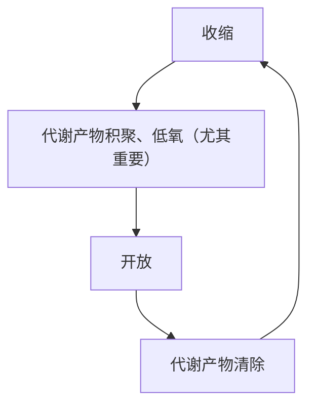

## 心脏泵血
### 心动周期

![[心动周期示意图.png]]

#### 心室收缩期
1. 等容收缩期：0.05 s
2. 射血期：半月瓣开放
	1. 快速射血期：0.1 s
	2. 减慢射血期：0.15 s，室内压略低于主动脉压
#### 心室舒张期
1. 等容舒张期：0.06~0.08 s
2. 心室充盈期：房室瓣开放
	1. 快速充盈期：0.11 s
	2. 减慢充盈期：0.22 s （最后 0.1 s 心房收缩期开始）
右心室基本同左心室，但压力变化小
### 作用

心房 --> 初级泵 --> 使心室舒张末期容积进一步增大 --> 初长度增加 --> 收缩力增加

心房内压变化 -->a、c、v 三个正向波 -->a：心房收缩标志；c：心室收缩标志；v：静脉回流

## 心输出量
- 每搏输出量=左心室舒张末期容积 `EDV`（125） - 收缩末期容积 `ESV`（55） =70
- 射血分数=搏出量/ `EDV` =55%~65%；正常情况下射血分数保持稳定；心室功能减退、心室异常扩大 --> 搏出量可能不变，`EDV` ↑--> 射血分数↓
- 每分输出量=搏出量 * 心率；♂ $4.5\sim6.0\mathrm{L/min}$；♀低 10% 左右；剧烈运动 --> $25\sim30\mathrm{L/min}$
- 心指数=心输出量/体表面积≈ $3.0\sim3.5\mathrm{L/(min*m^2)}$；随年龄增加而降低；运动时大致成比例增加
## 泵血能力储备

剧烈运动时，心输出量达 $25\sim30\mathrm{L/min}$ -->5 ~6 倍 --> 心泵功能储备/心力储备

### 搏出量储备
- 收缩期储备：增加心肌收缩力；提高射血分数 --> $35\sim40\mathrm{ml}$
- 舒张期储备：增加 `EDV` --> $15\mathrm{ml}$
### 心率储备

可达 160~180 次/分，高于 180 时舒张期过短 --> 充盈不足 --> 搏出量↓，心输出量↓

心力衰竭 --> 搏出量↓，剩余血量↑--> 收缩期储备/舒张期储备↓--> 心率代偿性加快，静息时已动用心率储备 -->120~140 时即已经搏出量↓，心输出量↓

强烈体力活动 --> 交感 - 肾上腺髓质系统↑--> 主要动用收缩期储备、心率储备 -->200~220，心输出量达 7 倍

## 影响因素
### 前负荷

取决于 `EDV` --> 一定范围内与心室舒张压力 `EDP` 良好相关 --> `EDP` 反映前负荷 --> 心室舒张末期心房内压≈心室内压 --> 测定心房内压

#### 影响因素
1. 静脉回心血量
	1. 心室充盈时间↓--> 静脉回心血量↓
	2. 静脉回流速度↓--> 静脉回心血量↓
	3. 心室舒张功能（受 $\mathrm{Ca^{2+}}$ 回降速度限制）↓--> 抽吸能力↓--> 静脉回心血量↓
	4. 心室顺应性 $C_{V}=\dfrac{\Delta V}{\Delta P}$ （心室僵硬度 $S_{V}=\dfrac{1}{\Delta C_{V}}=\dfrac{\Delta P}{\Delta V}$）↓--> 心室充盈量↓--> 静脉回心血量↓![[心室压力-容积曲线.png]]
	5. 心包腔内压↑--> 心室充盈↓--> 静脉回心血量↓
2. 射血后心室剩余血量↑（动脉血压突然升高导致）--> 舒张末期心室内压↑--> 静脉回心血量↓--> 心室充盈量**不一定**↑

### 后负荷
**大动脉血压**
大动脉血压↑--> 等容收缩期↑；快速射血期↓--> 搏出量↓--> `ESV` ↑--> `EDV` ↑ -->**异长自身调节**--> 搏出量回升；`EDV` 恢复
主动脉压长期高于正常值（$80\sim170\mathrm{mmHg}$）--> 心脏长期加强收缩，效率减退 --> 心肌增厚 --> 左心室肥厚、扩张；左心衰竭
### 心肌收缩能力

不依赖前后负荷的内在力学特性 --> 心肌收缩能力 aka. 心肌变力状态

等长调节 --> 改变心肌收缩能力

主要环节 --> 活化横桥数目；肌球蛋白的头部 `ATP` 酶活性 --> 兴奋时胞质 $\mathrm{Ca^{2+}}$ 浓度和肌钙蛋白亲和力

**儿茶酚胺**--> 激动β肾上腺素能受体 --> `cAMP` 通路 --> 激活 $\mathrm{Ca^{2+}}$ 通道 --> $\mathrm{Ca^{2+}}$ 内流↑

钙增敏剂（茶碱 etc.）--> 增加肌钙蛋白亲和力

甲状腺激素 --> 提高 `ATP` 酶活性 --> 增强心肌收缩能力

### 心肌异长自身调节
#### 心功能曲线 aka. Frank-Starling 曲线

![[心功能曲线.png]]

- $5\sim15\mathrm{mmHg}$：升支，每搏功随心室舒张末期压增大 --> $12\sim15\mathrm{mmHg}$ 最适前负荷
- $15\sim20\mathrm{mmHg}$：趋于平坦 --> 影响不大
- 高于 $20\mathrm{mmHg}$：平坦/轻度下倾（出现降支 --> 严重病理变化）
改变心肌初长度 --> 引起心肌收缩力变化 -->**异长自身调节**
心定律（Starling）：`EDV` 一定范围内增大可增强心室收缩力，aka. 富兰克 - 斯塔林定律
#### 抗过度延伸

初负荷影响机制类似骨骼肌 [[基本功能#^2c4a50]]

不同：较强抗过度延伸，肌节不超过 $2.25\sim2.30\mathrm{\mu m}$，强行拉伸至 $2.60\mathrm{\mu m}$ --> 断裂 --> 连接蛋白 `titin` 存在 --> 将 `actin` 固定在 Z 盘上；很强黏弹性 --> 限制被动拉长

`titin` 弹性回缩力 --> 舒张初期抽吸力基础

间质大量胶原纤维；多层肌纤维交叉排列 --> 最适初长度时静息张力已很大 --> 不易被伸展

![[心肌长度-张力变化.png]]

前负荷明显增加时一般不会改变搏出量和做功能力

慢性心脏病 --> 心脏过度扩张 --> 心室功能曲线出现降支 --> 严重受损

生理意义：对搏出量微小变化进行精细调节，保持稳定；变化较大时需进一步调节收缩能力

### 心率

静息 -->60~100 ，平均 75

一定范围内心率加快 --> 心输出量↑

超过 160~180--> 舒张期明显缩短 --> 静脉回心血量↓--> 搏出量↓--> 心输出量↓

低于 40--> 舒张期过长 --> 不能进一步增加充盈量 --> 心输出量↓

调节 --> 交感加快；迷走减慢；儿茶酚胺、`TH` 加快；体温↑加快

## 心功能评价
### 心室压力变化

基础 -->**心导管术**

#### 射血功能

![[左心室压变化.png]]

（A.青年；B.老年）

一阶导峰值降低 --> 收缩能力减弱

（因 ${\mathrm{d}P/\mathrm{d}t}_{max}$ 受其他因素影响 e.g.舒张末压↑，主动脉血压↑，有观点认为比较 $\dfrac{\mathrm{d}P}{P*\mathrm{d}t}_{max}$ 更合适）

#### 舒张功能

同理，一阶导负峰绝对值降低 --> 舒张能力降低

### 心室容积变化
#### 收缩功能

左心室舒张末内径 `LVDd`、左心室收缩末内径 `LVDs`、`EDV`、`ESV`、==左心室射血分数== `LVEF`（首选指标）、$\mathrm{d}V/\mathrm{d}t$ 、$\mathrm{d}D/\mathrm{d}t$

#### 舒张功能

![[左心室舒张功能.png]]

(实线：正常人；虚线：舒张功能不全)

e 波 --> 二尖瓣开放早期

a 波 --> 左心房收缩时

舒张功能不全 --> 抽吸↓；心房收缩作用↑-->e 波↓，a 波↑

心导管术有创 --> 替代：经胸超声心动图（最常用），心脏磁共振成像技术

### 综合压力和容积变化
#### 心脏做功量

外功（对血液所做机械功）+ 内功（离子转运；兴奋&收缩；产生并维持张力；克服黏滞阻力）

右心室做功≈左心室做功/6

##### 每搏功

一次射血所做外功=压力容积功（搏出量 * 心动周期室内压增量）+ 血液动能（占比很小）

因此每搏功≈压力容积功=0.803 J

##### 每分功

每分钟内所做功=每搏功 * 心率

若心率 75，每分功≈60.2 J/min

#### 心室压力 - 容积环

![[ESPVR.png]]

ac：充盈期；cd：等容收缩期；de：快速射血期；ef：减慢射血期；fa：等容舒张期

## 心音
### 第一心音

心尖搏动处（左第五肋间锁骨中线）最清楚，音调低，持续长

房室瓣突然关闭、大血管壁和血液湍流引起的震动 --> 射血开始

### 第二心音

心室舒张期开始、胸骨左右两旁第二肋间（主动脉瓣和肺动脉瓣听诊区），频率高、持续时间短

动脉瓣关闭 --> 冲击大动脉根部引起震动 --> 射血结束

### 第三心音

部分儿童和青年人偶见，低频、低幅震动 --> 快速充盈期末室壁、乳头肌伸展；血流减速

### 第四心音

心室舒张晚期，aka 心房音（正常心房收缩不产生声音，异常强烈/心室顺应性下降可产生）

## 心脏电生理学
### 细胞分类
- 工作细胞：心房肌、心室肌
- 自律细胞：窦房结、浦肯野
- 快反应（去极化幅度/速度大；复极缓慢&明确时相分布）：心房肌、心室肌、蒲肯野细胞
- 慢反应（去极化幅度/速度小；复极缓慢&没有明确时相分布）：窦房结、房室结
### 生理特性
- 兴奋性
- 传导性
- 自律性
- 收缩性
### 工作细胞
#### 心房肌
##### `RP`

$-90\sim80\mathrm{mV}$

$\mathrm{K^+}$ --> 内向整流钾通道 $I_{KI}$

$\mathrm{Na^+}$ --> 钠背景电流；泵电流 $I_{pump}$

###### `AP`

总持续 200~300 ms（4 期不算）

![[心肌工作细胞电位.png]]

1. 0 期：-90-->30
	1. 钠内向电流 $I_{Na}$ （快通道：激活快；失活快），对 `TTX` 敏感性仅为骨骼肌 1/100~1/1000
	2. T 型钙电流 $I_{CaT}$（电压门控）作用不大，但是能保证电位发生 --> 反应变慢
2. 1 期：30-->0，下降迅速 --> 锋电位
	1. 瞬时外向电流 $I_{to}$，主要为 $\mathrm{K^+}$，-30 时激活，短暂外流；过强可使平台期消失，形成三角形；阻断 -->4- 氨基吡啶 `4-AP`
	2. 氯电流 $I_{Cl}$ ，正常时强度小，作用短暂；**儿茶酚胺作用/交感兴奋时不可忽略**
3. 2 期：极为缓慢，持续 100-150 ms，aka 平台期
	1. L 型钙电流 $I_{Ca-L}$：**内向**，慢通道
	2. $I_{Na}$：**内向**，强度不大；失活受抑制/激动时 --> 明显增强 --> 延长，甚至出现第二平台期
	3. $I_{Na-Ca}$：钠钙交换
	4. $I_{KI}$： **内向整流**钾通道（**电流外向**）；电压依赖 --> 通透性随去极化而降低 --> 阻碍 $\mathrm{K^+}$ 流出
	5. $I_{K}$ ：延迟整流钾电流：随时间增强；早期 --> 抗衡内向电流；后期 --> 复极化主要电流 --> 决定平台期长度
	6. 早期 --> $\mathrm{Ca^{2+}}$ 内流与 $\mathrm{K^+}$ 外流平衡 --> 稳定 0 mV；晚期 --> $\mathrm{Ca^{2+}}$ ↓，$\mathrm{K^+}$ ↑--> 复极化

>[!important] 迟后去极化
		> 钠泵活动受抑制 --> 钠钙交换↓↓--> 胞内 $\mathrm{Ca^{2+}}$ ↑↑--> 钠通透性↑↑--> 短暂内向 $\mathrm{Na^+}$ 电流（**迟后去极化** `DAD`）

4. 3 期：快速复极化，100~150 ms
	1. $I_{K}$ 逐渐加强 --> 膜内变负 --> $I_{K}$ 进一步加强（正反馈）
	2. $I_{KI}$ -60 mV 时加强 --> 加速终末复极化
5. 4 期：$\mathrm{Na^+}$ 外运，$\mathrm{K^+}$ 内运
	1. $\mathrm{Na^+}$ - $\mathrm{Ca^{2+}}$ 交换体 -->3 $\mathrm{Na^+}$ 换 1 $\mathrm{Ca^{2+}}$
	2. 钙泵
#### 心房肌
##### `RP`

$I_{KI}$ 稍低于心室肌 --> 受 $\mathrm{Na^+}$ 影响较大 --> `RP` ≈-80 mV

##### `AP`

$I_{to}$ 较强，持续到 2 期 --> 平台期不明显；2/3 期分界不明显

复极化较快 -->150~200 ms

**乙酰胆碱敏感的钾电流**$I_{K-ACh}$ --> `ACh` 激活 --> $\mathrm{K^+}$ 通透性↑↑--> 超极化 --> 动作电位明显缩短

钾通道种类多，受神经递质调节 --> 电学重构

### 自律细胞

自动节律性 --> 没有稳定 `RP`，立刻去极化 --> 最大复极电位 `MRP` 代表静息电位

#### 窦房结细胞

自律细胞 -->P 细胞，慢反应 --> 没有明显 1 期和平台期

![[窦房结P细胞.png]]

$I_{KI}$ 较少 --> `MRP` ≈-70 mV，阈电位≈-40 mV

$I_{Na}$ 总是处于失活状态（`MRP` 太高，没法复活） --> 去极化依赖 $I_{Ca-L}$ --> 可被维拉帕米阻断；`TTX` 不敏感

缺乏 $I_{to}$ --> 无明显 1/2 期 --> 直接进入 3 期复极化 --> $I_{K}$ 实现，到达 `MRP`

4 期自动去极化 --> 超极化激活的内向离子电流 $I_{f}$ 引起 -->-50 mV 时，$I_{Ca-T}$ 加入，加速去极化 --> 触发 $I_{Ca-L}$，引起新的动作电位

$I_{Na-Ca}$ 自动去极后 1/3 起作用

肾上腺素 -->β受体 --> $I_{Ca-T}$ ↑，$I_{f}$ ↑--> 正性变时

`ACh` -->M 型受体 --> $I_{K-ACh}$ ↑&抑制 `cAMP` 活化 --> 钙通道磷酸化受抑制 --> 负性变时

$I_{K}$：进行性衰减 --> 自动去极化重要基础 -->-50 mV 逐步减小；阻滞剂 `E-4031` 可降低 `MRP` --> 影响 $I_{f}$ 充分激活

$I_{f}$ --> 进行性增强，主要为 $\mathrm{Na^+}$；P 细胞 `MRP` ≈-70--> 激活缓慢；电流小 --> 不重要（$\mathrm{Cs^{2+}}$ 抑制影响不大）

$I_{Ca-T}$ --> 阈电位较低，快速衰减；可被 $\mathrm{NiCl_2}$ 阻断；作用为引发 $I_{Ca-L}$

#### 蒲肯野细胞
**快反应**
0 期去极化快；1 期较心室肌更明显；1/2 期间明显切痕；3 期 `MRP` 较心室肌更负 --> $I_{KI}$ 密度大；4 期不稳定
##### 自动去极化
-50 mV 时，$I_{K}$ 开始关闭，$I_{f}$ 开始激活 -->-100 mV 时充分激活 --> 密度过低 --> 去极缓慢 --> 受到超速抑制 -->Ⅲ度房室传导阻滞突然发生时，心室停搏原因
## 生理特性

兴奋 --> 兴奋收缩耦联 --> 收缩

### 兴奋性

![[心室肌AP.png]]

- 绝对不应期 `ARP`：复极化至 -55 mV 前
- 局部反应期 `LRP`：-55~-60 mV，阈上刺激引起局部反应，`AP` 不能引发
- 有效不应期 `ERP` =绝对不应期 + 绝对不应期
- 相对不应期 `RRP`：-60~-80 mV，阈上刺激可产生 `AP`
- 超常期 `SNP`：低于阈值即可引发 `AP` --> 去极化速度/幅度较低；不应期短 --> 易发生期前兴奋 --> 快速性心律失常
- 动作电位时长 `ADP` --> 反映复极化速度；`ERP` --> 反映去极化能力（$G_{Na}$）--> `ERP` 相对延长抗心律失常

#### 影响因素
1. `RP` & `MRP` ↓--> 兴奋性↓（e.g.`ACh` --> $\mathrm{K^+}$ 外流 --> 兴奋性↓；高血钾 --> 心律失常）
2. 阈电位水平↓--> 兴奋性↑（e.g.低血钙；奎尼丁 --> 抑制 $\mathrm{Na^+}$ 内流 --> 阈值↑）
3. 0 期离子通道：快反应 --> 钠通道；慢反应 -->Ca-L 通道
#### 兴奋与收缩

![[期前收缩&代偿间歇.png]]

`ERP` 超长 --> 不会发生强直收缩

刺激落在 `ERP` 后 --> 发生期前兴奋&期前收缩 --> 下一个刺激落在期前兴奋的 `ERP` -->**代偿间歇**（窦性心律较慢，可能不发生）

#### QT 离散度

QT 间期的最大值与最小值之差 --> 反映复极化的均一性

### 传导性

窦房结 -->0.4 m/s 到心房肌纤维 --> 优势传导通路（小的肌束）-->1~1.2 m/s 到房室结 `AVN`

0.15 s 后出现在房室束 --> 一半时间用于穿过非常细的交界纤维 0.02 m/s--> 直径 $0.3\mathrm{\mu  m}$；闰盘缝隙连接少；分化低，传导能力低 -->**房室延搁**--> 保证心室收缩期在心房收缩完成后；好发房室传导阻滞

房室束 --> 蒲肯野纤维 4 m/s 0.03 s--> $70\mathrm{\mu m}$；肌原纤维少；缝隙连接多

心室肌纤维双螺旋状排列 --> 心内膜螺旋传导至心外膜（0.03 s）

左右心室几乎同时收缩 -->**功能合胞体**

#### 因素
- 结构：细胞直径；连接方式（缺血时缝隙连接可关闭）
- 生理：0 期去极化速度/幅度；膜电位水平（绝对值减小时去极化幅度/速度↓）；临近未兴奋部位兴奋性
### 自律性
#### 起搏点

正常：P 细胞（100，受迷走压制至 70）--> 窦性节律

潜在：房室结 50，房室束 40，蒲肯野 25--> 可作为**异位起搏点**

P 细胞 --> 抢先占领；超速驱动压抑（外来超速驱动停止刺激后，自律细胞经历一段静止期后恢复；钠泵增强 --> 超极化 --> 自律性降低）

#### 因素

![[自律性影响.png]]

- 4 期自动去极化速度：交感 --> `NE` -->β--> $I_{Ca-T}$ & $I_{f}$ ↑；负交感 --> `ACh` --> $I_{KI}↑
- `MRP`：`ACh` --> $G_{K}$ ↑--> `MRP` ↑
- 阈电位：$\mathrm{Ca^{2+}}$ 影响

### 收缩性
- 同步收缩 --> 功能合胞体样活动（左 + 右心房；左 + 右心室）-->**全或无**
- 不发生强直收缩
- $\mathrm{Ca^{2+}}$ 依赖性 --> 钙诱导钙释放 `CICR` --> 肌质网不发达导致
- 影响因素：影响搏出量者；运动；肾上腺素；洋地黄类药物；低氧；酸中毒
## 体表心电图 `ECG`
### 原理

![[心电图膜极化学说.png]]

膜极化学说；立体空间中心脏电活动的叠加

### 心电图波形

![[QRS.png]]

>[!important]- 导联
>- 标准肢体导联Ⅰ、Ⅱ、Ⅲ
>- 加压单极肢体导联 `aVR`、`aVL`、`aVF`
>- 单极胸导联 $V_{1}\sim V_{6}$

- P 波：左右两心房去极化 0.08 ~0.11 ms， <0.25 mV；不包括窦房结电位；房颤 -->P 波消失
- QRS 波群：两心室去极化；时长 --> 心室内传播 0.06~0.1 s；非正常路径传播 --> 延长；峰值增高 --> 心肌肥厚；室性期前收缩 --> 宽大畸形（`aVR` 导联中向下）
- T 波：心室复极化过程，0.05~0.25 s；升降支不对称；T 波改变原因超多
- U 波：可能出现，0.1~0.3 s，蒲肯野纤维网复极化？明显低血钾常有 U 波出现
- PQ 间期/PR 间期（起点到起点）：房室传导时间
- PR 段（终点到起点）：兴奋向心室传导时的电位变化
- QT 间期（起点到终点）：心室开始去极化到完全复极化 --> 与心率成反比；延长可能引发**尖端扭转型室性心动过速**
- ST 段 (终点到起点)：心室均去极化，应为直线；缺血/损伤 --> 异常抬高或压低

>[!note]- 房室传导阻滞
> 一度：PR 间期延长，无漏搏
> 二度 ：有漏搏
>
>>[!note] Mobitz Ⅱ度 I 型房室传导阻滞
>> ![[Mobitz Ⅱ度I型房室传导阻滞.png]]
>> 由 PR 间期延长引起的漏搏，通常为生理性，常为房室结阻滞
>
>>[!note] MobitzⅡ度Ⅱ型房室传导阻滞
>>![[MobitzⅡ度Ⅱ型房室传导阻滞.png]]
>> 总是病理性的；25% 病人阻滞发生在希氏束，其余的发生在束支
>
> 三度：互不相关，PP 间期 <RR 间期

### `ECG` & `AP`

![[心电图和动作电位.png]]

## 血管生理
### 功能

内膜（内皮细胞 `EC` + 内皮下组织）+ 中膜（血管平滑肌 `VSMC` + 弹性纤维 + 胶原纤维）+ 外膜（疏松结缔组织）

#### 分类

![[血管分类.png]]

- 弹性贮器血管：主动脉、肺动脉主干及其发出最大分支、富含弹性纤维 --> 弹性；可扩张性 --> 稳定血压波动幅度
- 分配血管：中动脉
- 毛细血管前阻力血管：小动脉、微动脉 --> 管径较细，阻力大；**毛细血管前括约肌**--> 属于微动脉，控制毛细血管开放
- 交换血管：毛细血管；管壁单层内皮
- 毛细血管后阻力血管：微静脉 --> 管径小；可产生一点阻力，但占比小 --> 主要影响毛细血管血压、容量、滤过；体液分配；
- 容量血管：静脉系统
- 短路血管：小动脉、小静脉直接吻合支 --> 手指、足趾、耳廓等处 --> 体温调节
#### 内分泌功能
- 内皮
	- 舒血管物质：一氧化氮、硫化氢、`PGI`
	- 缩血管物质：内皮素、血栓烷 A2
- 平滑肌：肾素、血管紧张素
- 外膜周脂肪组织：血管紧张素原、血管紧张素Ⅱ
### 动力学
#### 血流量
##### 泊肃叶定律
$$
\begin{align}
Q&=\frac{\pi{}\Delta{}Pr^{4}}{8 \eta L}\\
&=K \frac{r^{4}}{L}(P_1-P_2)\\
\eta&:血液黏度
\end{align}
$$

运用到血液循环时，实际上不呈线性关系 --> 血管有弹性、可扩张性

##### 层流&湍流

泊肃叶定律仅适用于层流 --> 判断：雷诺数 $Re$ （无量纲）

$$
Re=\frac{VD\rho}{\eta}
$$

$Re>2000$ 即可发生湍流 --> 血流速度快、口径大、黏度低

生理情况下 --> 心室腔、主动脉内；病理 --> 房室瓣狭窄、主动脉瓣狭窄、动脉导管未闭

#### 血流阻力

大致分配：：主动脉及大动脉约 9%，小动脉及其分支约 16%，微动脉约 41%，毛细血管约 27%，静脉系统约 7%

一般不能直接测量

$$
\begin{align}
Q&=\frac{\Delta{}P}{R}\\
\therefore R& =\frac{8\eta{}L}{\pi{}r^{4}}
\end{align}
$$

故影响最大的为口径

特殊情况下 $\eta$ 可变 --> 血细胞比容；切率（切率↑--> 层流↑--> `RBC` 碰撞摩擦↓--> $\eta$ ↓）；口径；温度

>[!note]- Fahraeus-Lindqvist 效应
> 当血液流经直径小于 $0.2\sim0.3\mathrm{mm}$ 微动脉时，只要切率够高，$\eta$ 将随口径减小而降低 --> 流经小血管时阻力明显降低
> 可能与血细胞比容小有关

#### 血压

![[平卧位血压.png]]

下降幅度与 $R$ 成正比

**延迟顺应性**：血容量突然增加 --> 血压先迅速升高，在数分钟/数小时内回到正常水平；血容量突然改变可改变扩张性

### 动脉血压
#### 形成
- 足够血液充盈 --> 循环系统平均充盈压（狗）≈ $7\mathrm{mmHg}$
- 心脏射血
- 外周阻力 --> 小动脉、微动脉
- 弹性贮器作用 --> 减小波动
#### 测量
- 直接测量：动脉 - 导管 -U 型管/压力换能器；创伤性
- 间接测量：Korotkoff 音法
	- ![[Korotkoff 音法.png]]
	- 听诊器测量肱动脉
	- 袖带内压 > 收缩压 --> 血流阻断；袖带内压≤收缩压 --> 血流湍流涌入，形成 Korotkoff 音；袖带内压≤舒张压 --> 血流恢复，Korotkoff 音消失
#### 正常值

![[肱动脉压.png]]

1. 收缩压 100~120
2. 舒张压 60~80
3. 脉压（收缩压 - 舒张压）30~40
4. 平均动脉压≈舒张压 +1/3 脉压=2/3 舒张压 +1/3 收缩压
随年龄增长，血压有升高趋势，收缩压比舒张压更明显
日节律：2 a.m~3 a.m 最低，6 a.m~10 a.m/4 p.m~8 p.m 各一个高峰，之后缓慢下降 -->==双峰双谷==（高血压）
![[高血压.png]]
（我国现行标准）

>[!note]- 单纯收缩期高血压
> 可能因素
>- 动脉硬化
>- 交感神经活动增强
>- 内分泌因素
>	- 甲亢 --> 增加心脏射血
>	- 醛固酮分泌过多 --> 血容量↑
>	- `E` 、`NE` 过多 --> 交感兴奋
>- 肾脏异常 --> 醛固酮；钠水潴留
>- 高钠饮食
>- 肥胖
>- 久坐不动
>- 药物：非甾体抗炎药（NSAIDs）、类固醇激素、避孕药
>- **主动脉瓣关闭不全**：反流性血液会增加左心室的负担 --> 升高收缩压
>- 贫血 --> 低氧 --> 心输出量↑-->**高动力循环**

血压升高 --> 脑卒中/冠心病危险因素；长期高血压 --> 心肌肥厚&动脉硬化 --> 心力衰竭

#### 影响因素
1. 每搏输出量↑--> 收缩压↑↑；舒张压↑（留存血量增加不大）；==脉压==↑
2. 心率↑--> 舒张期明显缩短 --> 收缩压↑；舒张压↑↑（留存血量增加）；脉压↓
3. 外周阻力↑--> 收缩压↑；舒张压↑↑；脉压↓
4. 弹性贮器作用↓--> 收缩压↑；舒张压↓；==脉压==↑↑
5. 循环血量 < 血管系统容量 --> 平均充盈压↓--> 血压↓
### 脉搏

![[脉搏波形.png]]

- 上升支：快速射血
- 下降支前段：减慢射血
- 降中波：主动脉瓣关闭 --> 根部容积增大
- 下降支后段：舒张期
主动脉瓣狭窄 --> 阻力大
主动脉瓣关闭不全 --> 舒张期血液反流
动脉壁可扩张性↑--> 脉搏传播速度↓
### 静脉血压

微静脉 15~20 mmHg

右心房&胸腔内大静脉血压 --> 中心静脉压 $4\sim12\mathrm{cmH_2O}$ --> 反映心脏功能状态&静脉回心血量

各器官静脉 --> 外周静脉压

射血能力减弱 --> 淤血 --> 中心静脉压↑

静脉回心血量↑&回流速度↑&血量增加&静脉收缩&微动脉舒张 --> 中心静脉压↑

#### 重力影响

产生静水压 --> 提高跨壁压；远大于动脉影响；

![[重力对静脉压影响.png]]

### 静脉回心血量
#### 阻力

静脉对血流阻力很小 --> 保证回心血量

微静脉收缩 --> 毛细血管后阻力↑--> 毛细血管血压↑--> 组织液↑-->**间接**调节静脉回心血量

#### 因素
1. 平均充盈压↑--> 静脉回心血量↑
2. 心肌收缩力↑--> 抽吸↑--> 静脉回心血量↑
3. 骨骼肌挤压 -->**静脉泵**；长时间站立、处于坐位 --> 下肢水肿
4. 体位改变 --> 从平卧到直立，跨壁压↑--> 容纳量↑--> 静脉回心血量↓
5. 呼吸运动 --> 吸气 --> 胸膜腔负压↓--> 胸腔大静脉、右心室扩张 --> 静脉回心血量↑
#### 静脉脉搏

大静脉受右心房血压波动逆行产生；外周静脉通常无

心力衰竭 --> 静脉压升高 --> 较易逆行传播 --> 明显颈静脉搏动

### 微循环

![[微循环.png]]

- 迂回通路：微动脉 --> 后微动脉 --> 真毛细血管 --> 微静脉
- 直接通路：微动脉 --> 后微动脉 --> 通血毛细血管（后微动脉移行，平滑肌减少/消失）--> 多见于骨骼肌，保证回心血量
- 动 - 静脉短路：微动脉 --> 动静脉吻合支（血管壁厚，较发达纵行平滑肌层，丰富血管运动神经末梢）--> 微静脉
	- 暖休克：感染性/中毒性休克 --> 大量开放 --> 皮肤较暖；可加重组织缺氧
#### 动力学
- 微循环血流阻力：微动脉起主要作用；血压由前后阻力比值决定（5:1-->20 mmHg）
- 血流量调节：后微动脉、毛细血管前括约肌间歇性收缩（**血管运动**）

#### 物质交换
1. 扩散（特殊：溶解于水、直径小于血管壁裂隙 -->==溶剂拖曳==）
2. 滤过&重吸收：压力差作用下跨血管壁
3. 吞饮：概率小（e.g.血浆蛋白转运）
### 组织液

绝大多数呈胶冻状，不能自由流动

凝胶基质： 胶原纤维、透明质酸细丝