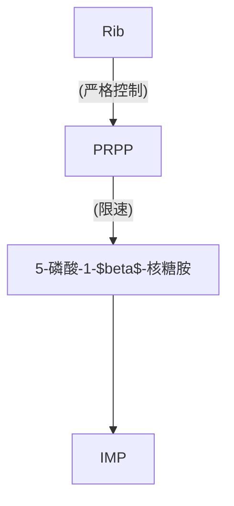

$K_s$ 型抑制剂型是通过与底物类似的结构实现抑制，$K_{cat}$ 型抑制剂是通过不可逆结合，即自杀性抑制剂（$K_{cat}$ 越高，抑制越强）

核苷酸合成

合子诱导：`Hfr`菌种中含有噬菌体基因，而 `F-`菌种对该噬菌体敏感，因而在噬菌体基因进入后噬菌体大量繁殖，引发裂解
特殊性转导：溶原性噬菌体在从宿主DNA解离时误带走了部分宿主基因，从而引发的转导。仅限于噬菌体附着点附近的基因
$F_1=\mu+h^2(\dfrac{P_1+P_{2}}{2}-\mu)$, 其中$\mu$为群体平均值，$h^2$为遗传力

线粒体DNA：
- 每个线粒体内有多个拷贝--->可导致异质性
- 存在多态现象
- 线粒体功能以及修复功能不完善导致 `mtDNA`存在大量突变
- 母体遗传
- 排列紧凑
- 大约15～16kb
叶绿体DNA：
- 一个成熟叶绿体大约含有10个`cpDNA`
- 植物 `cpDNA`大约为150-160kb，藻类 `cpDNA`大约为80～100kb

2.3629
3.7193
1.7320
1.75