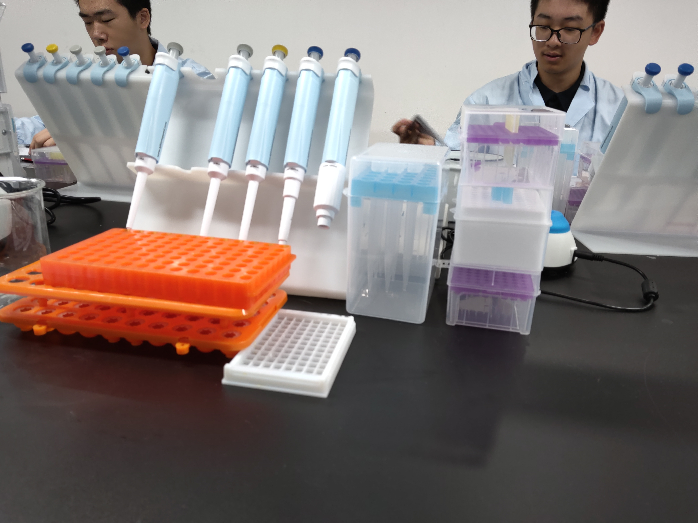
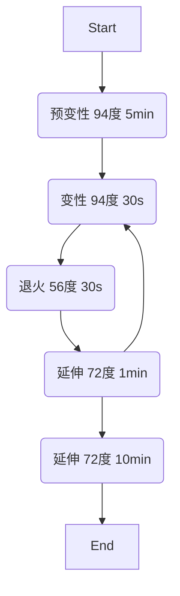

# Part 1. 常见仪器
## 移液枪



使用限制：低粘度，非强酸，非强腐蚀性，低挥发性，常温（降低误差）

体积设定：为确保准确性，从大到小

使用流程 ：

1. 装枪头 ![[也许是 实验报告 2024-07-09 21.13.24.excalidraw]]
2. 取液：润洗三次再取
3. 垂直取液，斜着排液，==缓慢吸液==以避免气泡 ![[也许是 实验报告 2024-07-09 19.38.36.excalidraw]]
4. 特殊：高粘度溶液 ![[也许是 实验报告 2024-07-09 19.41.23.excalidraw]]
常见误差

| 大小  | 范围             | 操作                          |
| --- | -------------- | --------------------------- |
| 大   | $1\%\sim5\%$   | 错误的浸入深度和角度，错误的吸液速度          |
| 中   | $0.5\%\sim1\%$ | 错误的量程，浸入深度，吸液速度；较差的排液技术和一致性 |
| 小   | $<0.5\%$       | 量程设定，浸入角度，润洗，手部温度           |

测漏：吸液后垂直放置，静置 15 s

>[!Warning] 对于易挥发液体
>记得排除是否是由饱和蒸汽压引起的漏液（润洗）

## 分光光度计

![[IMG_20240708_112009.jpg]]

波长：紫外 $200\sim400\mathrm{nm}$；可见光 $400\sim760\mathrm{nm}$；

>[!Notice] 常见特殊波长
> `Tyr&Trp`：$280\mathrm{nm}$
> `Phe&DNA`：$260\mathrm{nm}$
> 考马斯亮蓝：$465\mathrm{nm}$
> 考马斯亮蓝（结合蛋白质）：$595\mathrm{nm}$
> BCA 络合物：$562\mathrm{nm}$

原理：光吸收遵循朗伯 - 比尔定律 $A=-\lg T=-\lg \frac{I_{0}}{I}=\epsilon b c$ ，可以认为一定条件下光的吸收与物质浓度成正比

操作流程：

1. 预热 $25\mathrm{min}$
2. 调零：使用标准溶液将吸光度调至零，同时将透光度调至零
3. 上样：将待测溶液装入比色皿，确保光面干燥无污染，放入仪器中

>[!notice] 注意事项
>每次更换样品或量程后需要重新调零

## 离心机

配平

# Part 2. 生化实验
## BCA 测定蛋白浓度

BCA 法：具有一定还原性的蛋白将 $\mathrm{Cu}^{2+}$ 还原成 $\mathrm{Cu}^{1+}$，并与 BCA（双吡啶甲酸）形成络合物，测定 $562\mathrm{nm}$ 的吸光度以反应蛋白质的量

流程：

1. 测定标准品与样品吸光度
2. 计算拟合函数
3. 确认样品蛋白含量
![[IMG_20240708_104030.jpg]]
影响因素：还原剂（包括 `Cys`），螯合剂

## 考马斯亮蓝确定蛋白浓度

原理：考马斯亮蓝与蛋白质的疏水区结合，在 $595\mathrm{nm}$ 处存在光吸收峰

流程：同 BCA 法

影响因素：少

## SDS-PAGE 测定蛋白质分子量

原理：SDS 使蛋白质变性并均匀带上负电荷，因此在 PAGE 电泳时蛋白质迁移率仅与其相对分子量相关

凝胶：聚丙烯酰胺，聚合催化剂为四甲基乙二胺 ![[IMG_20240708_162643.jpg]]

```
>[!Important] 浓缩胶和分离胶
```

>SDS-PAGE 电泳中有两套缓冲系统，分别为电泳缓冲液的 `Tris-HCL` 和制胶缓冲液的 `Tris-Gly`
>在浓缩胶（pH=6.8）中，甘氨酸解离少，但 $\mathrm{Cl}^-$ 很高，因此甘氨酸会和氯离子将蛋白质夹在中间，实现浓缩 ![[也许是 实验报告 2024-07-10 21.13.21.excalidraw]]
>相反，在分离胶（pH=8.8）中，甘氨酸解离程度增大，将蛋白质远远甩在身后，再加上凝胶孔径缩小，蛋白质实现分离

上样试剂配置：首先按照测定的蛋白含量确定样品剂量，buffer 由所需上样体系总体积和 buffer 浓度确定（eg：$10 \mathrm{\mu l}$ 需要 $5\times$ SDS-PAGE buffer $2\mathrm{\mu l}$ ）, 最后剩余部分由水或 PBS 补齐

`marker`: 已知分子量的蛋白质，用来为样品蛋白分子量的计算提供数据，满足 $\lg M_{r}=-b\times m_R+K$ （$m_R$：电泳迁移率）

## VC 含量测定

### 2,6- 二氯酚靛酚法

原理：2,6- 二氯酚靛酚（DCPIP）在酸性溶液中呈红色，但被还原后无色，因此可通过测定 VC 还原 DCPIP 的量确定 VC 的量

流程：

1. 制取样品提取液
2. 使用 DCPIP 溶液滴定 VC 标准液（==为控制变量，需加入提取液中所使用的试剂==），确立 VC 含量与 DCPIP 含量之间的数量关系
3. 滴定样液，并进行空白对照
4. 计算
### 钼蓝法

原理：$偏磷酸+钼酸盐+\mathrm{VC}\xrightarrow{酸性} 钼蓝络合物(亮蓝色)$

流程：

1. 制取样品提取液，==离心取上清液==
2. 加入钼酸铵，偏磷酸 - 醋酸溶液，硫酸，以及草酸 -EDTA 溶液，制备得样液
3. 同样配方，使用 VC 标准液制备标准液 ![[IMG_20240709_111600.jpg]]
4. 分光计于 $760 \mathrm{nm}$ 处测量吸光度，绘制标准曲线，并使用样液数据计算得到 VC 含量
# Part 2. 分子生物学

（因为都是用的试剂盒所以记了一点原理）

## 质粒 DNA 提取

 细胞裂解：SDS 裂解细胞并使蛋白质变性，NaOH 使 DNA 变性，随后用 HAC (乙酸) 中和 NaOH，DNA 复性，最后用 KAC 使 SDS 和蛋白质沉淀，氯仿进一步除去蛋白，最后用无水乙醇沉淀质粒，$70\%$ 乙醇洗涤

 缓冲液：蔗糖提高粘度，保护质粒，EDTA 螯合镁离子，ban 掉 DNAase，`Tris-HCl ` 缓冲 pH

## 质粒琼脂糖凝胶电泳

泳动速度：超螺旋 DNA>线性 DNA>开环 DNA

加样：DNA 带负电，因此在负极端加样，向正极泳动

染色：之前常用溴化乙锭（EB），但因为有致癌性，现多用 GoldView 代替

## 质粒酶切

使用限制性内切酶（You know it）对特定点位进行识别和切割，随后电泳鉴定

> [!error] 酶切失败
> - 缓冲体系有问题
> - 酶过多
> - 杂质高
> - DNA 被降解

## 质粒回收

紫外照射（时间尽可能短，用长波，否则 DNA 会断裂），确定质粒位置，切胶

溶胶，去杂

## RNA 提取

==**RNA 不稳定，所以全程确保无酶且保持低温**==

基本流程类似 DNA 提取，不过裂解细胞改用异硫氰酸胍/苯酚，可使 DNA 和 RNA 因溶解度不同而分离

（本次实验效果不佳，$A260/A280$ 不高，反映 RNA 纯度不高，$A260/A230$ 更低，说明污染物主要是==有机溶剂==）![[IMG_20240710_181448.jpg]]

# Part 3. 遗传学
## PCR 鉴定人类性别

原理：在 Y 染色体长臂上存在 DZY-1 基因，可用做判断 Y 染色体是否存在的标记。同时，可用 Alu 家族的短散在重复序列（无论男女都会有）用作对照

流程：

1. 制样：缓冲液 +dNTPs+Taq DNA 聚合酶 + $\mathrm{ddH_2O}$ +==引物==![[也许是 实验报告 2024-07-13 07.40.26.excalidraw]]
2. 扩增



==PS. 对于 1 kb 及以下的片段，延伸 1 分钟足矣，但是对于更长的片段，需要按需增加时长==

3. 电泳，鉴定扩增产物 ![[IMG_20240712_150521.jpg]]![[IMG_20240712_161932.jpg]]

4. （图示结果显示 PCR 只有 DZY 基因被成功 PCR，但 Alu 基因没有，提示在操作过程中存在问题）

## 植物有丝分裂的观察

原理：没啥

流程：

1. 解离：取已固定根尖 $1 \mathrm{cm}$ 左右，放入 $60 \degree C\ 1\mathrm{mol/L}\ \mathrm{HCl}$ ，水浴加热 $90 \mathrm{s}$ ，漂洗
2. 制片：加入改良品红染色 5 分钟，盖上盖玻片，吸取多余染液，用力按压使细胞分离开 ![[1720754316885.jpg]]
## 果蝇的性别鉴定

原理：雄果蝇相比雌果蝇而言，体型更小；雌果蝇背部有 5 根黑色条带，而雄果蝇只有 3 根，且最后一根形成一个明显的黑斑；雄性在第一对足的跗节有一黑色鬃毛结构，称作性梳，是分辨雌雄的最准确标准 ![[IMG_20240713_093814.jpg]] 雄： ![[IMG_20240713_101006.jpg]] 雌：![[IMG_20240713_101113.jpg]]

## 果蝇唾腺染色体的观察

果蝇唾腺染色体：果蝇幼虫的唾腺发达，需要分泌大量消化酶，因此，在果蝇唾腺细胞中会形成巨大染色体，这是由多次复制后的同源染色体不分开而形成的结构。一个 ![[IMG_20240713_144000.jpg]]

流程：

1. 剥离唾腺：取果蝇==三龄==幼虫置于体视镜下，并滴加==生理盐水==，存在黑色物体（口器），形状细长的一段为头部，用一根解剖针固定住头部，另一根从同一处沿身体侧面向后划去，可见两条橙粒状透明组织即为唾腺
2. 解离&染色：使用 $1\mathrm{mol/L}{\ }\mathrm{HCl}$ 解离 $3\mathrm{min}$ ，随后蒸馏水漂洗 3 次，滴加改良品红染色 $10\mathrm{min}$
3. 制片： 将唾腺放上载玻片，盖上盖玻片，用铅笔一头的橡皮擦垂直敲打，再用拇指垂直按压，确保细胞完全分散，上镜观察，每个唾腺染色体应有 5 条长臂 ![[IMG_20240713_155740.jpg]]
# Part 4. 细胞生物学
## 细胞计数与活力检测

细胞计数板：用于给细胞计数的特质玻片

![[IMG_20240714_092029.jpg]]

流程

1. ==首先盖上盖玻片==
2. 从计数池旁的斜坡处缓慢加样，样品会因为毛细现象流入计数池中
3. 在显微镜下找到计数池中的方格，调整聚光器和光圈，确保方格清晰可见 ![[IMG_20240714_102447.jpg]]
4. 开始数数！（方格呈九宫格样，四角为白细胞计数区，中央一格为红细胞计数区，但其又被划分为九宫格，只数中央和四角）（==注意对于压边细胞，数上不数下，数左不数右==）
5. 计算密度：盖玻片和载玻片的距离恒定为 $1\mathrm{mm}$，因此计数池体积固定

> [!Warning] 注意
> 在加样时注意量，如果过多导致盖玻片上浮，会导致体积变大，同时记得注意浓度，细胞太多不好数，要稀释，浓度过低也不准，离心提高浓度

6. 活力检测：台盼蓝染液可以区分死细胞和活细胞，在计数前加入台盼蓝并分开计数即可
## 福尔根反应

原理：Schiff 试剂可与 DNA 的醛基进行反应，呈紫红色，而 RNA 也可反应因此提前水解掉 RNA，确保染色准确性。此种方式染色只对 DNA 染色，因此只有细胞核会上色，且核仁清晰可见

流程（以小麦根尖为例）

1. 水解：$60\degree C\ 1\mathrm{mol/L}\ \mathrm{HCl}{\ }10\mathrm{min}$
2. 染色：Schiff 染液中 $20\mathrm{min}$，待根尖变为深红色
3. 漂洗：==新配==亚硫酸液（亚硫酸会被氧化，因此必须新配）中洗三次，每次 $1\mathrm{min}$ 去除多余染液
4. 水洗： $5\mathrm{min}$，切下根尖
5. 制片：根尖剁碎，加一滴 $45\%$ 冰醋酸，盖上盖玻片，压片，敲打，==确保完全散开==
6. 观察：紫红色区域即为细胞核，其中的透明部分为核仁 ![[IMG_20240714_145822.jpg]]
## 细胞质膜通透性

原理：细胞质膜的通透性无法直接观察，因此采取测量红细胞溶血的时间的方法来反映通透性

流程：没啥，配溶液，测时间

> [!notice] 溶血判断标准
> 在装有样品的离心管后面放上一张画有黑线的白纸，若黑线清晰可见，即说明发生了溶血

## 血涂片染色

原理：对于血涂片，此处使用瑞吉染色，瑞氏染色和吉姆萨染色双重染色，二者染色相似，但瑞氏染色对细胞核效果较差，吉姆萨则对细胞质较差，因此二者常混合使用

流程

1. 涂片：![[也许是 实验报告 2024-07-17 16.00.50.excalidraw]]
2. 固定：甲醇固定 $2\sim5\mathrm{min}$, 晾干
3. 染色：先 A 液 $1\mathrm{min}$，再用两到三倍量的 B 液 $3\mathrm{min}$，水洗去多余染液
4. 观察：![[IMG_20240714_165954.jpg]]
# Part 5. 植物生理学
