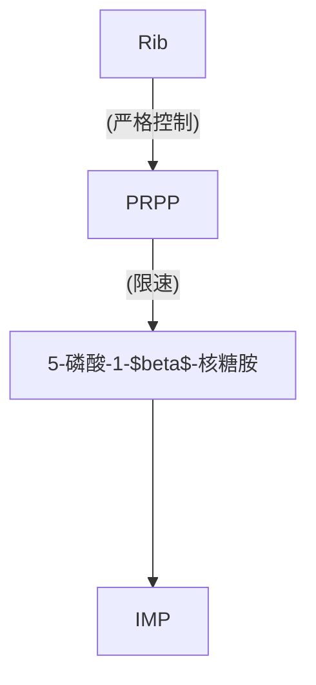

>[!faq] 卵胎生
>- 角鲨目
>- 矛尾鱼属

>[!info] 无尾目
>|       | 肩带  | 椎体            |
>| ----- | --- | ------------- |
>| 负子蟾   | 固胸型 | 后凹型           |
>| 盘舌蟾   | 弧胸型 | 后凹型           |
>| 蟾蜍    | 弧胸型 | 前凹型           |
>| 雨蛙    | 弧胸型 | 前凹型           |
>| 蛙     | 固胸型 | 1-7 前凹型，8 双凹型 |
>| 树蛙/姬蛙 | 同蛙  | 同蛙            |

>[!faq] 抗体&补体
>### 抗体
> - **定义**：抗体是一种由 B 细胞（特别是浆细胞）产生的蛋白质，主要用于识别和中和体内的特定抗原（如细菌、病毒等外来物质）。
> - **功能**：抗体能够特异性地与抗原结合，标记病原体，使其更容易被其他免疫细胞（如吞噬细胞）识别和清除。它们还可以直接中和毒素或阻止病原体进入宿主细胞。
> - **结构**：典型的抗体结构包括两个重链和两个轻链，形成一个 Y 字形结构，顶端的“手臂”负责与抗原结合。
>
> ### 补体
> - **定义**：补体是一组约 30 种不同的蛋白质，它们主要存在于血浆中，并通过一系列的级联反应来增强免疫系统的防御能力。
> - **功能**：补体系统的主要功能包括促进病原体的溶解（溶菌作用）、增强吞噬细胞的吞噬能力（调理作用）以及激发炎症反应。补体还可以与抗体协同作用，通过经典途径激活补体系统。
> - **机制**：补体系统可以通过三种不同的途径（经典途径、旁路途径和凝集素途径）激活，一旦激活，它们可以通过生成膜攻击复合物（MAC）直接杀死病原体。

酶标仪：酶联反应检测仪，实质是一种比色计，但所需体积远小于常规比色计，因此使用中可用常规比色仪代替，但需加大剂量

BCA：使用双吡啶甲酸，蛋白将 $\mathrm {Cu^{2+}}$ 还原后与 BCA 形成络合物因此极易受螯合剂和还原剂影响

SDS-PAGE 电泳：只跟分子量有关，满足 $\lg M_{r}=K-bx$，其中 $b$ 为斜率，$x$ 为==相对==迁移率

>[!Notice] 关于为什么用 PCR 仪处理蛋白样品
>只是把它当锅用，水浴温度不够

$K_s$ 型抑制剂型是通过与底物类似的结构实现抑制，$K_{cat}$ 型抑制剂是通过不可逆结合，即自杀性抑制剂（$K_{cat}$ 越高，抑制越强）

核苷酸合成



合子诱导：`Hfr` 菌种中含有噬菌体基因，而 `F-` 菌种对该噬菌体敏感，因而在噬菌体基因进入后噬菌体大量繁殖，引发裂解

特殊性转导：溶原性噬菌体在从宿主 DNA 解离时误带走了部分宿主基因，从而引发的转导。仅限于噬菌体附着点附近的基因

$F_1=\mu+h^2(\dfrac{P_1+P_{2}}{2}-\mu)$, 其中 $\mu$ 为群体平均值，$h^2$ 为遗传力

线粒体 DNA：

- 每个线粒体内有多个拷贝 --->可导致异质性
- 存在多态现象
- 线粒体功能以及修复功能不完善导致 `mtDNA` 存在大量突变
- 母体遗传
- 排列紧凑
- 大约 15～16kb
叶绿体 DNA：
- 一个成熟叶绿体大约含有 10 个 `cpDNA`
- 植物 `cpDNA` 大约为 150-160kb，藻类 `cpDNA` 大约为 80～100kb

```mermaid
flowchart
subgraph 血液
A1(Na+)
end
subgraph 上皮细胞
B1(Na+)
end
subgraph 小管液
C1(Na+)
end
subgraph 近端小管
B1--钠泵->A1
```

肾的重吸收基本法则

1. `Na2+` 换 `K+`，`H+`

---

```smiles
O=C(O)\C=C\C1C=C(O)C(O)=CC=1 咖啡酸
O2C1=CC(O)=C(C(O))C=C1C=CC(=O)2 东茛菪素
CC12CC13C(C(C)(O3)C)CC2 桉精油
OC1C=CC(CC(N5C)C3C=CC(O)C24)=C(C(O2)=1)C34(CC5) 吗啡
CN1C(=O)NC(=O)C2=C1N=CN(C)2
```
