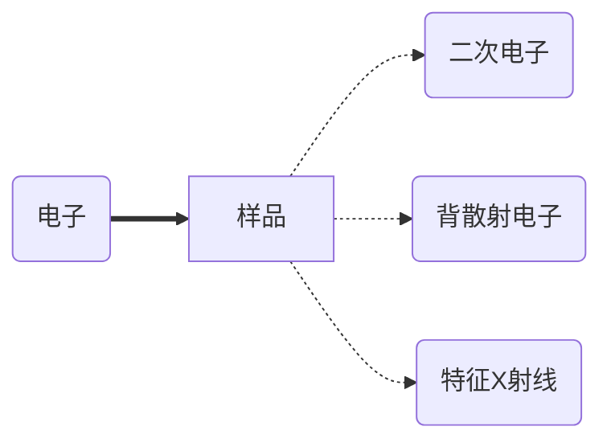
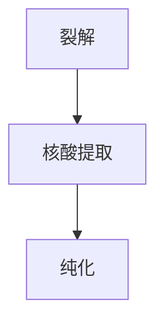
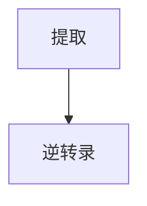

# 层析

分离系数：$R_s=\frac{{V_2-V_1}}{\frac{(W1+W2)}{2}}$, `V`：波峰横坐标，`W`：波宽

分类：

1. 凝胶过滤层析（最便宜）
2. 离子交换层析（常用阴离子交换，pH 8.5）
3. 亲和层析
4. 疏水层析
## 凝胶过滤层析

分子大小不同 --> 进入凝胶介质孔的能力不同 --> 大的先出，小的后出

排阻限度：完全不能进入凝胶的临界大小

渗入限度：能够完全进入凝胶的临界大小

分子量测定：计算回归方程

## 离子交换层析

所带电荷不同 --> 与分离柱亲和能力不同（需要缓冲液建立恒定 pH）

### 流程
1. 通常情况下，因大多数蛋白质 pI 低于 7，选阴离子交换和 pH 8.5
2. 上样，清洗掉未结合分子
3. 洗脱：高盐（存在梯度，从低到高）洗脱，净电荷越多，洗脱越靠后
4. 再生：高离子强度平衡液清洗
### 作图
- 横坐标：体积
- 纵坐标：A280
## 亲和层析

高选择性、高分辨率、高回收率、高容量、==贵==

### 蛋白标签

| 标签          | 配体             |
| ----------- | -------------- |
| 6 x His     | Ni-NTA 树脂      |
| HA          | 抗体             |
| Myc         | 抗体             |
| GST         | GSH            |
| Flag        | M2 mAB agarose |
| 单链 DNA 结合蛋白 | 单链 DNA         |
| 糖蛋白         | 植物凝集素 `lectin` |

`TEVsite`：蛋白酶 TEV 的切割位点，用于在纯化后切下标签

## 疏水层析 `HIC`

盐析：盐离子与水分子竞争结合

疏水相互作用理论：疏水性分子倾向于聚集

固相：醚，聚丙二醇，苯基 etc.

洗脱：高盐上样，低盐洗脱（从高到低）（高盐环境增强疏水作用）

穿透液（上样时）--> 杂蛋白

洗脱液（洗脱时）--> 目标蛋白

## 聚焦层析 `CF`

依照 `pI` 不同进行分离，流动相：多元缓冲剂；固定相：多缓冲交换剂

通过带缓冲能力的流动相在固定相表面形成 `pH` 梯度

## 高效液相色谱 `HPLC`

高压，常用于化合物的分离

第一个分离峰：溶剂的峰，因为无法被色谱柱保留，所以最先出现，出现时间（体积）称作死时间（体积）

正相&反相：

- 正相：亲水固定相，疏水性分子先出
- 反相：疏水固定相（多用 $\text C_{18}$），亲水性分子先出

# 电泳
## 聚丙烯酰胺凝胶电泳
### Native PAGE

非变性，蛋白质保持活性和天然构象

用途：

- 分子量&形状分析
- `Western Blot`
- 质谱
### BN-PAGE

加入考马斯亮蓝，使蛋白质带上负电荷并显色

>[!tip] 丽春红染色
> 原理类似于考马斯亮蓝法，本身带负电荷，结合蛋白质中的正电荷，但不同的是它不固定蛋白质，电泳后可以直接回收进行下一步处理

### SDS-PAGE

使蛋白质变性，均匀带上负电荷（从负极泳动到正极）

β- 巯基乙醇：切断二硫键，完全展开

[浓缩胶](obsidian://open?vault=notebook&file=%E4%B9%9F%E8%AE%B8%E6%98%AF%20%E5%AE%9E%E9%AA%8C%E6%8A%A5%E5%91%8A)

制胶：

- 原料：丙烯酰胺，甲叉双丙烯酰胺
- 过硫酸铵（APS）：引发剂
- 四甲基乙二胺（TEMED）：促进 APS 产生自由基，加速聚合

>[!tip] 样液乱漂？
> 加点甘油提高密度，有助于加样

>[!faq] `SDS-PAGE` vs. `AGE`
>
> `SDS-PAGE`：通常用于蛋白质，也可用于 DNA/RNA，但是时间长
>
> `AGE`：通常用于 DNA/RNA，耗时短，但分辨率不如 `SDS-PAGE`

>[!tip] `Aga` & `Agarose`
>  `Aga`：琼脂
>  `Agarose`：琼脂糖

## 等电聚焦 `IFE`

一般在双向电泳中使用，基于 `pI` 不同实现

# 离心

`rpm`：转速

`g` 或 `RGF`：离心力，$RGF=1.118\times 10^{-5}\times r\times{}(RPM)^2$

沉降系数 `S`：$S=(p-m)V/\mathit{f}$，其中 $(p-m)$ 为密度差；单位为秒，表示颗粒在离心力作用下沉降的特征时间尺度（移动单位距离所需时间）

分类：

- 密度梯度离心
- 等密度梯度离心，即平衡密度梯度离心
- 速率区带离心：依照速度分离，因此不会达到平衡
# 质谱

质荷比：$m/z$

>[!info] 一些推导（来自活力满分）
> $$
> \begin{align}
> \text 加速场中\\
> E_k&=E_1q\\
> v&=\sqrt{2E_{k}/m}=\sqrt{2E_1q/m}\\
> \text 分离场中\\
> \frac{mv^{2}}{r}&=Bvq\\
> \frac{mv}{r}&=Bq\\
> r&=\frac{mv}{Bq}\\
> &=\sqrt{2E_1qm}/Bq\\
> &=\sqrt{2E_1m/B^2q}\\
> \therefore \frac{m}{q}&=\frac{B^2r^{2}}{2E_{1}}
> \end{align}
> $$

分离

- 基质辅助激光解离 `MALDI`
- 电喷雾电离质谱 `ESI-MS`
## 液相色谱 - 质谱联用 `LC-MS`

先用 `LC` 分离化合物，再用 `MS` 鉴定

## 同位素编码亲合标记 `ICAT`

~~ICat~~

用于蛋白质质量测定

有轻标记（$\text C_{12}$）和重标记 ($\text C_{13}$)

两组样品在不同条件下进行反应，如对照组和实验组，然后打质谱

>[!faq] 为什么要用质谱？
> 考虑以下情况，某种蛋白质可以与过氧化氢反应，该反应是由某个特定的氨基酸导致的，如果选用电泳，显然无法得知是什么氨基酸，但是如果使用质谱，不仅可以分辨，还可以定量测定

## `ELISA`

直接 ELSA

间接 ELISA

三明治 ELISA

竞争 ELISA

> 封闭：BSA，血清蛋白，==脱脂奶粉==

# 显微镜

分辨率：$R=\dfrac{0.61\lambda}{N\sin\alpha/2}$

流程：

常用固定剂：10% 福尔马林；戊二醛（电镜）

染色：

- 苏木精 - 伊红染色：苏木精染核，蓝紫色，伊红染细胞质和细胞外基质，粉红色
- Masson 三色染色：区分细胞和细胞外基质，胶原纤维蓝色，肌肉、细胞质、红细胞红色
- PAS 染色：检测糖原、多糖，高碘酸氧化，生成醛基，与 Schiff 试剂生成紫红色产物
- 吉姆萨染色：甲苯胺蓝 + 伊红，甲苯胺蓝染 DNA--> 紫色，伊红染细胞质和 RBC--> 粉红色
- 甲苯胺蓝染色：碱性染料，染动物细胞核，硫酸软骨素，尼氏小体；植物韧皮部、木质部、花粉管
- 间苯三酚：
- GUS 染色 $\mathrm{ X‐Gluc\xrightarrow{\beta‐半乳糖苷酶}蓝色产物}$
- β- 半乳糖苷酶

## 相差显微镜

添加**环状光阑**和**相差板**

## 微分干涉显微镜

偏振光

Bar：标尺

Ca：形成层

Ph：韧皮部

Xy：木质部

## 暗场显微镜
## 荧光显微镜
## 共聚焦扫描显微镜
## 共聚焦激光扫描显微镜

用途

1. 平面成像
2. 延时成像
3. 荧光漂白恢复 `FRAP`
4. 荧光共振能量转移 `FRET`
## 扫描电子显微镜 `SEM`

背散射电子：被原子核弹回的电子，用于元素对比成像

特征 X 射线：激发内层电子跃迁时产生的 X 射线，可用于元素分析

## 透射电镜 `TEM`
## 扫描透电镜 `STEM`

新增**扫描线圈**，使电子束以扫描的方式穿过样品，类似于共聚焦激光扫描显微镜

## 扫描隧道显微镜 `STM`

使用一个探针扫描样品，记录二者之间的量子隧穿电流，反映表面形貌特征

## 原子力显微镜 `AFM`

类似 `STM`，但是记录的是作用力

# 切片

分类

- 徒手切片
- 振荡切片
- 冰冻切片
- 石蜡切片
# 流式细胞术

前向散射 `FS`

侧向散射 `SS`

---
# 免疫组化与免疫荧光
## 免疫组化 `HIC`

使用一抗和二抗对抗原进行标记

常用标记：

- HRP-polymer：辣根过氧化物酶聚合酶
- DAB：3,3'- 二氨基联苯按，显色底物，产生棕色物质
流程：

DAB--> 棕色

AEC--> 红色

AP（碱性磷酸酶）：

NBT/BCIP--> 蓝紫色

Fast Red--> 红色

HRP：效率高；多底物；速度快

AP：不易被抑制；背景干扰低

## 免疫荧光 `IF`

不再使用 HRP 来显色，而是给二抗偶联上荧光基团，具有高灵敏度和多重标记

>[!warning] 注意
> 并不是所有蛋白质都能找到抗体，因此很多时候会给 DNA 序列加上一个标签，用来结合一抗，例如 Xpress

---

分子生物学

## 核酸凝胶电泳

详见前文

## 核酸提取

流程

裂解

- 物理
	- 煮沸（无细胞壁）
	- 玻璃珠
	- 超声波
	- 研磨（植物，液氮）
	- 冻融
	- 匀浆
- 化学
	- SDS
	- 碱裂解
- 生物
	- 酶
提取
- 有机试剂
- 离心柱层析
- 磁珠
## 逆转录

需要逆转录酶，包括 DNA 聚合酶结构域和核糖核酸酶 H 结构域

流程

提取：用 OD 值判断纯度，纯 RNA OD 260/OD

## PCR
### 引物设计
1. 长度：18-25 nt，但更长的也不是没有
2. Tm 值：通常 55 度到 65 度
3. GC 值通常在 40% 到 60%
4. 3' 端：避免出现连续的 G/C，也避免以 A/T 结尾
5. 避免二级结构
### 重叠延伸 PCR

通过使用带有重叠片段的引物，融合基因

### 巢式 PCR

用来提高特异性和灵敏度

先用外侧引物 PCR 一次，再用内侧引物对上一次的产物进行 PCR

### 多重 PCR

一次对多个基因进行 PCR，常用于品种鉴定

## 分子标记
### 限制性片段长度多态性 `RFLP`

对酶的选择：通常不是构建载体用的那些酶，会把基因切的太碎

### 随机扩增多态性 DNA `RAPD`

随机引物设计：长约 10 nt，单引物，需要能体现出多态性

## 载体构建

> xxxR：通常指 xxx 抗性基因

酶切：通常用双酶切，如果用单酶切常会出现==自连==，要去磷酸化处理

>[!info] 限制性内切酶命名
> 属名的首字母 + 种名的头两个字母 (+ 株系名首字母)+ 发现顺序

>[!faq] 一些特殊情况
>Q1：质粒上只有 A 位点，但是目标基因中间也有，怎么办？
>A1：换同尾酶来处理目标基因，依然能接上
>Q2：质粒上有 4 个位点，但是切出来只有 2 条带？
>A2：可能是另外两个位点被甲基化了

酶连：使用 T4 DNA 连接酶

感受态细胞：理化方法诱导细胞，吸收周围环境中的 DNA。大肠杆菌缓冲液常用氯化钙

挑菌时挑小的，边缘清晰的

# 基因表达水平分析
## 半定量 RT-PCR

起始模板越多，理论上 PCR 产物越多，因此可以通过进行一定次数的 PCR 来半定量

不同基因的循环数可以不一样，但同一个基因的循环数必须一样

***==不准确==***

## 实时定量 PCR `qPCR`

指数期：PCR 产物量随循环数提高

阈值：通常为背景信号标准差的 10 倍

Ct/Cq 值：反应荧光信号达到阈值时的循环数

溶解曲线：用来判断引物特异性，如果其存在两个断崖，或其导函数存在两个峰，说明存在两种产物，即有非特异性产物

>[!info] 计算
> 假设我们有 2 个基因，A 做内参，B 做实验，现在我们对他们做了两次 qPCR，分别为对照组 1 和实验组 2，因此，我们可以得到 $Ct_{A1},Ct_{A2},Ct_{B1},Ct_{B2}$ 四个值
> 显然，$2^{Ct}$ 与原始模板量成正比。所以，对于组一，B 的表达量是 A 的 $2^{-(Ct_{A1}-Ct_{B1})}$ 倍，组二同理为 $2^{-(Ct_{A2}-Ct_{B2})}$
> 因为基因 A 是内参，它的表达量应该不受影响，所以，在两组实验中，基因 B 的表达量的变化值应该是 $2^{-(Ct_{A2}-Ct_{B2})}/2^{-(Ct_{A1}-Ct_{B1})}=2^{-\Delta Ct_1}/2^{-\Delta Ct_2}=2^{-\Delta\Delta Ct}$

## 原位杂交 `ISH`

用标记的核酸探针来检测基因表达的时空特异性

通常用地高辛或生物素标记

## Southern Blotting

将待测 DNA 电泳分离后转至薄膜上，加入同位素标记的探针后退火

## Northern Blotting

同 Southern Blotting，将 DNA 换做 RNA

## Western Blotting

将待测蛋白电泳分离，转膜，封闭（脱脂奶粉），加入一抗二抗，荧光/同位素/化学显色/化学发光

所的图像灰度值可以用来定量

## RNA-Seq 之 GO 分析

将两组 RNA-Seq 的数据进行对比，将其中有差异的基因根据其功能，代谢途径等富集在一起，绘制成图

>[!faq] GO&KEGG
> 两个不同的数据库，KEGG 更偏向代谢和信号通路，GO 更中立

## 基因表达连续分析 `SAGE`
# 亚细胞定位
## GUS 组织化学染色

多在组织水平，原理见前文

## GFP 荧光标记
# 分子相互作用分析
## 免疫共沉淀 `Co-IP`

原理：如果蛋白 A 可以和蛋白 B 结合，那么 A 被沉淀下来时，B 也应当一起被沉淀

ProteinA/G：可以结合抗体的 FC 片段，用来将抗体和珠子结合，形成抗体捕获复合物

Input：阳性对照，将裂解液不做处理直接跑 WB，确保每一个蛋白都存在

IP-IgG：阴性对照，理论上用 IgG 不能拉下任何一个蛋白

## GST pull-Down

类似于 Co-IP，不过是用 GSH 结合标记了 GST 的蛋白，再去拉取可以相互作用的蛋白

>[!faq] Co-IP vs. GST pull-down
>Co-IP 所用的 Bait 蛋白是由细胞内表达的，Prey 也是在该细胞内表达的，二者在胞内结合，证明二者在生理状态下结合，再用抗体把 Bait 拉出来
>GST pull-down 的 Bait 是在体外表达得到的，先与珠子结合，再在试管内与 Prey 结合，证明二者存在可结合结构域

## 酵母双杂交

将两个蛋白分别结合 AD（转录激活结构域） 和 BD（DNA 结合结构域），二者结合后可激活基因转录。

常用的报告基因主要分为三类：营养标记基因，抗菌素基因，化学显色基因

二缺板：转进去的 AD 和 BD 的质粒上不仅包括目标蛋白，还包括两种营养标记基因，如果能存活，则证明转入成功

转入不带 AD 和 BD 的质粒：证明酵母不会出现自激活

## 双分子荧光互补 `BiFC`

残忍地将 YFP 分成 N 端和 C 端两部分，分别与两种目标蛋白融合，如果二者可以结合，那么 YFP 可以拼在一起，发出荧光

## 染色质免疫共沉淀 `ChIP`

在活细胞中将蛋白质 -DNA 复合物固定，随机切成小片段，沉淀，纯化。在已知信息较多的情况下可以做 `qPCR` 定量，否则选择 `seq` 进行分析鉴定

对于 `seq`，它的分析结果可以帮助判断该蛋白调控了哪些启动子

对于 `qPCR`，它的分析结果可以帮助判断该蛋白结合哪些 box

## 酵母单杂交

许多转录激活子物理上分为 AD 和 BD 两部分，如果某蛋白可以和 DNA 结合，则将它与 AD 融合后应该可以激活其表达

其他操作仍然类似于酵母单杂交

## 凝胶迁移实验 `EMSA`

在 DNA 与蛋白质结合后，其电泳速度会极大的下降，电泳时表现为滞后带

冷探针：不带标记的探针，其作用为竞争性结合蛋白质，表现为滞后带变淡

抗体：结合蛋白质，使其电泳速度进一步减慢，表现为超级滞后带，佐证 DNA 电泳滞后由该蛋白引起

# 基因编辑与表达调控
## RNAi
## 病毒诱导的基因沉默 `VIGS`

利用植物本身存在的免疫系统，将要沉默的基因转入病毒，待病毒在细胞内繁殖时，使内源免疫系统误将该基因视作外源基因，进行清除，从而实现沉默

## Cre-LoxP 系统

`Cre` 是一种重组酶，识别 `LoxP` 位点并促进 `LoxP` 之间的重组，可以利用它实现基因的倒位，缺失和易位，主要运用在小鼠中

## Tet ON/OFF 系统

四环素操纵子，类似于乳糖操纵子，在四环素存在的情况下用于将其泵出

## GAL4/UAS 系统

GAL 4 是一种转录激活因子，识别结合 UAS 序列，可以实现组织特异性表达，多应用在果蝇中

## 锌指核酸酶 `ZFN`
## TALEN
## `CRISPR-Cas9` 系统

原核生物的适应性免疫系统，Cas 酶通过识别外来核酸的 `PAM` 位点（5'-NGG-3'），特异性切割（`PAM` 向前 3 个 nt），并将其整合到自身的 CRISPR 序列中，在下一次入侵时，CRSIPR 序列表达形成 `crRNA`，与 `tracrRNA` 结合识别核酸并诱导 Cas 酶靶向切割

在运用中，通常将 `tracrRNA` 和 `crRNA` 合并成 `gRNA`

>[!faq] Cas 9 vs. Cas 12
>Cas 9 的 PAM 为 NGG
>Cas 12 的 PAM 为 TTTN
>Cas 12 不需要 tracrRNA
>Cas 9 通常切平末端
>Cas 12 通常切出 5' 粘性末端
>Cas 9 切上游 3 nt
>Cas 12 切下游 20-21 nt
>Cas 9 通常用于富 G 序列
>Cas 12 通常用于富 T 序列

修复

- NHEJ：非同源重组，通常会导致移码突变，实现敲除
- HDR：通过引入 `donor` 模板实现精确修复，通常用于敲入
`dCas9`：失去了切割活性，但是仍然有结合活性，与其他蛋白融合后可以实现其他功能，例如定向甲基化
### 组织特异性基因组编辑

利用 `CRISPR-Cas9` 系统的组织特异性表达实现

载体上通常有两个筛选基因，一个用于筛选转入成功的菌种，另一个用于筛选转入成功的株系

## Meganuclease
