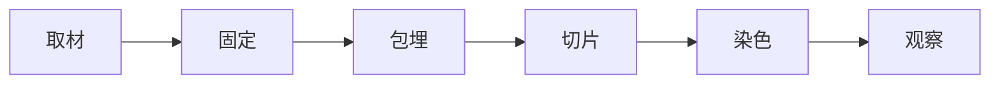
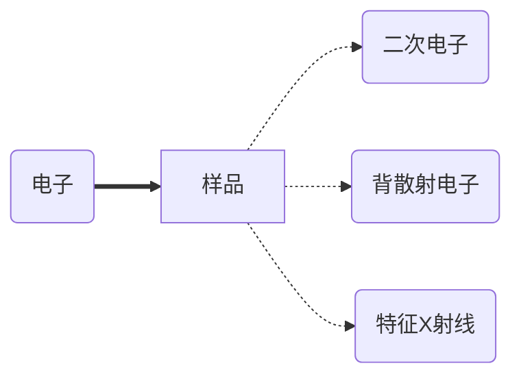

## 层析

分离系数：$R_s=\frac{{V_2-V_1}}{\frac{(W1+W2)}{2}}$, `V`：波峰横坐标，`W`：波宽

分类：

1. 凝胶过滤层析（最便宜）
2. 离子交换层析（常用阴离子交换，pH 8.5）
3. 亲和层析
4. 疏水层析
### 凝胶过滤层析

分子大小不同 -->进入凝胶介质孔的能力不同 -->大的先出，小的后出

排阻限度：完全不能进入凝胶的临界大小

渗入限度：能够完全进入凝胶的临界大小

分子量测定：计算回归方程

### 离子交换层析

所带电荷不同 -->与分离柱亲和能力不同（需要缓冲液建立恒定 pH）

流程

1. 通常情况下，因大多数蛋白质 pI 低于 7，选阴离子交换和 pH 8.5
2. 上样，清洗掉未结合分子
3. 洗脱：高盐（存在梯度，从低到高）洗脱，净电荷越多，洗脱越靠后
4. 再生：高离子强度平衡液清洗
作图：
- 横坐标：体积
- 纵坐标：A280
### 亲和层析

高选择性、高分辨率、高回收率、高容量、==贵==

蛋白标签

| 标签      | 配体             |
| ------- | -------------- |
| 6 x His | Ni-NTA 树脂      |
| HA      | 抗体             |
| Myc     | 抗体             |
| GST     | GSH            |
| Flag    | M2 mAB agarose |

`TEVsite`：蛋白酶 TEV 的切割位点，用于在纯化后切下标签

### 疏水层析

盐析：盐离子与水分子竞争结合

疏水相互作用理论：疏水性分子倾向于聚集

固相：醚，聚丙二醇，苯基 etc.

洗脱：高盐上样，低盐洗脱（从高到低）（高盐环境增强疏水作用）

穿透液（上样时）-->杂蛋白

洗脱液（洗脱时）-->目标蛋白

### 高效液相色谱

高压，常用于化合物的分离

第一个分离峰：溶剂的峰，因为无法被色谱柱保留，所以最先出现，出现时间（体积）称作死时间（体积）

正相&反相：

- 正相：亲水固定相，疏水性分子先出
- 反相：疏水固定相（多用 $\text C_{18}$），亲水性分子先出

## 电泳
### 聚丙烯酰胺凝胶电泳
#### Native PAGE

非变性，蛋白质保持活性和天然构象

用途：

- 分子量&形状分析
- `Western Blot`
- 质谱
#### BN-PAGE

加入考马斯亮蓝，使蛋白质带上负电荷并显色

#### SDS-PAGE

使蛋白质变性，均匀带上负电荷（从负极泳动到正极）

β- 巯基乙醇：切断二硫键，完全展开

[浓缩胶](obsidian://open?vault=notebook&file=%E4%B9%9F%E8%AE%B8%E6%98%AF%20%E5%AE%9E%E9%AA%8C%E6%8A%A5%E5%91%8A)

制胶：

- 原料：丙烯酰胺，甲叉双丙烯酰胺
- 过硫酸铵（APS）：引发剂
- 四甲基乙二胺（TEMED）：促进 APS 产生自由基，加速聚合

>[!tip] 样液乱漂？
>加点甘油提高密度，有助于加样

>[!faq] `SDS-PAGE` vs. `AGE`
>
> `SDS-PAGE`：通常用于蛋白质，也可用于 DNA/RNA，但是时间长
>
> `AGE`：通常用于 DNA/RNA，耗时短，但分辨率不如 `SDS-PAGE`

>[!tip] `Aga` & `Agarose`
>  `Aga`：琼脂
>  `Agarose`：琼脂糖

### 等电聚焦

一般在双向电泳中使用

## 离心

`rpm`：转速

`g` 或 `RGF`：离心力，$RGF=1.118\times 10^{-5}\times r\times{}(RPM)^2$

分类：

- 密度梯度离心
- 等密度梯度离心
- 速率区带离心：依照速度分离，因此不会达到平衡
## 质谱

质荷比：$m/z$

>[!info] 一些推导（来自活力满分）
> $$
> \begin{align}
> \text 加速场中\\
> E_k&=E_1q\\
> v_x&=\sqrt{2E_{k}/m}=\sqrt{2E_1q/m}\\
> \text 分离场中\\
> t&=d/v_x=d/\sqrt{2E_1q/m}\\
> a_y&=E_2q/m\\
> v_y&=a_yt=\frac{E_2qd}{m\sqrt\frac{2E_{1}q}{m}}\\
> d_y&=v_yt=\frac{E_{2}m^2d^{2}}{{2mE_1}}\\
> \end{align}
> $$

分离

- 基质辅助激光解离 `MALDI`
- 电喷雾电离质谱 `ESI-MS`
### 液相色谱 - 质谱联用 `LC-MS`

先用 `LC` 分离化合物，再用 `MS` 鉴定

### 同位素编码亲合标记 `ICAT`

~~ICat~~

用于蛋白质质量测定

有轻标记（$\text C_{12}$）和重标记 ($\text C_{13}$)

两组样品在不同条件下进行反应，如对照组和实验组，然后打质谱

>[!faq] 为什么要用质谱？
>考虑以下情况，某种蛋白质可以与过氧化氢反应，该反应是由某个特定的氨基酸导致的，如果选用电泳，显然无法得知是什么氨基酸，但是如果使用质谱，不仅可以分辨，还可以定量测定

### `ELISA`

直接 ELSA

间接 ELISA

三明治 ELISA

竞争 ELISA

## 显微镜

分辨率：$R=\dfrac{0.61\lambda}{N\sin\alpha/2}$

流程：

常用固定剂：10% 福尔马林；戊二醛（电镜）

染色：

- 苏木精 - 伊红染色：苏木精染核，蓝紫色，伊红染细胞质和细胞外基质，粉红色
- Masson 三色染色：区分细胞和细胞外基质，胶原纤维蓝色，肌肉、细胞质、红细胞红色
- PAS 染色：糖原、多糖，高碘酸氧化，生成醛基，与 Schiff 试剂生成紫红色产物
- 吉姆萨染色
- 甲苯胺兰染色：碱性染料
- 间苯三酚：
- GUS 染色 $\mathrm{ X‐Gluc\xrightarrow{\beta‐半乳糖苷酶}蓝色产物}$
- β- 半乳糖苷酶

### 相差显微镜

添加**环状光阑**和**相差板**

### 微分干涉显微镜

偏振光

Bar：标尺

Ca：形成层

Ph：韧皮部

Xy：木质部

### 暗场显微镜
### 荧光显微镜
### 共聚焦扫描显微镜
### 共聚焦激光扫描显微镜

用途

1. 平面成像
2. 延时成像
3. 荧光漂白恢复 `FRAP`
4. 荧光共振能量转移 `FRET`
### 扫描电子显微镜 `SEM`

背散射电子：被原子核弹回的电子，用于元素对比成像

特征 X 射线：激发内层电子跃迁时产生的 X 射线，可用于元素分析

### 透射电镜 `TEM`
### 扫描透电镜 `STEM`

新增**扫描线圈**，使电子束以扫描的方式穿过样品，类似于共聚焦激光扫描显微镜

### 扫描隧道显微镜 `STM`

使用一个探针扫描样品，记录二者之间的量子隧穿电流，反映表面形貌特征

### 原子力显微镜 `AFM`

类似 `STM`，但是记录的是作用力

## 切片

分类

- 徒手切片
- 振荡切片
- 冰冻切片
- 石蜡切片
## 流式细胞术

前向散射 `FS`

侧向散射 `SS`      