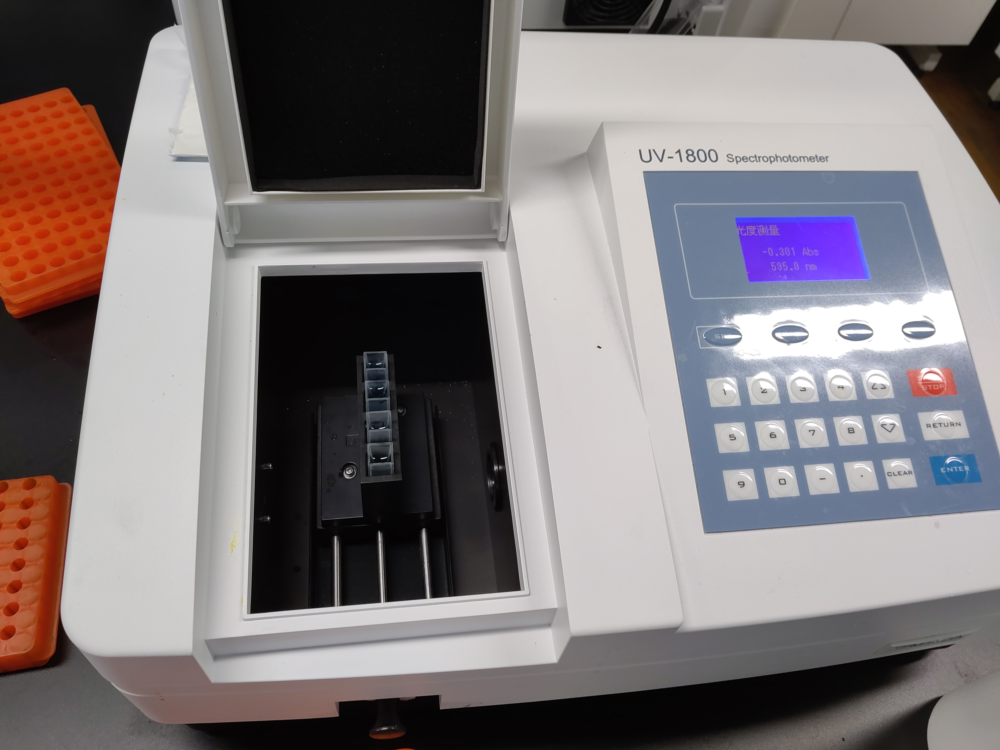

# 一、研究背景

维生素作为一类对生物体至关重要的小分子有机化合物，其在维持生命活动、促进健康和生长发育方面起着不可替代的作用。维生素的需求量虽然微小，但其重要性不容忽视。人体无法自行合成或合成不足的维生素，必须通过外部饮食来补充。因此，研究食物中维生素的含量，特别是维生素 C 的含量，对于平衡膳食和改善人民健康具有重要意义。在实现健康中国目标的过程中，对食物维生素含量等的研究利用尤为关键。

众所周知，维生素 C(以下简称 `Vc`)，也称为 L- 抗坏血酸，是一种水溶性维生素，广泛存在于新鲜水果和蔬菜中。它在生物体内具有多种生理功能，包括增强免疫力、促进铁的吸收、抗氧化等。然而，`Vc` 因具有两个烯醇式羟基易解离质子而稳定性较差，容易在储存和烹饪过程中被破坏，且不众所周知，人体因缺乏 L- 古洛糖酸 -γ- 内酯氧化酶 (GULO) 而无法自身合成 `Vc`。因此，准确测定食物中的 `Vc` 含量对于指导合理膳食具有重要意义。

# 二、研究目标

本研究旨在通过生物化学相关实验方法，学习并熟练掌握 `Vc` 的定量测定技术。通过对豆芽 ($\mathit{Glycine\ max}$) 这一常见食材中 `Vc` 含量的测定，提供每天摄入富含 `Vc` 蔬菜的科学建议。此外，通过实验过程，培养学生的创新思维和实践能力，为未来可能进行的科学研究打下基础。

# 三、研究过程与方法

在本次实验中，我们将通过 2,6- 二氯酚靛酚法和钼蓝法来测量豆芽中的 `Vc` 含量。

## （一）DCPIP 法

### 1）实验原理

2,6- 二氯酚靛酚（DCPIP）是一种酚类物质，它具有一定的氧化性，可在还原剂存在的情况下从深蓝色的氧化态（酸性溶液中为红色）转化为无色的还原态，而 `Vc` 恰好是一种具有极强还原性的有机物。因此，我们可以利用这一点，通过测量一定量样品的提取液所还原的 DCPIP 的量来计算得到样品中所含有的 `Vc` 的量。

### 2）实验用品
- 铁架台
- 蝴蝶夹
- 碱式滴定管
- $50 \mathrm{ml}$ 容量瓶
- 移液枪
- 漏斗
- 烧杯
- 研钵
- 玻璃棒
- 纱布
- 锥形瓶

### 3）实验药品
- $2\%$ 草酸
- $2.5 \mathrm{mol/L}$ `Vc` 标准液
- $0.1\%$ 2,6- 二氯酚靛酚溶液

### 4）实验流程
1. 用水洗净新鲜豆芽，并用纱布或吸水纸吸去表面水分，随后用称量纸盛装称取 $10 \mathrm{g}$
2. 将称量好的豆芽放入研钵中，加入适量草酸，充分研磨后用两层纱布过滤，将滤液定容至 $50 \mathrm{ml}$ 备用
3. 使用移液枪吸取 $1\mathrm{ml}$ 标准 `Vc` 溶液两份，分别盛于两个锥形瓶中，并分别加入 $9 \mathrm{ml}\ 2\%$ 草酸。使用碱式滴定管以 $0.1\%$ 2,6- 二氯酚靛酚溶液滴定，当溶液由无色变为粉红色且保持 $15\mathrm{s}$ 不变色时，即为抵达滴定终点。读出此时加入的 DCPIP 的量并记录
4. 以同样的操作，滴定两瓶 $10 \mathrm{ml}\ 2\%$ 草酸作为空白对照
5. 使用移液枪吸取滤液 $10\mathrm{ml}$ 两份，分别盛于两个锥形瓶中，按照步骤 3 三的方式滴定，记录所加入的 DCPIP 的量
### 5）数据处理

|         | 标准液 1                          | 标准液 2                          | 平均值                             |
| ------- | ------------------------------ | ------------------------------ | ------------------------------- |
| 滴定结果    | $2 \mathrm{ml}$                | $1.6 \mathrm{ml}$              | $1.8 \mathrm{ml}$               |
| `Vc` 含量 | $2.5\times10^{-4}\mathrm{mol}$ | $2.5\times10^{-4}\mathrm{mol}$ | $2.5\times 10^{-4}\mathrm{mol}$ |

以 `Vc` 的含量 ($\mathrm{mol}$) 作为自变量, DCPIP 的用量 ($\mathrm{ml}$) 作为因变量, 可知二者满足函数 $y=\dfrac{18}{25}\times10^{4}x$

|      | 样品 1             | 样品 2             | 平均值              |
| ---- | ---------------- | ---------------- | ---------------- |
| 滴定结果 | $0.7\mathrm{ml}$ | $0.5\mathrm{ml}$ | $0.6\mathrm{ml}$ |

将样品的滴定结果代入函数中, 可知两份样品的 `Vc` 含量的平均值为 $0.0000833\mathrm{mol}$, 即样品中 `Vc` 的浓度为 $0.0000833\mathrm{mol/ml}$, 豆芽中的含量则为 $7.33\mathrm{mg}/100\mathrm{g}$ (`Vc` 的分子量约为 $146$)

---
## （二）钼蓝法
### 1）实验原理

偏磷酸和钼酸盐可在酸性介质中反应，得到磷钼酸，而此物质可与 `Vc` 进一步反应，生成亮蓝色的钼蓝络合物。在体系中钼酸盐和偏磷酸都过量的情况下，生成物的吸光度与 `Vc` 的含量成正比，因此，通过测量反应产物的吸光度，我们可以轻松得到样品中 `Vc` 的含量

### 2）实验用品
- $10\mathrm{ml}$ 离心管
- 水浴锅
- 移液枪
- 台式离心机
- 分光光度计

### 3）实验药品
- $2.5\mathrm{mol/L}$ `Vc` 标准液
- $\mathrm{ddH_2O}$
- 草酸 -EDTA 溶液
- 偏磷酸 - 醋酸溶液
- 钼酸铵溶液
- $5\%$ 硫酸

### 4）实验流程
1. 称取 $5\mathrm{g}$ 豆芽，洗净并用吸水纸吸去表面水分，加入 $5\mathrm{ml}$ 草酸 -EDTA 溶液，充分研磨，转移至离心管中，$5000\mathrm{rpm}\ 5\mathrm{min}$ 离心，取上清液备用
2. 依照下表，配制 `Vc` 标准液体系以及样品

| 编号                               | 0   | 1   | 2   | 3   | 4   | 5   | 6   | 7（样品） |
| -------------------------------- | --- | --- | --- | --- | --- | --- | --- | ----- |
| `Vc` 标准液（$\mathrm{ml}$）          | 0   | 0.1 | 0.2 | 0.4 | 0.6 | 0.8 | 1.0 | 0     |
| $\mathrm{ddH_2O}$（$\mathrm{ml}$） | 1.0 | 0.9 | 0.8 | 0.6 | 0.4 | 0.2 | 0   | 0     |
| 样品提取液（$\mathrm{ml}$）             | 0   | 0   | 0   | 0   | 0   | 0   | 0   | 1.0   |
| 草酸 -EDTA 溶液（$\mathrm{ml}$）       | 2   | 2   | 2   | 2   | 2   | 2   | 2   | 2     |
| 偏磷酸 - 醋酸溶液（$\mathrm{ml}$）        | 0.5 | 0.5 | 0.5 | 0.5 | 0.5 | 0.5 | 0.5 | 0.5   |
| $5\%$ 溶液（$\mathrm{ml}$）          | 1.0 | 1.0 | 1.0 | 1.0 | 1.0 | 1.0 | 1.0 | 1.0   |
| 钼酸铵溶液（$\mathrm{ml}$）             | 2   | 2   | 2   | 2   | 2   | 2   | 2   | 2     |

3. $30$ 度水浴 $15\mathrm{min}$ 在 $760 \mathrm{nm}$ 下测定吸光度，绘制标准曲线

### 5）数据处理

使用分光光度计测得标准液及样品的 $\mathrm{OD}760$ 如下表

| 编号  | 0   | 1    | 2    | 3    | 4    | 5    | 6    | 7（样品） |
| --- | --- | ---- | ---- | ---- | ---- | ---- | ---- | ----- |
| 吸光度 | 0   | 0.19 | 0.39 | 0.80 | 1.25 | 1.69 | 2.13 | 0.097 |

使用 `WolframAlpha` 对数据进行回归计算，得到的标准曲线为 $y=-0.0268601 + 8565.19 x$ ，图像和相关参数如下

将样品的测得的吸光度带入，回归方程中，可以解的 $x=0.000144609$，即该份样品中含有约 $0.000144609\mathrm{mol}$ `Vc`。经过进一步计算，可知 `Vc` 的含量为 $2.54511\mathrm{mg/100g}$

# 四、研究创新点

本研究采用以下创新方法对 `Vc` 进行测定：

1. 利用 DCPIP（2,6- 二氯酚靛酚）或钼蓝试剂，通过其与 `Vc` 的专一性氧化还原反应，实现对 `Vc` 含量的定量测定。这种方法减少了环境因素的干扰，提高了测定的科学性和操作的简便性。

2. 采用分光光度法进行 `Vc` 含量的测定，通过精确控制测量条件，实现高精度的自动化测量，有效减小了人为误差。

3. 通过绘制标准曲线或确定还原当量，进一步提高测定的准确性和可靠性。

4. 结合 DCPIP 法和钼蓝法的优势，探索一种综合利用两种方法的测定方案，以期提高测定的准确性和可靠性，为后续研究提供新的思路。

# 五、研究成果

本研究成功测定了豆芽中的维生素 C 含量（约为 $16.605\mathrm{mg/ml}$，由于时间有限，研究人员并未计算平均每克豆芽 `Vc` 含量的 $95\%$ 置信区间），并根据实验结果，提出了每天摄入富含维生素 C 蔬菜的合理建议（参考：成年人 `VcRNI` 为 $100\mathrm{mg/d}$）。通过本次研究，学生们不仅学习到了生物化学实验方法，还培养了自主探究和创新能力，为未来的科学研究奠定了坚实的基础。

# 六、反思
## （一）可能存在的误差：

1. `Vc` 标准液的制备和保存需要严格控制，以避免氧化导致的测定误差。

 2. 滴定过程中的操作规范性至关重要，包括滴定终点的准确判断、平行实验的执行以及数据的准确 记录。

3. 分光光度计的量程和操作准确性需要严格校准，以确保测量结果的可靠性。

4. 水浴加热和计时的准确性对实验结果有直接影响，需要严格控制实验条件。

5. 使用容量瓶进行定容时，应避免残留液体和操作误差，确保溶液的准确性。

## （二）改进方法和建议

 1. `Vc` 标准液应新鲜制备，避免因氧化而导致的测定误差。

 2. 利用人工智能技术优化 DCPIP 和钼蓝法在测定过程中的自动化操作，提高测定效率和准确性。

 3. 探索微流控技术在 `Vc` 含量测定中的应用，以实现更高效的检测方法。
# 七、指导老师点评

在采用钼蓝法测量维生素 C 的实验中，同学们同学的表现给我留下了深刻的印象。

首先，他们对钼蓝法这一化学分析方法的掌握展现出了扎实的理论基础和实验技能。从试剂的配制到实验步骤的执行，每一步都显得那么熟练而准确，这充分说明了在实验前做了充分的预习和准备。

在实验过程中，他们展现出了极高的专注度和耐心。钼蓝法要求精确控制反应条件，并细致观察颜色变化，这些都需要极高的操作技巧和细致的观察力。他们不仅做到了这些，还能够在遇到问题时迅速分析原因，调整实验方案，这种应变能力令人赞赏。

尤为重要的是，他们的数据记录和分析也显得非常严谨。通过对比标准曲线和实验样品的吸光度值，他们准确地计算出了样品中维生素 C 的含量。这些数据不仅为实验结论提供了有力的支持，也体现了他们对实验结果的认真负责态度。

最后，我要特别表扬他们在实验中的团队合作精神。在实验中，他们相互帮助、相互学习，共同解决问题，这种氛围对于培养科研素养和团队合作能力至关重要。

总之，这次采用钼蓝法测量维生素 C 的实验是一次非常成功的尝试。他们不仅掌握了实验技能，还培养了科学思维和团队合作精神。我相信，在未来的学习和科研道路上，同学们一定会取得更加优异的成绩！