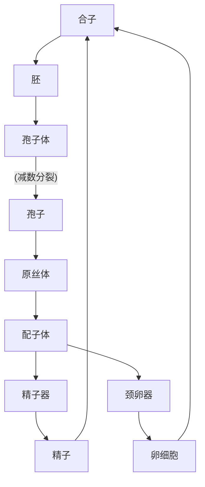

# 孢子植物
## 藻类植物
- 进化：线粒体，叶绿体，内共生
- 具光合色素，可光合，自养
 - 形态，结构差异较大
- 生殖结构多单细胞，不发育成胚
- 多生活在水中 ==陆上：亚气生藻==
- 可共生
- 原绿植物->蓝藻门
- 与高等植物最接近：绿藻门（叶绿素a，b；淀粉）
- 硅藻门细胞壁：硅质，果胶
### 原核藻类：蓝藻门
- 原核
- 异形胞
	- 排布有规律，均匀
	- 固氮，营养繁殖
- 繁殖
	- 营养生殖
	- 无性繁殖：外生孢子，内生孢子
	- ==没有有性生殖==
	- 代表
		- 颤藻：隔离盘可断
		- 念珠藻：地木耳
		- 鱼腥藻：类似地木耳，水生
### 真核藻类
- 无真正分化
- 具光合器
- 合子不发育成胚
- 生殖结构简单
- 繁殖
	- 营养
	- 无性
	- 有性
		- 同配生殖
		- 异配生殖
		- 卵式生殖
- 生活史
	- 分为合子减数分裂，配子减数分裂，孢子减数分裂
	- 均有核相交替
	- 仅孢子减数分裂有世代交替
#### 红藻门
- 生活史复杂
- 多细胞
- 代表：紫菜
#### 甲藻门
#### 硅藻门
- 细胞壁由两个套合半片组成，有花纹
- 繁殖：==细胞分裂==，母代->1原大+1较小
- 大小恢复：形成复大孢子
#### 褐藻门
- 多细胞，出现原始分化
- 多数为孢子减数分裂
#### 裸藻门
- 多数淡水，可形成水华
#### 绿藻门
- 代表
	- 衣藻：有叶绿体，单细胞
	- 水绵：丝状体，有带状螺旋叶绿体
		- 接合生殖：两细胞接合形成合子，减数分裂
	- 石莼（海白菜）：同形世代交替】
	- 轮藻：有节和节间，假根，卵式减数分裂（精囊球，卵囊球）、
## 苔藓植物
- 合子发育成胚
- 生殖器官：颈卵器，精子器
- 配子体发达，孢子体退化
- 受精离不开水
- 无真正的分化：叶状体，拟茎叶体，假根
- 颈卵器：颈壁细胞，卵细胞，颈沟细胞，腹沟细胞
- 孢子体：孢蒴，蒴柄，基足

#### 角苔纲
- 配子体：叶状体，分背腹面
#### 苔纲
- 代表：地钱
	- 扁平叶状，上表皮有不能闭合的气孔
	- 下表皮：营养繁殖结构胞芽杯
	- 配子体：雌雄异株，形态不一（雄器托，雌器托）
		- 颈卵器倒挂，精子器直立
	- 孢子体：受精后留在雌器托上
#### 藓纲
- 配子体：茎叶体
	- 雄器苞，雌器苞
- 多细胞假根
- 蒴帽：配子体
- 蒴盖：孢子体
## 蕨类植物
- 合子发育成胚
- 有颈卵器，较退化
- 孢子体发达，配子体退化
- 真正分化，有维管组织（原始）
- 孢子体
	- 主根不发达，常不定根
	- 低等气生茎，高等根状茎
	- 叶
		- 同型
		- 异型：营养叶，生殖叶
	- 孢子
		- 同型孢子/异型孢子
		- 大孢子/小孢子
		- 厚孢子囊/薄孢子囊
		- 孢子->孢子囊（聚囊）->孢子囊群
- 配子体（原叶体）
	- 无分化
	- 生殖器官：颈卵器，精子器
	- 仍然离不开水
- [分类](obsidian://open?vault=notebook&file=%E5%88%86%E7%B1%BB1.pdf)
	- 石松科
	- 卷柏科
	- 水韭科
	- 木贼科
		- 具节和节间（实心）
	- 松叶蕨科
	- 瓶尔小草科
	- 合囊蕨科
	- 
	- 碗蕨科
# 种子植物
## 裸子植物
  - 孢子体发达
  - 配子体退化，仍具颈卵器
  - 形成==裸露种子==
  - 形成花粉管，花粉粒->不受水的限制
  - 多胚现象
	  - 简单多胚：多个颈卵器同时受精
	  - 裂生多胚：一个受精卵分裂为几个胚
  - 生殖器官：球花
	  - 雄球花：小孢子叶
	  - 雌球花：大孢子叶
		  - 珠鳞（松柏类）
		  - 珠领（银杏纲）
		  - 珠托（红豆杉科）：像心皮，但不完全
		  - 套被（罗汉松科）：更像心皮，仍不完全
		  - 盖被（买麻藤科）
  - 受精：受精滴
  - 分类
  - 代表类群
	  - 苏铁亚纲
		  - 叶二型，鳞叶小，营养叶大型羽状
		  - 小孢子囊：小孢子叶远轴面
		  - 三层种皮：肉质外层，石细胞中层，薄纸质内层
	  - 银杏亚纲
		  - 分长短枝
		  - 具珠领
	  - 松亚纲
		  - ==叫松不一定是松==
		  - 叶针形或条形
		  - 具珠鳞，大小孢子叶螺旋状着生
		  - 花粉多具气囊
		  - 雌球花枝顶（第二年成熟，受精），雄球花在下
		  - 代表：马尾松，银杉，紫果冷杉，云杉
	  - 买麻藤亚纲
		  - 有导管，无树脂道
		  - 有阔叶
		  - 有假花被，无颈卵器
	  - 柏亚纲
		  - 常有长短枝之分
		  - 小孢子无气囊
		  - 球果当年成熟
		  - 大小孢子叶常对生或轮生
		  - 孢鳞珠鳞半愈合
		  - 代表：杉木，侧柏，红豆杉，罗汉松
  - ==孑遗植物==
## 被子植物
- 最进化的一门
	- 孢子体高度发达
		- 颈卵器已消失，残余为卵器（2助细胞+1卵细胞）
		- 导管，筛管代替管胞，筛胞
	- 具有真正的花（==尤其是雌蕊==）
		- 传粉方式多样化
		- 子房壁保护种子并发育成果皮
